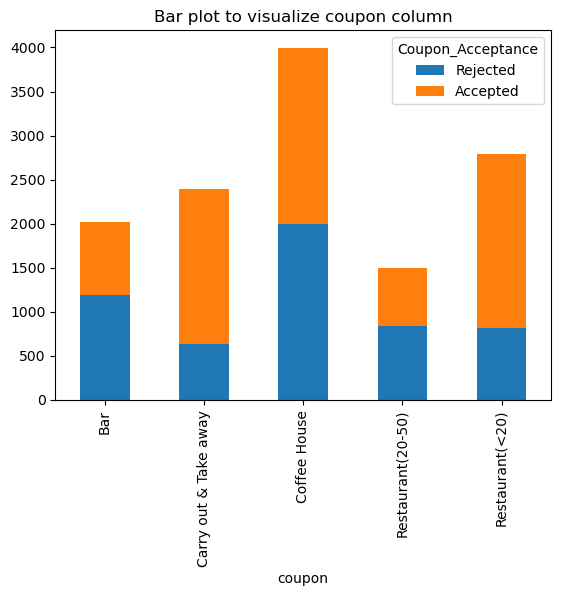

### Will a Customer Accept the Coupon?

**Context**

Imagine driving through town and a coupon is delivered to your cell phone for a restaraunt near where you are driving. Would you accept that coupon and take a short detour to the restaraunt? Would you accept the coupon but use it on a sunbsequent trip? Would you ignore the coupon entirely? What if the coupon was for a bar instead of a restaraunt? What about a coffee house? Would you accept a bar coupon with a minor passenger in the car? What about if it was just you and your partner in the car? Would weather impact the rate of acceptance? What about the time of day?

Obviously, proximity to the business is a factor on whether the coupon is delivered to the driver or not, but what are the factors that determine whether a driver accepts the coupon once it is delivered to them? How would you determine whether a driver is likely to accept a coupon?

**Overview**

The goal of this project is to use what you know about visualizations and probability distributions to distinguish between customers who accepted a driving coupon versus those that did not.

**Data**

This data comes to us from the UCI Machine Learning repository and was collected via a survey on Amazon Mechanical Turk. The survey describes different driving scenarios including the destination, current time, weather, passenger, etc., and then ask the person whether he will accept the coupon if he is the driver. Answers that the user will drive there ‘right away’ or ‘later before the coupon expires’ are labeled as ‘Y = 1’ and answers ‘no, I do not want the coupon’ are labeled as ‘Y = 0’.  There are five different types of coupons -- less expensive restaurants (under \\$20), coffee houses, carry out & take away, bar, and more expensive restaurants (\\$20 - \\$50). 

**Deliverables**

Your final product should be a brief report that highlights the differences between customers who did and did not accept the coupons.  To explore the data you will utilize your knowledge of plotting, statistical summaries, and visualization using Python. You will publish your findings in a public facing github repository as your first portfolio piece. 


### Data Description
Keep in mind that these values mentioned below are average values.

The attributes of this data set include:
1. User attributes
    -  Gender: male, female
    -  Age: below 21, 21 to 25, 26 to 30, etc.
    -  Marital Status: single, married partner, unmarried partner, or widowed
    -  Number of children: 0, 1, or more than 1
    -  Education: high school, bachelors degree, associates degree, or graduate degree
    -  Occupation: architecture & engineering, business & financial, etc.
    -  Annual income: less than \\$12500, \\$12500 - \\$24999, \\$25000 - \\$37499, etc.
    -  Number of times that he/she goes to a bar: 0, less than 1, 1 to 3, 4 to 8 or greater than 8
    -  Number of times that he/she buys takeaway food: 0, less than 1, 1 to 3, 4 to 8 or greater
    than 8
    -  Number of times that he/she goes to a coffee house: 0, less than 1, 1 to 3, 4 to 8 or
    greater than 8
    -  Number of times that he/she eats at a restaurant with average expense less than \\$20 per
    person: 0, less than 1, 1 to 3, 4 to 8 or greater than 8
    -  Number of times that he/she goes to a bar: 0, less than 1, 1 to 3, 4 to 8 or greater than 8
    

2. Contextual attributes
    - Driving destination: home, work, or no urgent destination
    - Location of user, coupon and destination: we provide a map to show the geographical
    location of the user, destination, and the venue, and we mark the distance between each
    two places with time of driving. The user can see whether the venue is in the same
    direction as the destination.
    - Weather: sunny, rainy, or snowy
    - Temperature: 30F, 55F, or 80F
    - Time: 10AM, 2PM, or 6PM
    - Passenger: alone, partner, kid(s), or friend(s)


3. Coupon attributes
    - time before it expires: 2 hours or one day


```python
import matplotlib.pyplot as plt
import seaborn as sns
import pandas as pd
import numpy as np
import plotly.express as px

```

### Problems

Use the prompts below to get started with your data analysis.  

1. Read in the `coupons.csv` file.


```python
data = pd.read_csv('data/coupons.csv')
```


```python
data.head()
```


<div>
<style scoped>
    .dataframe tbody tr th:only-of-type {
        vertical-align: middle;
    }

    .dataframe tbody tr th {
        vertical-align: top;
    }

    .dataframe thead th {
        text-align: right;
    }
</style>
<table border="1" class="dataframe">
  <thead>
    <tr style="text-align: right;">
      <th></th>
      <th>destination</th>
      <th>passanger</th>
      <th>weather</th>
      <th>temperature</th>
      <th>time</th>
      <th>coupon</th>
      <th>expiration</th>
      <th>gender</th>
      <th>age</th>
      <th>maritalStatus</th>
      <th>...</th>
      <th>CoffeeHouse</th>
      <th>CarryAway</th>
      <th>RestaurantLessThan20</th>
      <th>Restaurant20To50</th>
      <th>toCoupon_GEQ5min</th>
      <th>toCoupon_GEQ15min</th>
      <th>toCoupon_GEQ25min</th>
      <th>direction_same</th>
      <th>direction_opp</th>
      <th>Y</th>
    </tr>
  </thead>
  <tbody>
    <tr>
      <th>0</th>
      <td>No Urgent Place</td>
      <td>Alone</td>
      <td>Sunny</td>
      <td>55</td>
      <td>2PM</td>
      <td>Restaurant(&lt;20)</td>
      <td>1d</td>
      <td>Female</td>
      <td>21</td>
      <td>Unmarried partner</td>
      <td>...</td>
      <td>never</td>
      <td>NaN</td>
      <td>4~8</td>
      <td>1~3</td>
      <td>1</td>
      <td>0</td>
      <td>0</td>
      <td>0</td>
      <td>1</td>
      <td>1</td>
    </tr>
    <tr>
      <th>1</th>
      <td>No Urgent Place</td>
      <td>Friend(s)</td>
      <td>Sunny</td>
      <td>80</td>
      <td>10AM</td>
      <td>Coffee House</td>
      <td>2h</td>
      <td>Female</td>
      <td>21</td>
      <td>Unmarried partner</td>
      <td>...</td>
      <td>never</td>
      <td>NaN</td>
      <td>4~8</td>
      <td>1~3</td>
      <td>1</td>
      <td>0</td>
      <td>0</td>
      <td>0</td>
      <td>1</td>
      <td>0</td>
    </tr>
    <tr>
      <th>2</th>
      <td>No Urgent Place</td>
      <td>Friend(s)</td>
      <td>Sunny</td>
      <td>80</td>
      <td>10AM</td>
      <td>Carry out &amp; Take away</td>
      <td>2h</td>
      <td>Female</td>
      <td>21</td>
      <td>Unmarried partner</td>
      <td>...</td>
      <td>never</td>
      <td>NaN</td>
      <td>4~8</td>
      <td>1~3</td>
      <td>1</td>
      <td>1</td>
      <td>0</td>
      <td>0</td>
      <td>1</td>
      <td>1</td>
    </tr>
    <tr>
      <th>3</th>
      <td>No Urgent Place</td>
      <td>Friend(s)</td>
      <td>Sunny</td>
      <td>80</td>
      <td>2PM</td>
      <td>Coffee House</td>
      <td>2h</td>
      <td>Female</td>
      <td>21</td>
      <td>Unmarried partner</td>
      <td>...</td>
      <td>never</td>
      <td>NaN</td>
      <td>4~8</td>
      <td>1~3</td>
      <td>1</td>
      <td>1</td>
      <td>0</td>
      <td>0</td>
      <td>1</td>
      <td>0</td>
    </tr>
    <tr>
      <th>4</th>
      <td>No Urgent Place</td>
      <td>Friend(s)</td>
      <td>Sunny</td>
      <td>80</td>
      <td>2PM</td>
      <td>Coffee House</td>
      <td>1d</td>
      <td>Female</td>
      <td>21</td>
      <td>Unmarried partner</td>
      <td>...</td>
      <td>never</td>
      <td>NaN</td>
      <td>4~8</td>
      <td>1~3</td>
      <td>1</td>
      <td>1</td>
      <td>0</td>
      <td>0</td>
      <td>1</td>
      <td>0</td>
    </tr>
  </tbody>
</table>
<p>5 rows × 26 columns</p>
</div>


2. Investigate the dataset for missing or problematic data.


```python
#check missing values in each column
print(data.isna().sum())


```

    destination             0
    passenger               0
    weather                 0
    temperature             0
    time                    0
    coupon                  0
    expiration              0
    gender                  0
    age                     0
    maritalStatus           0
    has_children            0
    education               0
    occupation              0
    income                  0
    car                     0
    Bar                     0
    CoffeeHouse             0
    CarryAway               0
    RestaurantLessThan20    0
    Restaurant20To50        0
    toCoupon_GEQ5min        0
    toCoupon_GEQ15min       0
    toCoupon_GEQ25min       0
    direction_same          0
    direction_opp           0
    Coupon_Acceptance       0
    new_coupon_group        0
    dtype: int64


3. Decide what to do about your missing data -- drop, replace, other...


```python
#checking datatypes before replacing/filling in missing values
data.info()
#Now filling the data with the most frquently used value for Attributes
data['car'] = data['car'].fillna(data['car'].value_counts().index[0])
data['Bar'] = data['Bar'].fillna(data['Bar'].value_counts().index[0])
data['CoffeeHouse'] = data['CoffeeHouse'].fillna(data['CoffeeHouse'].value_counts().index[0])
data['CarryAway'] = data['CarryAway'].fillna(data['CarryAway'].value_counts().index[0])
data['RestaurantLessThan20'] = data['RestaurantLessThan20'].fillna(data['RestaurantLessThan20'].value_counts().index[0])
data['Restaurant20To50'] = data['Restaurant20To50'].fillna(data['Restaurant20To50'].value_counts().index[0])
#Renaming Columns
data.rename(columns={'passanger': 'passenger' ,'Y': 'Coupon_Acceptance'}, inplace = True)
#Mapping Values to Attributes for ease of Analysis and Cleaning up of data
data = data.replace({'age': {'50plus': 50, 'below21': 20 } })
data['age'] = pd.to_numeric(data['age'])
income_mapping = {'income': {'Less than $12500': 12500, '$12500 - $24999': 24999, '$25000 - $37499': 37499, '$37500 - $49999': 49999, '$50000 - $62499': 62499, '$62500 - $74999': 74999 , '$75000 - $87499': 87499, '$87500 - $99999': 99999, '$100000 or More': 100000} }
data = data.replace(income_mapping)


```

    <class 'pandas.core.frame.DataFrame'>
    RangeIndex: 12684 entries, 0 to 12683
    Data columns (total 27 columns):
     #   Column                Non-Null Count  Dtype 
    ---  ------                --------------  ----- 
     0   destination           12684 non-null  object
     1   passenger             12684 non-null  object
     2   weather               12684 non-null  object
     3   temperature           12684 non-null  int64 
     4   time                  12684 non-null  object
     5   coupon                12684 non-null  object
     6   expiration            12684 non-null  object
     7   gender                12684 non-null  object
     8   age                   12684 non-null  int64 
     9   maritalStatus         12684 non-null  object
     10  has_children          12684 non-null  int64 
     11  education             12684 non-null  object
     12  occupation            12684 non-null  object
     13  income                12684 non-null  int64 
     14  car                   12684 non-null  object
     15  Bar                   12684 non-null  object
     16  CoffeeHouse           12684 non-null  object
     17  CarryAway             12684 non-null  object
     18  RestaurantLessThan20  12684 non-null  object
     19  Restaurant20To50      12684 non-null  object
     20  toCoupon_GEQ5min      12684 non-null  int64 
     21  toCoupon_GEQ15min     12684 non-null  int64 
     22  toCoupon_GEQ25min     12684 non-null  int64 
     23  direction_same        12684 non-null  int64 
     24  direction_opp         12684 non-null  int64 
     25  Coupon_Acceptance     12684 non-null  int64 
     26  new_coupon_group      12684 non-null  object
    dtypes: int64(10), object(17)
    memory usage: 2.6+ MB


4. What proportion of the total observations chose to accept the coupon? 


```python
# Coupon Accepted/Rejected Count and %
data.Coupon_Acceptance.value_counts().plot(kind ='bar')
accept_count = (data['Coupon_Acceptance']==1).sum()
reject_count = (data['Coupon_Acceptance']==0).sum()
total_count = len(data)
accept_percentage = round((accept_count/total_count)*100,2)
reject_percentage = round((reject_count/total_count)*100,2)
print('Coupon Accepted Count and %: ', accept_count, accept_percentage,'%')
print('Coupon Rejected Count and %: ', reject_count, reject_percentage, '%')

# Observation : Overall Accepted Count and % is Higher than the Rejected metrics
```

    Coupon Accepted Count and %:  7210 56.84 %
    Coupon Rejected Count and %:  5474 43.16 %


    

    


5. Use a bar plot to visualize the `coupon` column.

**Visualizing the Overall Coupons Acceptance**

From this Bar plot we can clearly see that Coffee Coupon Was the Most offered and most coupons accepted were of Carry outs and Restaurants < 20 ones

1. Creating a Stacked Bar plot to see the Accepted & Rejected Counts by Coupons offered.


```python
coupon_counts = data.groupby(['coupon', 'Coupon_Acceptance']).size().unstack(fill_value=0)
coupon_counts.plot(kind='bar', stacked=True, rot=90)
plt.xlabel ='Coupon'
plt.ylabel = 'Count'
plt.title('Bar plot to visualize coupon column')
plt.legend(title='Coupon_Acceptance', labels=['Rejected', 'Accepted'])

```


    <matplotlib.legend.Legend at 0x157009e50>


    

    


6. Use a histogram to visualize the temperature column.


```python
sns.histplot(data,x='temperature',bins =10, kde=True, color ='blue')
plt.title('Temperature histogram')
```


    Text(0.5, 1.0, 'Temperature histogram')


    

    


**Investigating the Bar Coupons**

Now, we will lead you through an exploration of just the bar related coupons.  

1. Create a new `DataFrame` that contains just the bar coupons.


```python
#Creating a data frame with Coupon - Bar
df_bar = data[data['coupon'] =='Bar']
df_bar.head()
```


<div>
<style scoped>
    .dataframe tbody tr th:only-of-type {
        vertical-align: middle;
    }

    .dataframe tbody tr th {
        vertical-align: top;
    }

    .dataframe thead th {
        text-align: right;
    }
</style>
<table border="1" class="dataframe">
  <thead>
    <tr style="text-align: right;">
      <th></th>
      <th>destination</th>
      <th>passenger</th>
      <th>weather</th>
      <th>temperature</th>
      <th>time</th>
      <th>coupon</th>
      <th>expiration</th>
      <th>gender</th>
      <th>age</th>
      <th>maritalStatus</th>
      <th>...</th>
      <th>CarryAway</th>
      <th>RestaurantLessThan20</th>
      <th>Restaurant20To50</th>
      <th>toCoupon_GEQ5min</th>
      <th>toCoupon_GEQ15min</th>
      <th>toCoupon_GEQ25min</th>
      <th>direction_same</th>
      <th>direction_opp</th>
      <th>Coupon_Acceptance</th>
      <th>new_coupon_group</th>
    </tr>
  </thead>
  <tbody>
    <tr>
      <th>9</th>
      <td>No Urgent Place</td>
      <td>Kid(s)</td>
      <td>Sunny</td>
      <td>80</td>
      <td>10AM</td>
      <td>Bar</td>
      <td>1d</td>
      <td>Female</td>
      <td>21</td>
      <td>Unmarried partner</td>
      <td>...</td>
      <td>1~3</td>
      <td>4~8</td>
      <td>1~3</td>
      <td>1</td>
      <td>1</td>
      <td>0</td>
      <td>0</td>
      <td>1</td>
      <td>0</td>
      <td>Bar</td>
    </tr>
    <tr>
      <th>13</th>
      <td>Home</td>
      <td>Alone</td>
      <td>Sunny</td>
      <td>55</td>
      <td>6PM</td>
      <td>Bar</td>
      <td>1d</td>
      <td>Female</td>
      <td>21</td>
      <td>Unmarried partner</td>
      <td>...</td>
      <td>1~3</td>
      <td>4~8</td>
      <td>1~3</td>
      <td>1</td>
      <td>0</td>
      <td>0</td>
      <td>1</td>
      <td>0</td>
      <td>1</td>
      <td>Bar</td>
    </tr>
    <tr>
      <th>17</th>
      <td>Work</td>
      <td>Alone</td>
      <td>Sunny</td>
      <td>55</td>
      <td>7AM</td>
      <td>Bar</td>
      <td>1d</td>
      <td>Female</td>
      <td>21</td>
      <td>Unmarried partner</td>
      <td>...</td>
      <td>1~3</td>
      <td>4~8</td>
      <td>1~3</td>
      <td>1</td>
      <td>1</td>
      <td>1</td>
      <td>0</td>
      <td>1</td>
      <td>0</td>
      <td>Bar</td>
    </tr>
    <tr>
      <th>24</th>
      <td>No Urgent Place</td>
      <td>Friend(s)</td>
      <td>Sunny</td>
      <td>80</td>
      <td>10AM</td>
      <td>Bar</td>
      <td>1d</td>
      <td>Male</td>
      <td>21</td>
      <td>Single</td>
      <td>...</td>
      <td>4~8</td>
      <td>4~8</td>
      <td>less1</td>
      <td>1</td>
      <td>0</td>
      <td>0</td>
      <td>0</td>
      <td>1</td>
      <td>1</td>
      <td>Bar</td>
    </tr>
    <tr>
      <th>35</th>
      <td>Home</td>
      <td>Alone</td>
      <td>Sunny</td>
      <td>55</td>
      <td>6PM</td>
      <td>Bar</td>
      <td>1d</td>
      <td>Male</td>
      <td>21</td>
      <td>Single</td>
      <td>...</td>
      <td>4~8</td>
      <td>4~8</td>
      <td>less1</td>
      <td>1</td>
      <td>0</td>
      <td>0</td>
      <td>1</td>
      <td>0</td>
      <td>1</td>
      <td>Bar</td>
    </tr>
  </tbody>
</table>
<p>5 rows × 27 columns</p>
</div>


2. What proportion of bar coupons were accepted?


```python
#Creating a pie plot to check the Bar Coupons Acceptance ratio vs Total Accepted Coupons
data.loc[data['coupon'] == 'Bar', 'new_coupon_group'] = 'Bar'
data.loc[data['coupon'] != 'Bar', 'new_coupon_group'] = 'Others'
fig1 = px.pie(data, values = 'Coupon_Acceptance', names = 'new_coupon_group',
              title = 'Bar Coupons Acceptance vs Total Accepted Coupons',color_discrete_sequence=['blue','green'])
fig1.show()


```


<div>                            <div id="2caa2cf1-52da-48c9-9296-0826a680b1af" class="plotly-graph-div" style="height:525px; width:100%;"></div>            <script type="text/javascript">                require(["plotly"], function(Plotly) {                    window.PLOTLYENV=window.PLOTLYENV || {};                                    if (document.getElementById("2caa2cf1-52da-48c9-9296-0826a680b1af")) {                    Plotly.newPlot(                        "2caa2cf1-52da-48c9-9296-0826a680b1af",                        [{"domain":{"x":[0.0,1.0],"y":[0.0,1.0]},"hovertemplate":"new_coupon_group=%{label}<br>Coupon_Acceptance=%{value}<extra></extra>","labels":["Others","Others","Others","Others","Others","Others","Others","Others","Others","Bar","Others","Others","Others","Bar","Others","Others","Others","Bar","Others","Others","Others","Others","Others","Others","Bar","Others","Others","Others","Others","Others","Others","Others","Others","Others","Others","Bar","Others","Others","Others","Bar","Others","Others","Others","Others","Others","Others","Bar","Others","Others","Others","Others","Others","Others","Others","Others","Others","Others","Bar","Others","Others","Others","Bar","Others","Others","Others","Others","Others","Others","Others","Others","Others","Others","Others","Others","Others","Bar","Others","Others","Others","Bar","Others","Others","Others","Bar","Others","Others","Others","Others","Others","Others","Bar","Others","Others","Others","Others","Others","Others","Others","Others","Others","Others","Bar","Others","Others","Others","Bar","Others","Others","Others","Others","Others","Others","Bar","Others","Others","Others","Others","Others","Others","Others","Others","Others","Others","Bar","Others","Others","Others","Bar","Others","Others","Others","Others","Others","Others","Others","Others","Others","Others","Others","Others","Others","Bar","Others","Others","Others","Bar","Others","Others","Others","Bar","Others","Others","Others","Others","Others","Others","Bar","Others","Others","Others","Others","Others","Others","Others","Others","Others","Others","Bar","Others","Others","Others","Bar","Others","Others","Others","Others","Others","Others","Bar","Others","Others","Others","Others","Others","Others","Others","Others","Others","Others","Bar","Others","Others","Others","Others","Others","Bar","Others","Others","Others","Others","Others","Others","Others","Others","Others","Others","Bar","Others","Others","Others","Bar","Others","Others","Others","Others","Others","Others","Others","Others","Others","Others","Others","Others","Others","Bar","Others","Others","Bar","Bar","Others","Others","Others","Bar","Others","Others","Others","Others","Others","Others","Bar","Others","Others","Others","Others","Others","Others","Others","Others","Others","Others","Bar","Others","Others","Others","Bar","Others","Others","Others","Others","Others","Others","Others","Others","Others","Others","Others","Others","Others","Bar","Others","Others","Others","Bar","Others","Others","Others","Bar","Others","Others","Others","Others","Others","Others","Others","Others","Others","Others","Others","Others","Others","Bar","Others","Others","Bar","Others","Others","Bar","Others","Others","Others","Others","Others","Others","Others","Others","Others","Others","Others","Others","Others","Bar","Others","Others","Others","Bar","Others","Others","Others","Bar","Others","Others","Others","Others","Others","Others","Others","Others","Others","Others","Others","Others","Others","Bar","Others","Bar","Others","Others","Others","Bar","Others","Others","Others","Others","Others","Others","Others","Others","Others","Others","Others","Others","Others","Bar","Others","Others","Others","Bar","Others","Others","Others","Bar","Others","Others","Others","Others","Others","Others","Others","Others","Others","Others","Others","Others","Others","Bar","Others","Others","Others","Bar","Others","Others","Others","Bar","Others","Others","Others","Others","Others","Others","Bar","Others","Others","Others","Others","Others","Others","Others","Others","Others","Others","Bar","Others","Others","Others","Bar","Others","Others","Others","Others","Others","Others","Others","Others","Others","Others","Others","Others","Others","Bar","Others","Others","Bar","Bar","Others","Others","Others","Bar","Others","Others","Others","Others","Others","Bar","Others","Others","Others","Others","Others","Others","Others","Others","Others","Others","Bar","Others","Others","Others","Bar","Others","Others","Others","Others","Others","Others","Bar","Others","Others","Others","Others","Others","Others","Others","Others","Others","Others","Bar","Others","Others","Others","Others","Others","Others","Others","Others","Others","Bar","Others","Others","Others","Others","Others","Others","Others","Others","Others","Others","Bar","Others","Others","Others","Bar","Others","Others","Others","Others","Others","Others","Others","Others","Others","Others","Others","Others","Others","Bar","Others","Others","Bar","Bar","Others","Others","Others","Bar","Others","Others","Others","Others","Bar","Others","Others","Others","Others","Others","Others","Others","Others","Others","Others","Others","Others","Others","Others","Bar","Others","Others","Others","Bar","Others","Others","Others","Bar","Others","Others","Others","Others","Others","Others","Bar","Others","Others","Others","Others","Others","Others","Others","Others","Others","Others","Bar","Others","Others","Others","Bar","Others","Others","Others","Others","Others","Others","Bar","Others","Others","Others","Others","Others","Others","Others","Others","Others","Others","Bar","Others","Others","Others","Bar","Others","Others","Others","Others","Others","Others","Bar","Others","Others","Others","Others","Others","Others","Others","Others","Others","Others","Bar","Others","Others","Others","Bar","Others","Others","Others","Others","Others","Others","Others","Others","Others","Others","Others","Others","Others","Bar","Others","Others","Others","Bar","Others","Others","Others","Bar","Others","Others","Others","Others","Others","Others","Bar","Others","Others","Others","Others","Others","Others","Others","Others","Others","Others","Bar","Others","Others","Others","Bar","Others","Others","Others","Others","Others","Others","Others","Others","Others","Others","Others","Others","Others","Bar","Others","Others","Bar","Bar","Others","Others","Others","Bar","Others","Others","Others","Others","Others","Others","Others","Others","Others","Others","Others","Others","Others","Bar","Others","Others","Others","Bar","Others","Others","Others","Bar","Others","Others","Others","Others","Others","Others","Others","Others","Others","Others","Others","Others","Others","Bar","Others","Others","Bar","Bar","Others","Others","Others","Bar","Others","Others","Others","Others","Others","Others","Bar","Others","Others","Others","Others","Others","Others","Others","Others","Others","Others","Bar","Others","Others","Others","Bar","Others","Others","Others","Others","Others","Others","Others","Others","Others","Others","Others","Others","Others","Bar","Others","Others","Bar","Bar","Others","Others","Others","Bar","Others","Others","Others","Others","Others","Others","Bar","Others","Others","Others","Others","Others","Others","Others","Others","Others","Others","Bar","Others","Others","Others","Bar","Others","Others","Others","Others","Others","Others","Others","Others","Others","Others","Others","Others","Others","Bar","Others","Others","Others","Bar","Others","Others","Others","Bar","Others","Others","Others","Others","Others","Others","Others","Others","Others","Others","Others","Others","Others","Bar","Others","Others","Others","Bar","Others","Others","Bar","Others","Others","Others","Others","Others","Others","Others","Others","Others","Others","Others","Others","Others","Bar","Others","Others","Others","Bar","Others","Others","Others","Bar","Others","Others","Others","Others","Others","Others","Bar","Others","Others","Bar","Others","Others","Others","Others","Others","Others","Others","Others","Others","Bar","Others","Others","Bar","Bar","Others","Others","Others","Bar","Others","Others","Others","Others","Others","Others","Bar","Others","Others","Others","Others","Others","Others","Others","Others","Others","Others","Bar","Others","Others","Others","Bar","Others","Others","Others","Others","Others","Others","Others","Others","Others","Others","Others","Others","Others","Bar","Others","Others","Others","Bar","Others","Others","Others","Bar","Others","Others","Others","Others","Others","Others","Bar","Others","Others","Others","Others","Others","Others","Others","Others","Others","Others","Bar","Others","Others","Others","Bar","Others","Others","Others","Others","Others","Others","Others","Others","Others","Others","Others","Others","Others","Bar","Others","Others","Bar","Bar","Others","Others","Others","Bar","Others","Others","Others","Others","Others","Others","Others","Others","Others","Others","Others","Others","Others","Bar","Others","Others","Others","Bar","Others","Others","Others","Bar","Others","Others","Others","Others","Others","Others","Others","Others","Others","Others","Others","Others","Others","Bar","Others","Others","Others","Bar","Others","Others","Others","Bar","Others","Others","Others","Others","Others","Others","Bar","Others","Others","Others","Others","Others","Others","Others","Others","Others","Others","Bar","Others","Others","Others","Bar","Others","Others","Others","Others","Others","Others","Others","Others","Others","Others","Others","Others","Others","Bar","Others","Others","Bar","Bar","Others","Others","Others","Bar","Others","Others","Others","Others","Others","Others","Others","Others","Others","Others","Others","Others","Others","Bar","Others","Others","Bar","Bar","Others","Others","Others","Bar","Others","Others","Others","Others","Others","Others","Others","Others","Others","Others","Others","Others","Others","Bar","Others","Others","Others","Bar","Others","Others","Others","Bar","Others","Others","Others","Others","Others","Others","Others","Others","Others","Others","Others","Others","Others","Bar","Others","Others","Others","Bar","Others","Others","Others","Bar","Others","Others","Others","Others","Others","Others","Others","Others","Others","Others","Others","Others","Others","Bar","Others","Others","Others","Bar","Others","Others","Others","Bar","Others","Others","Others","Others","Others","Others","Others","Others","Others","Others","Others","Others","Others","Bar","Others","Others","Bar","Bar","Others","Others","Others","Bar","Others","Others","Others","Others","Others","Others","Bar","Others","Others","Bar","Others","Others","Others","Others","Others","Others","Others","Others","Others","Bar","Others","Others","Others","Bar","Others","Others","Others","Bar","Others","Others","Others","Others","Others","Others","Others","Others","Others","Others","Others","Others","Others","Bar","Others","Others","Bar","Others","Others","Others","Bar","Others","Others","Others","Others","Others","Others","Bar","Others","Others","Others","Others","Others","Others","Others","Others","Others","Others","Bar","Others","Others","Others","Bar","Others","Others","Others","Others","Others","Others","Bar","Others","Others","Others","Others","Others","Others","Others","Others","Others","Others","Bar","Others","Others","Others","Bar","Others","Others","Others","Others","Others","Others","Bar","Others","Others","Others","Others","Others","Others","Others","Others","Others","Others","Bar","Others","Others","Others","Bar","Others","Others","Others","Others","Others","Others","Others","Others","Others","Others","Others","Others","Others","Bar","Others","Others","Bar","Bar","Others","Others","Others","Bar","Others","Others","Others","Others","Others","Others","Others","Others","Others","Others","Others","Others","Others","Bar","Others","Others","Bar","Bar","Others","Others","Others","Bar","Others","Others","Others","Others","Others","Others","Bar","Others","Others","Others","Others","Others","Others","Others","Others","Others","Others","Bar","Others","Others","Others","Bar","Others","Others","Others","Others","Others","Others","Others","Others","Others","Others","Others","Others","Others","Bar","Others","Others","Bar","Bar","Others","Others","Others","Bar","Others","Others","Others","Others","Others","Others","Others","Others","Others","Others","Others","Others","Others","Bar","Others","Others","Bar","Bar","Others","Others","Others","Bar","Others","Others","Others","Others","Others","Others","Bar","Others","Others","Others","Others","Others","Others","Others","Others","Others","Others","Bar","Others","Others","Others","Bar","Others","Others","Others","Others","Others","Others","Others","Others","Others","Others","Others","Others","Others","Bar","Others","Others","Others","Bar","Others","Others","Others","Bar","Others","Others","Others","Others","Others","Others","Bar","Others","Others","Others","Others","Others","Others","Others","Others","Others","Others","Bar","Others","Others","Others","Bar","Others","Others","Others","Others","Others","Others","Others","Others","Others","Others","Others","Others","Others","Bar","Others","Others","Others","Bar","Others","Others","Others","Bar","Others","Others","Others","Others","Others","Others","Others","Others","Others","Others","Others","Others","Others","Bar","Others","Others","Bar","Bar","Others","Others","Others","Bar","Others","Others","Others","Others","Others","Others","Others","Others","Others","Others","Others","Others","Others","Bar","Others","Others","Bar","Bar","Others","Others","Others","Bar","Others","Others","Others","Others","Others","Others","Others","Others","Others","Others","Others","Others","Others","Bar","Others","Others","Others","Bar","Others","Others","Others","Bar","Others","Others","Others","Others","Others","Others","Bar","Others","Others","Others","Others","Others","Others","Others","Others","Others","Others","Bar","Others","Others","Others","Bar","Others","Others","Others","Others","Others","Others","Bar","Others","Others","Others","Others","Others","Others","Others","Others","Others","Others","Bar","Others","Others","Others","Bar","Others","Others","Others","Others","Others","Others","Others","Others","Others","Others","Others","Others","Others","Bar","Others","Others","Others","Bar","Others","Others","Others","Bar","Others","Others","Others","Others","Others","Others","Bar","Others","Others","Others","Others","Others","Others","Others","Others","Others","Others","Bar","Others","Others","Others","Bar","Others","Others","Others","Others","Others","Others","Others","Others","Others","Others","Others","Others","Others","Bar","Others","Others","Others","Bar","Others","Others","Others","Bar","Others","Others","Others","Others","Others","Others","Others","Others","Others","Others","Others","Others","Others","Bar","Others","Others","Others","Bar","Others","Others","Others","Bar","Others","Others","Others","Others","Others","Others","Bar","Others","Others","Others","Others","Others","Others","Others","Others","Others","Others","Bar","Others","Others","Others","Bar","Others","Others","Others","Others","Others","Others","Others","Others","Others","Others","Others","Others","Others","Bar","Others","Others","Others","Bar","Others","Others","Others","Bar","Others","Others","Others","Others","Others","Others","Others","Others","Others","Others","Others","Others","Others","Bar","Others","Others","Bar","Bar","Others","Others","Others","Bar","Others","Others","Others","Others","Others","Others","Bar","Others","Others","Others","Others","Others","Others","Others","Others","Others","Others","Bar","Others","Others","Others","Bar","Others","Others","Others","Others","Others","Others","Others","Others","Others","Others","Others","Others","Others","Bar","Others","Others","Bar","Bar","Others","Others","Others","Bar","Others","Others","Others","Others","Others","Others","Others","Others","Others","Others","Others","Others","Others","Bar","Others","Others","Others","Bar","Others","Others","Others","Bar","Others","Others","Others","Others","Others","Others","Others","Others","Others","Others","Others","Others","Others","Bar","Others","Others","Others","Bar","Others","Others","Others","Bar","Others","Others","Others","Others","Others","Others","Bar","Others","Others","Others","Others","Others","Others","Others","Others","Others","Others","Bar","Others","Others","Others","Bar","Others","Others","Others","Others","Others","Others","Bar","Others","Others","Others","Others","Others","Others","Others","Others","Others","Others","Bar","Others","Others","Others","Bar","Others","Others","Others","Others","Others","Others","Bar","Others","Others","Others","Others","Others","Others","Others","Others","Others","Others","Bar","Others","Others","Others","Bar","Others","Others","Others","Others","Others","Others","Bar","Others","Others","Others","Others","Others","Others","Others","Others","Others","Others","Bar","Others","Others","Others","Bar","Others","Others","Others","Others","Others","Others","Bar","Others","Others","Others","Others","Others","Others","Others","Others","Others","Others","Bar","Others","Others","Others","Bar","Others","Others","Others","Others","Others","Others","Others","Others","Others","Others","Others","Others","Others","Bar","Others","Others","Others","Bar","Others","Others","Others","Bar","Others","Others","Others","Others","Others","Others","Others","Others","Others","Others","Others","Others","Others","Bar","Others","Others","Others","Bar","Others","Others","Others","Bar","Others","Others","Others","Others","Others","Others","Others","Others","Others","Others","Others","Others","Others","Bar","Others","Others","Bar","Bar","Others","Others","Others","Bar","Others","Others","Others","Others","Others","Others","Others","Others","Others","Others","Others","Others","Others","Bar","Others","Others","Bar","Bar","Others","Others","Others","Bar","Others","Others","Others","Others","Others","Others","Others","Others","Others","Others","Others","Others","Others","Bar","Others","Others","Others","Bar","Others","Others","Others","Bar","Others","Others","Others","Others","Others","Others","Others","Others","Others","Others","Others","Others","Others","Bar","Others","Others","Others","Bar","Others","Others","Others","Bar","Others","Others","Others","Others","Others","Others","Others","Others","Others","Others","Others","Others","Others","Bar","Others","Others","Others","Bar","Others","Others","Others","Bar","Others","Others","Others","Others","Others","Others","Bar","Others","Others","Others","Others","Others","Others","Others","Others","Others","Others","Bar","Others","Others","Others","Bar","Others","Others","Others","Others","Others","Others","Bar","Others","Others","Others","Others","Others","Others","Others","Others","Others","Others","Bar","Others","Others","Others","Bar","Others","Others","Others","Others","Others","Others","Others","Others","Others","Others","Others","Others","Others","Bar","Others","Others","Others","Bar","Others","Others","Others","Bar","Others","Others","Others","Others","Others","Others","Bar","Others","Others","Others","Others","Others","Others","Others","Others","Others","Others","Bar","Others","Others","Others","Bar","Others","Others","Others","Others","Others","Others","Bar","Others","Others","Others","Others","Others","Others","Others","Others","Others","Others","Bar","Others","Others","Others","Bar","Others","Others","Others","Others","Others","Others","Others","Others","Others","Others","Others","Others","Others","Bar","Others","Others","Bar","Bar","Others","Others","Others","Bar","Others","Others","Others","Others","Others","Others","Others","Others","Others","Others","Others","Others","Others","Bar","Others","Others","Bar","Bar","Others","Others","Others","Bar","Others","Others","Others","Others","Others","Others","Bar","Others","Others","Others","Others","Others","Others","Others","Others","Others","Others","Bar","Others","Others","Others","Bar","Others","Others","Others","Others","Others","Others","Bar","Others","Others","Others","Others","Others","Others","Others","Others","Others","Others","Bar","Others","Others","Others","Bar","Others","Others","Others","Others","Others","Others","Others","Others","Others","Others","Others","Others","Others","Bar","Others","Others","Bar","Bar","Others","Others","Others","Bar","Others","Others","Others","Others","Others","Others","Bar","Others","Others","Others","Others","Others","Others","Others","Others","Others","Bar","Others","Others","Others","Bar","Others","Others","Others","Others","Others","Others","Others","Others","Others","Others","Others","Others","Others","Bar","Others","Others","Others","Bar","Others","Others","Others","Bar","Others","Others","Others","Others","Others","Others","Bar","Others","Others","Others","Others","Others","Others","Others","Others","Others","Others","Bar","Others","Others","Others","Bar","Others","Others","Others","Others","Bar","Others","Others","Others","Others","Others","Others","Others","Others","Others","Others","Others","Others","Others","Others","Bar","Others","Others","Others","Bar","Others","Others","Others","Bar","Others","Others","Others","Others","Others","Others","Bar","Others","Others","Others","Others","Others","Others","Others","Others","Others","Others","Bar","Others","Others","Others","Bar","Others","Others","Others","Others","Others","Others","Others","Others","Others","Others","Others","Others","Others","Bar","Others","Others","Bar","Bar","Others","Others","Others","Bar","Others","Others","Others","Others","Others","Others","Others","Others","Others","Others","Others","Others","Others","Bar","Others","Others","Bar","Bar","Others","Others","Others","Bar","Others","Others","Others","Others","Others","Others","Bar","Others","Others","Others","Others","Others","Others","Others","Others","Others","Bar","Others","Others","Bar","Others","Others","Others","Others","Others","Others","Bar","Others","Others","Others","Others","Others","Others","Others","Others","Others","Others","Bar","Others","Others","Others","Bar","Others","Others","Others","Others","Others","Others","Others","Others","Others","Others","Others","Others","Others","Bar","Others","Others","Others","Bar","Others","Others","Others","Bar","Others","Others","Others","Others","Others","Others","Bar","Others","Others","Others","Others","Others","Others","Others","Others","Others","Others","Bar","Others","Others","Others","Bar","Others","Others","Others","Others","Others","Others","Others","Others","Others","Others","Others","Others","Others","Bar","Others","Others","Others","Bar","Others","Others","Others","Bar","Others","Others","Others","Others","Others","Others","Bar","Others","Others","Others","Others","Others","Others","Others","Others","Others","Others","Bar","Others","Others","Others","Bar","Others","Others","Others","Others","Others","Others","Others","Others","Others","Others","Others","Others","Others","Bar","Others","Others","Others","Bar","Others","Others","Others","Bar","Others","Others","Others","Others","Others","Others","Others","Others","Others","Others","Others","Others","Bar","Others","Others","Others","Bar","Others","Others","Others","Bar","Others","Others","Others","Others","Others","Others","Others","Others","Others","Others","Others","Others","Others","Bar","Others","Others","Bar","Others","Others","Others","Bar","Others","Others","Others","Others","Others","Others","Others","Others","Others","Others","Others","Others","Others","Bar","Others","Others","Bar","Bar","Others","Others","Others","Bar","Others","Others","Others","Others","Others","Others","Others","Others","Others","Others","Others","Others","Others","Bar","Others","Others","Others","Bar","Others","Others","Others","Bar","Others","Others","Others","Others","Others","Others","Bar","Others","Others","Others","Others","Others","Others","Others","Others","Others","Others","Bar","Others","Others","Others","Bar","Others","Others","Others","Others","Others","Others","Bar","Others","Others","Others","Others","Others","Others","Others","Others","Others","Others","Bar","Others","Others","Others","Bar","Others","Others","Others","Others","Others","Others","Others","Others","Others","Others","Others","Others","Others","Bar","Others","Others","Others","Bar","Others","Others","Others","Bar","Others","Others","Others","Others","Others","Others","Bar","Others","Others","Others","Others","Others","Others","Others","Others","Others","Others","Bar","Others","Others","Others","Bar","Others","Others","Others","Others","Others","Others","Bar","Others","Others","Others","Others","Others","Others","Others","Others","Others","Others","Bar","Others","Others","Others","Bar","Others","Others","Others","Others","Others","Others","Others","Others","Others","Others","Others","Others","Others","Bar","Others","Others","Others","Bar","Others","Others","Others","Bar","Others","Others","Others","Others","Others","Others","Bar","Others","Others","Others","Others","Others","Others","Others","Others","Others","Others","Bar","Others","Others","Others","Bar","Others","Others","Others","Others","Others","Others","Bar","Others","Others","Others","Others","Others","Others","Others","Others","Others","Others","Others","Others","Bar","Others","Others","Others","Bar","Others","Others","Others","Bar","Others","Others","Others","Others","Others","Others","Bar","Others","Others","Others","Others","Others","Others","Others","Others","Others","Others","Bar","Others","Others","Others","Bar","Others","Others","Others","Others","Others","Others","Others","Others","Others","Others","Others","Others","Others","Bar","Others","Others","Others","Bar","Others","Others","Others","Bar","Others","Others","Others","Others","Others","Others","Others","Others","Others","Others","Others","Others","Others","Bar","Others","Others","Others","Bar","Others","Others","Others","Bar","Others","Others","Others","Others","Others","Others","Others","Others","Others","Others","Others","Others","Others","Bar","Others","Others","Others","Bar","Others","Others","Others","Bar","Others","Others","Others","Others","Others","Others","Bar","Others","Others","Others","Others","Others","Others","Others","Others","Others","Others","Bar","Others","Others","Others","Bar","Others","Others","Others","Others","Others","Others","Others","Others","Others","Others","Others","Others","Others","Bar","Others","Others","Others","Bar","Others","Others","Others","Bar","Others","Others","Others","Others","Others","Others","Bar","Others","Others","Others","Others","Others","Others","Others","Others","Others","Others","Bar","Others","Others","Others","Bar","Others","Others","Others","Others","Others","Others","Others","Others","Others","Others","Others","Others","Others","Bar","Others","Others","Others","Bar","Others","Others","Others","Bar","Others","Others","Others","Others","Others","Others","Bar","Others","Others","Others","Others","Others","Others","Others","Others","Others","Others","Bar","Others","Others","Others","Bar","Others","Others","Others","Others","Others","Others","Others","Others","Others","Others","Others","Others","Others","Bar","Others","Others","Others","Bar","Others","Others","Others","Bar","Others","Others","Others","Others","Others","Others","Bar","Others","Others","Others","Others","Others","Others","Others","Others","Others","Others","Others","Bar","Others","Others","Others","Bar","Others","Others","Others","Others","Bar","Others","Others","Others","Others","Others","Others","Others","Others","Others","Others","Others","Others","Others","Others","Bar","Others","Others","Others","Bar","Others","Others","Others","Others","Others","Others","Others","Others","Others","Others","Others","Others","Others","Others","Others","Others","Bar","Others","Others","Bar","Bar","Others","Others","Others","Bar","Others","Others","Others","Others","Others","Others","Others","Others","Others","Others","Others","Others","Bar","Others","Others","Bar","Bar","Others","Others","Bar","Others","Others","Others","Others","Others","Others","Others","Others","Others","Others","Others","Others","Others","Bar","Others","Others","Others","Bar","Others","Others","Others","Bar","Others","Others","Others","Others","Others","Others","Bar","Others","Others","Others","Others","Others","Others","Others","Others","Others","Others","Bar","Others","Others","Others","Bar","Others","Others","Others","Others","Others","Others","Others","Others","Others","Others","Others","Others","Others","Bar","Others","Others","Others","Bar","Others","Others","Others","Bar","Others","Others","Others","Others","Others","Others","Others","Others","Others","Others","Others","Others","Others","Bar","Others","Others","Bar","Bar","Others","Others","Others","Bar","Others","Others","Others","Others","Others","Others","Bar","Others","Others","Others","Others","Others","Others","Others","Others","Others","Others","Bar","Others","Others","Others","Bar","Others","Others","Others","Others","Others","Others","Others","Others","Others","Others","Others","Bar","Others","Others","Others","Bar","Others","Others","Others","Others","Others","Others","Others","Others","Others","Others","Others","Others","Others","Bar","Others","Others","Others","Bar","Others","Others","Others","Bar","Others","Others","Others","Others","Bar","Others","Others","Others","Others","Others","Others","Others","Bar","Others","Others","Others","Others","Others","Others","Others","Others","Others","Others","Bar","Others","Others","Others","Bar","Others","Others","Others","Others","Others","Others","Others","Others","Others","Others","Others","Others","Others","Bar","Others","Others","Bar","Bar","Others","Others","Others","Bar","Others","Others","Others","Others","Others","Others","Others","Others","Others","Others","Others","Others","Others","Bar","Others","Others","Bar","Bar","Others","Others","Others","Bar","Others","Others","Others","Others","Others","Others","Bar","Others","Others","Others","Others","Others","Others","Others","Others","Others","Others","Bar","Others","Others","Others","Bar","Others","Others","Others","Others","Others","Others","Bar","Others","Others","Others","Others","Others","Others","Others","Others","Others","Others","Bar","Others","Others","Others","Bar","Others","Others","Others","Others","Others","Others","Others","Others","Others","Others","Others","Others","Others","Bar","Others","Others","Others","Bar","Others","Others","Others","Bar","Others","Others","Others","Others","Others","Others","Others","Others","Others","Others","Others","Others","Others","Bar","Others","Others","Others","Bar","Others","Others","Others","Bar","Others","Others","Others","Others","Others","Others","Others","Others","Others","Others","Others","Others","Others","Bar","Others","Others","Bar","Bar","Others","Others","Others","Bar","Others","Others","Others","Others","Others","Others","Bar","Others","Others","Others","Others","Others","Others","Others","Others","Others","Others","Bar","Others","Others","Others","Bar","Others","Others","Others","Others","Others","Others","Bar","Others","Others","Others","Others","Others","Others","Others","Others","Others","Others","Bar","Others","Others","Others","Bar","Others","Others","Others","Others","Others","Others","Others","Others","Others","Others","Others","Others","Others","Bar","Others","Others","Bar","Bar","Others","Others","Others","Bar","Others","Others","Others","Others","Others","Others","Bar","Others","Others","Others","Others","Others","Others","Others","Others","Others","Others","Bar","Others","Others","Others","Bar","Others","Others","Others","Others","Others","Others","Bar","Others","Others","Others","Others","Others","Others","Others","Others","Others","Others","Bar","Others","Others","Others","Bar","Others","Others","Others","Others","Others","Others","Others","Others","Others","Others","Others","Others","Others","Bar","Others","Others","Others","Bar","Others","Others","Others","Bar","Others","Others","Others","Others","Others","Others","Others","Others","Others","Others","Others","Others","Others","Bar","Others","Others","Bar","Bar","Others","Others","Others","Bar","Others","Others","Others","Others","Others","Others","Others","Others","Others","Others","Others","Others","Others","Bar","Others","Others","Bar","Bar","Others","Others","Others","Bar","Others","Others","Others","Others","Others","Others","Bar","Others","Others","Others","Others","Others","Others","Others","Others","Others","Others","Bar","Others","Others","Others","Bar","Others","Others","Others","Others","Others","Others","Others","Others","Others","Others","Others","Others","Others","Bar","Others","Others","Bar","Bar","Others","Others","Others","Bar","Others","Others","Others","Others","Others","Others","Others","Others","Others","Others","Others","Others","Others","Bar","Others","Others","Others","Bar","Others","Others","Others","Bar","Others","Others","Others","Others","Others","Others","Bar","Others","Others","Others","Others","Others","Others","Others","Others","Others","Others","Bar","Others","Others","Others","Bar","Others","Others","Others","Others","Others","Others","Others","Others","Others","Others","Others","Others","Others","Bar","Others","Others","Bar","Bar","Others","Others","Others","Bar","Others","Others","Others","Others","Others","Others","Others","Others","Others","Others","Others","Others","Others","Bar","Others","Others","Others","Bar","Others","Others","Others","Bar","Others","Others","Others","Others","Others","Others","Bar","Others","Others","Others","Others","Others","Others","Others","Others","Others","Others","Bar","Others","Others","Others","Bar","Others","Others","Others","Others","Others","Others","Others","Others","Others","Others","Others","Others","Others","Bar","Others","Others","Bar","Bar","Others","Others","Others","Bar","Others","Others","Others","Others","Others","Others","Bar","Others","Others","Others","Others","Others","Others","Others","Others","Others","Others","Bar","Others","Others","Others","Bar","Others","Others","Others","Others","Others","Others","Bar","Others","Others","Others","Others","Others","Others","Others","Others","Others","Others","Bar","Others","Others","Others","Bar","Others","Others","Others","Others","Others","Others","Others","Others","Others","Others","Others","Others","Others","Bar","Others","Others","Others","Bar","Others","Others","Others","Bar","Others","Others","Others","Others","Others","Others","Bar","Others","Others","Others","Others","Others","Others","Others","Others","Others","Others","Bar","Others","Others","Others","Bar","Others","Others","Others","Others","Others","Others","Bar","Others","Others","Others","Others","Others","Others","Others","Others","Others","Others","Bar","Others","Others","Others","Bar","Others","Others","Others","Others","Bar","Others","Others","Others","Others","Others","Others","Bar","Others","Others","Others","Others","Others","Others","Others","Others","Others","Others","Others","Others","Others","Others","Bar","Others","Others","Others","Others","Others","Others","Others","Others","Others","Bar","Others","Others","Others","Others","Others","Others","Others","Others","Others","Others","Others","Bar","Others","Others","Others","Others","Others","Others","Others","Others","Others","Bar","Others","Others","Others","Others","Others","Others","Others","Others","Others","Others","Others","Bar","Others","Others","Others","Others","Others","Others","Bar","Others","Others","Others","Others","Others","Others","Others","Others","Others","Others","Others","Others","Others","Others","Bar","Others","Others","Others","Others","Others","Others","Others","Others","Others","Bar","Others","Others","Others","Others","Others","Others","Others","Others","Others","Others","Others","Bar","Others","Others","Others","Others","Others","Others","Bar","Others","Others","Others","Others","Others","Others","Others","Others","Others","Others","Others","Others","Others","Others","Others","Others","Others","Others","Others","Others","Bar","Others","Others","Others","Others","Others","Others","Others","Others","Others","Others","Others","Others","Others","Others","Bar","Others","Others","Others","Others","Others","Others","Others","Others","Others","Bar","Others","Others","Others","Others","Others","Others","Others","Others","Others","Others","Others","Bar","Others","Others","Others","Others","Others","Others","Others","Others","Others","Others","Others","Others","Others","Bar","Others","Others","Others","Others","Others","Others","Others","Bar","Others","Others","Others","Others","Others","Others","Others","Others","Others","Bar","Others","Others","Others","Others","Others","Others","Others","Others","Others","Others","Others","Bar","Others","Others","Others","Others","Others","Others","Others","Others","Others","Others","Others","Others","Others","Bar","Others","Others","Others","Others","Others","Others","Others","Bar","Others","Others","Others","Others","Others","Others","Others","Others","Others","Others","Others","Others","Others","Bar","Others","Others","Others","Others","Others","Others","Others","Bar","Others","Others","Others","Others","Others","Others","Others","Others","Others","Others","Others","Others","Others","Bar","Others","Others","Others","Others","Others","Others","Others","Bar","Others","Others","Others","Others","Others","Others","Others","Others","Others","Bar","Others","Others","Others","Others","Others","Others","Others","Others","Others","Others","Others","Bar","Others","Others","Others","Others","Others","Others","Others","Others","Others","Others","Others","Others","Others","Bar","Others","Others","Others","Others","Others","Others","Others","Bar","Others","Others","Others","Others","Others","Others","Others","Bar","Others","Others","Others","Others","Others","Others","Others","Others","Others","Others","Bar","Others","Others","Others","Others","Others","Others","Others","Others","Others","Bar","Others","Others","Others","Others","Others","Others","Others","Others","Others","Others","Others","Bar","Others","Others","Others","Others","Others","Others","Others","Others","Others","Bar","Others","Others","Others","Others","Others","Others","Others","Others","Others","Others","Others","Bar","Others","Others","Others","Others","Others","Others","Others","Others","Others","Others","Others","Others","Others","Bar","Others","Others","Others","Others","Others","Others","Others","Bar","Others","Others","Others","Others","Others","Others","Others","Others","Others","Bar","Others","Others","Others","Others","Others","Others","Others","Others","Others","Others","Others","Bar","Others","Others","Others","Others","Others","Others","Others","Others","Others","Bar","Others","Others","Others","Others","Others","Others","Others","Others","Others","Others","Others","Bar","Others","Others","Others","Others","Others","Others","Others","Others","Others","Others","Others","Others","Others","Bar","Others","Others","Others","Others","Others","Others","Others","Bar","Others","Others","Others","Others","Others","Others","Others","Others","Others","Others","Others","Others","Others","Others","Bar","Others","Others","Others","Others","Others","Others","Others","Bar","Others","Others","Others","Others","Others","Others","Others","Others","Others","Bar","Others","Others","Others","Others","Others","Others","Others","Others","Others","Others","Others","Bar","Others","Others","Others","Others","Others","Others","Bar","Others","Others","Others","Others","Others","Others","Others","Others","Others","Others","Others","Others","Others","Others","Bar","Others","Others","Others","Others","Others","Others","Bar","Others","Others","Others","Others","Others","Others","Others","Others","Others","Others","Others","Others","Others","Others","Bar","Others","Others","Others","Others","Others","Others","Others","Others","Others","Bar","Others","Others","Others","Others","Others","Others","Others","Others","Others","Others","Others","Bar","Others","Others","Others","Others","Others","Others","Others","Others","Others","Bar","Others","Others","Others","Others","Others","Others","Others","Others","Others","Others","Others","Bar","Others","Others","Others","Others","Others","Others","Others","Others","Others","Others","Others","Others","Others","Bar","Others","Others","Others","Others","Others","Others","Others","Bar","Others","Others","Others","Others","Others","Others","Others","Others","Others","Others","Others","Others","Others","Bar","Others","Others","Others","Others","Others","Others","Others","Bar","Others","Others","Others","Others","Others","Others","Others","Others","Others","Bar","Others","Others","Others","Others","Others","Others","Others","Others","Others","Others","Others","Bar","Others","Others","Others","Others","Others","Others","Bar","Others","Others","Others","Others","Others","Others","Others","Others","Others","Others","Others","Others","Others","Others","Bar","Others","Others","Others","Others","Others","Others","Others","Others","Others","Bar","Others","Others","Others","Others","Others","Others","Others","Others","Others","Others","Others","Bar","Others","Others","Others","Others","Others","Others","Others","Others","Others","Others","Others","Others","Bar","Others","Others","Others","Others","Others","Others","Others","Bar","Others","Others","Others","Others","Others","Others","Others","Others","Others","Others","Others","Others","Others","Bar","Others","Others","Others","Others","Others","Others","Others","Bar","Others","Others","Others","Others","Others","Others","Others","Others","Others","Bar","Others","Others","Others","Others","Others","Others","Others","Others","Others","Others","Others","Bar","Others","Others","Others","Others","Others","Others","Others","Others","Others","Others","Others","Others","Others","Bar","Others","Others","Others","Others","Others","Others","Others","Bar","Others","Others","Others","Others","Others","Others","Others","Others","Others","Others","Others","Others","Others","Bar","Others","Others","Others","Others","Others","Others","Others","Bar","Others","Others","Others","Others","Others","Others","Others","Others","Others","Others","Others","Others","Others","Bar","Others","Others","Others","Others","Others","Others","Others","Bar","Others","Others","Others","Others","Others","Others","Others","Others","Others","Others","Others","Others","Others","Bar","Others","Others","Others","Others","Others","Others","Others","Bar","Others","Others","Others","Others","Others","Others","Bar","Others","Others","Others","Others","Others","Others","Others","Others","Others","Others","Others","Others","Others","Others","Bar","Others","Others","Others","Others","Others","Others","Bar","Others","Others","Others","Others","Others","Others","Others","Others","Others","Others","Others","Others","Others","Others","Bar","Others","Others","Others","Others","Others","Others","Bar","Others","Others","Others","Others","Others","Others","Others","Others","Others","Others","Others","Others","Others","Others","Bar","Others","Others","Others","Others","Others","Others","Others","Others","Others","Others","Others","Others","Others","Bar","Others","Others","Others","Others","Others","Others","Others","Bar","Others","Others","Others","Others","Others","Others","Others","Others","Others","Others","Others","Others","Bar","Others","Others","Others","Others","Others","Others","Others","Bar","Others","Others","Others","Others","Others","Others","Others","Others","Others","Others","Others","Others","Others","Bar","Others","Others","Others","Others","Others","Others","Others","Bar","Others","Others","Others","Others","Others","Others","Others","Others","Others","Bar","Others","Others","Others","Others","Others","Others","Others","Others","Others","Others","Others","Bar","Others","Others","Others","Others","Others","Others","Others","Others","Others","Others","Bar","Others","Others","Bar","Others","Others","Others","Others","Others","Others","Others","Others","Others","Others","Others","Bar","Others","Others","Others","Others","Others","Others","Others","Bar","Others","Others","Others","Others","Others","Others","Others","Others","Others","Bar","Others","Others","Others","Others","Others","Others","Others","Others","Others","Others","Others","Bar","Others","Others","Others","Others","Others","Others","Others","Others","Others","Others","Others","Others","Others","Bar","Others","Others","Others","Others","Others","Others","Others","Bar","Others","Others","Others","Others","Others","Others","Others","Others","Others","Others","Others","Others","Others","Bar","Others","Others","Others","Others","Others","Others","Others","Bar","Others","Others","Others","Others","Others","Others","Others","Others","Others","Others","Others","Others","Others","Bar","Others","Others","Others","Others","Others","Others","Others","Bar","Others","Others","Others","Others","Others","Others","Others","Others","Others","Bar","Others","Others","Others","Others","Others","Others","Others","Others","Others","Others","Others","Bar","Others","Others","Others","Others","Others","Others","Others","Others","Others","Others","Others","Others","Others","Bar","Others","Others","Others","Others","Others","Others","Others","Bar","Others","Others","Others","Others","Others","Others","Bar","Others","Others","Others","Others","Others","Others","Others","Others","Others","Others","Others","Others","Others","Others","Bar","Others","Others","Others","Others","Others","Others","Bar","Others","Others","Others","Others","Others","Others","Others","Others","Others","Others","Others","Others","Others","Others","Bar","Others","Others","Others","Others","Others","Others","Others","Others","Others","Bar","Others","Others","Others","Others","Others","Others","Others","Others","Others","Others","Others","Bar","Others","Others","Others","Others","Others","Others","Bar","Others","Others","Others","Others","Others","Others","Others","Others","Others","Others","Others","Others","Others","Others","Bar","Others","Others","Others","Others","Others","Others","Others","Others","Others","Bar","Others","Others","Others","Others","Others","Others","Others","Others","Others","Others","Others","Bar","Others","Others","Others","Others","Others","Others","Others","Others","Others","Bar","Others","Others","Others","Others","Others","Others","Others","Others","Others","Others","Others","Bar","Others","Others","Others","Others","Others","Others","Others","Others","Others","Bar","Others","Others","Others","Others","Others","Others","Others","Others","Others","Others","Others","Bar","Others","Others","Others","Others","Others","Others","Others","Others","Others","Bar","Others","Others","Others","Others","Others","Others","Others","Others","Others","Others","Others","Bar","Others","Others","Others","Others","Others","Others","Others","Others","Others","Others","Others","Others","Others","Bar","Others","Others","Others","Others","Others","Others","Others","Bar","Others","Others","Others","Others","Others","Others","Others","Others","Others","Bar","Others","Others","Others","Others","Others","Others","Others","Others","Others","Others","Others","Bar","Others","Others","Others","Others","Others","Others","Others","Others","Others","Others","Others","Others","Others","Bar","Others","Others","Others","Others","Others","Others","Others","Bar","Others","Others","Others","Others","Others","Others","Others","Others","Others","Others","Others","Others","Others","Bar","Others","Others","Others","Others","Others","Others","Others","Bar","Others","Others","Others","Others","Others","Others","Others","Others","Others","Others","Others","Others","Others","Others","Others","Others","Others","Others","Others","Others","Bar","Others","Others","Others","Others","Others","Others","Others","Others","Others","Others","Others","Others","Others","Bar","Others","Others","Others","Others","Others","Others","Others","Bar","Others","Others","Others","Others","Others","Others","Others","Others","Others","Bar","Others","Others","Others","Others","Others","Others","Others","Others","Others","Others","Others","Bar","Others","Others","Others","Others","Others","Others","Others","Others","Others","Others","Others","Others","Others","Bar","Others","Others","Others","Others","Others","Others","Others","Bar","Others","Others","Others","Others","Others","Others","Bar","Others","Others","Others","Others","Others","Others","Others","Others","Others","Others","Others","Others","Others","Bar","Others","Others","Others","Others","Others","Others","Bar","Others","Others","Others","Others","Others","Others","Others","Others","Others","Others","Others","Others","Others","Others","Bar","Others","Others","Others","Others","Others","Others","Others","Others","Others","Others","Others","Others","Others","Bar","Others","Others","Others","Others","Others","Others","Others","Bar","Others","Others","Others","Others","Others","Others","Others","Others","Others","Others","Others","Others","Others","Bar","Others","Others","Others","Others","Others","Others","Others","Bar","Others","Others","Others","Others","Others","Others","Others","Others","Others","Others","Others","Others","Others","Bar","Others","Others","Others","Others","Others","Others","Others","Bar","Others","Others","Others","Others","Others","Others","Others","Others","Others","Others","Others","Others","Others","Bar","Others","Others","Others","Others","Others","Others","Others","Bar","Others","Others","Others","Others","Others","Others","Others","Others","Others","Others","Others","Others","Others","Bar","Others","Others","Others","Others","Others","Others","Others","Bar","Others","Others","Others","Others","Others","Others","Others","Others","Others","Bar","Others","Others","Others","Others","Others","Others","Others","Others","Others","Others","Others","Bar","Others","Others","Others","Others","Others","Others","Others","Others","Others","Others","Others","Others","Others","Bar","Others","Others","Others","Others","Others","Others","Others","Bar","Others","Others","Others","Others","Others","Others","Bar","Others","Others","Others","Others","Others","Others","Others","Others","Others","Others","Others","Others","Others","Others","Bar","Others","Others","Others","Others","Others","Others","Others","Others","Others","Others","Others","Others","Others","Bar","Others","Others","Others","Others","Others","Others","Others","Bar","Others","Others","Others","Others","Others","Others","Others","Others","Others","Bar","Others","Others","Others","Others","Others","Others","Others","Others","Others","Others","Others","Bar","Others","Others","Others","Others","Others","Others","Bar","Others","Others","Others","Others","Others","Others","Others","Others","Others","Others","Others","Others","Others","Others","Bar","Others","Others","Others","Others","Others","Others","Others","Others","Others","Others","Others","Others","Others","Bar","Others","Others","Others","Others","Others","Others","Others","Bar","Others","Others","Others","Others","Others","Others","Others","Others","Others","Bar","Others","Others","Others","Others","Others","Others","Others","Others","Others","Others","Others","Bar","Others","Others","Others","Others","Others","Others","Bar","Others","Others","Others","Others","Others","Others","Others","Others","Others","Others","Others","Others","Others","Others","Bar","Others","Others","Others","Others","Others","Others","Bar","Others","Others","Others","Others","Others","Others","Others","Others","Others","Others","Others","Others","Others","Others","Bar","Others","Others","Others","Others","Others","Others","Others","Others","Others","Others","Others","Others","Others","Bar","Others","Others","Others","Others","Others","Others","Others","Bar","Others","Others","Others","Others","Others","Others","Others","Others","Others","Bar","Others","Others","Others","Others","Others","Others","Others","Others","Others","Others","Others","Bar","Others","Others","Others","Others","Others","Others","Others","Others","Others","Bar","Others","Others","Others","Others","Others","Others","Others","Others","Others","Others","Bar","Others","Others","Others","Others","Others","Others","Others","Others","Others","Others","Others","Others","Others","Bar","Others","Others","Others","Others","Others","Others","Others","Bar","Others","Others","Others","Others","Others","Others","Others","Others","Others","Others","Others","Others","Others","Bar","Others","Others","Others","Others","Others","Others","Others","Bar","Others","Others","Others","Others","Others","Others","Others","Others","Others","Bar","Others","Others","Others","Others","Others","Others","Others","Others","Others","Others","Others","Bar","Others","Others","Others","Others","Others","Others","Others","Others","Others","Others","Others","Others","Others","Bar","Others","Others","Others","Others","Others","Others","Others","Bar","Others","Others","Others","Others","Others","Others","Others","Others","Others","Others","Others","Others","Others","Bar","Others","Others","Others","Others","Others","Others","Others","Bar","Others","Others","Others","Others","Others","Others","Others","Others","Others","Bar","Others","Others","Others","Others","Others","Others","Others","Others","Others","Others","Others","Bar","Others","Others","Others","Others","Others","Others","Others","Others","Others","Bar","Others","Others","Others","Others","Others","Others","Others","Others","Others","Others","Others","Bar","Others","Others","Others","Others","Others","Others","Others","Others","Others","Others","Bar","Others","Others","Bar","Others","Others","Others","Others","Others","Others","Others","Others","Others","Others","Others","Bar","Others","Others","Others","Others","Others","Others","Others","Bar","Others","Others","Others","Others","Others","Others","Others","Others","Others","Bar","Others","Others","Others","Others","Others","Others","Others","Others","Others","Others","Others","Bar","Others","Others","Others","Others","Others","Others","Others","Others","Others","Bar","Others","Others","Others","Others","Others","Others","Others","Others","Others","Others","Others","Bar","Others","Others","Others","Others","Others","Others","Bar","Others","Others","Others","Others","Others","Others","Others","Others","Others","Others","Others","Others","Others","Others","Bar","Others","Others","Others","Others","Others","Others","Others","Others","Others","Others","Others","Others","Others","Bar","Others","Others","Others","Others","Others","Others","Others","Bar","Others","Others","Others","Others","Others","Others","Others","Others","Others","Bar","Others","Others","Others","Others","Others","Others","Others","Others","Others","Others","Others","Bar","Others","Others","Others","Others","Others","Others","Others","Others","Others","Bar","Others","Others","Others","Others","Others","Others","Others","Others","Others","Others","Others","Bar","Others","Others","Others","Others","Others","Others","Others","Others","Others","Others","Others","Others","Others","Bar","Others","Others","Others","Others","Others","Others","Others","Bar","Others","Others","Others","Others","Others","Others","Others","Others","Others","Others","Others","Others","Others","Bar","Others","Others","Others","Others","Others","Others","Others","Bar","Others","Others","Others","Others","Others","Others","Others","Others","Others","Bar","Others","Others","Others","Others","Others","Others","Others","Others","Others","Others","Others","Bar","Others","Others","Others","Others","Others","Others","Others","Others","Others","Others","Others","Others","Others","Others","Others","Others","Bar","Others","Others","Others","Others","Others","Others","Others","Others","Others","Others","Others","Others","Others","Bar","Others","Others","Others","Others","Others","Others","Others","Bar","Others","Others","Others","Others","Others","Others","Bar","Others","Others","Others","Others","Others","Others","Others","Others","Others","Others","Others","Others","Others","Others","Bar","Others","Others","Others","Others","Others","Others","Others","Others","Others","Others","Others","Others","Others","Bar","Others","Others","Others","Others","Others","Others","Others","Bar","Others","Others","Others","Others","Others","Others","Others","Others","Others","Others","Others","Others","Others","Bar","Others","Others","Others","Others","Others","Others","Others","Bar","Others","Others","Others","Others","Others","Others","Others","Others","Others","Others","Others","Others","Others","Bar","Others","Others","Others","Others","Others","Others","Others","Bar","Others","Others","Others","Others","Others","Others","Bar","Others","Others","Others","Others","Others","Others","Others","Others","Others","Others","Others","Others","Others","Others","Bar","Others","Others","Others","Others","Others","Others","Others","Others","Others","Others","Others","Others","Others","Bar","Others","Others","Others","Others","Others","Others","Bar","Others","Others","Others","Others","Others","Others","Others","Others","Others","Others","Others","Others","Others","Bar","Others","Others","Others","Others","Others","Others","Others","Bar","Others","Others","Others","Others","Others","Others","Others","Others","Others","Bar","Others","Others","Others","Others","Others","Others","Others","Others","Others","Others","Others","Others","Others","Others","Others","Others","Others","Others","Others","Others","Others","Others","Bar","Others","Others","Others","Others","Others","Bar","Others","Bar","Bar","Others","Others","Others","Others","Others","Others","Others","Others","Others","Others","Others","Others","Bar","Others","Others","Others","Others","Others","Bar","Others","Bar","Bar","Others","Others","Others","Others","Others","Others","Others","Others","Others","Others","Others","Others","Others","Bar","Others","Bar","Others","Bar","Others","Others","Others","Others","Others","Others","Others","Others","Others","Others","Bar","Others","Bar","Others","Bar","Others","Others","Bar","Others","Others","Bar","Others","Bar","Bar","Others","Others","Others","Others","Others","Others","Others","Others","Others","Bar","Others","Others","Others","Others","Others","Bar","Others","Bar","Others","Bar","Others","Others","Others","Others","Others","Others","Others","Others","Others","Others","Others","Bar","Others","Others","Others","Others","Others","Bar","Others","Bar","Others","Bar","Others","Others","Others","Others","Others","Others","Others","Others","Others","Others","Others","Others","Others","Others","Bar","Others","Others","Others","Others","Others","Bar","Others","Bar","Bar","Others","Others","Others","Others","Others","Others","Others","Others","Others","Bar","Others","Others","Others","Others","Others","Bar","Others","Bar","Others","Bar","Others","Others","Others","Others","Others","Others","Others","Others","Others","Others","Bar","Others","Bar","Others","Bar","Others","Others","Bar","Others","Others","Bar","Others","Bar","Bar","Others","Others","Others","Others","Others","Others","Others","Others","Others","Others","Others","Others","Bar","Others","Others","Others","Others","Others","Bar","Others","Bar","Bar","Others","Others","Others","Others","Others","Others","Others","Others","Bar","Others","Bar","Others","Bar","Others","Others","Bar","Others","Others","Bar","Others","Bar","Bar","Others","Others","Others","Others","Others","Others","Others","Others","Others","Others","Others","Others","Bar","Others","Others","Others","Others","Others","Bar","Others","Bar","Bar","Others","Others","Others","Others","Others","Others","Others","Others","Others","Others","Others","Others","Bar","Others","Others","Others","Others","Others","Bar","Others","Bar","Bar","Others","Others","Others","Others","Others","Others","Others","Others","Others","Bar","Others","Others","Others","Others","Others","Bar","Others","Bar","Others","Others","Others","Others","Others","Others","Others","Others","Others","Others","Others","Bar","Others","Bar","Others","Bar","Others","Others","Bar","Others","Others","Bar","Others","Bar","Bar","Others","Others","Others","Others","Others","Others","Bar","Others","Others","Others","Bar","Others","Others","Others","Others","Others","Others","Others","Bar","Others","Others","Others","Others","Others","Bar","Bar","Others","Others","Others","Others","Others","Bar","Others","Others","Others","Others","Others","Others","Others","Bar","Others","Others","Others","Others","Others","Others","Others","Others","Others","Others","Bar","Others","Others","Others","Bar","Others","Others","Others","Others","Others","Others","Others","Bar","Others","Others","Others","Others","Others","Bar","Bar","Others","Others","Others","Others","Others","Bar","Others","Others","Others","Others","Others","Others","Others","Bar","Others","Others","Others","Others","Others","Others","Bar","Bar","Others","Others","Others","Others","Others","Bar","Others","Others","Others","Others","Others","Others","Others","Bar","Others","Others","Others","Others","Others","Others","Others","Others","Others","Others","Others","Others","Others","Bar","Others","Others","Others","Others","Others","Others","Others","Bar","Others","Others","Others","Others","Others","Others","Others","Others","Others","Others","Bar","Others","Others","Others","Bar","Others","Others","Others","Others","Others","Others","Others","Bar","Others","Others","Others","Others","Others","Others","Others","Others","Others","Bar","Others","Others","Others","Bar","Others","Others","Others","Others","Others","Others","Others","Bar","Others","Others","Others","Others","Others","Others","Others","Others","Others","Others","Others","Others","Bar","Others","Others","Others","Others","Others","Others","Others","Bar","Others","Others","Others","Others","Others","Others","Others","Others","Others","Others","Bar","Others","Others","Others","Bar","Others","Others","Others","Others","Others","Others","Others","Bar","Others","Others","Others","Others","Others","Bar","Bar","Others","Others","Others","Others","Others","Bar","Others","Others","Others","Others","Others","Others","Others","Bar","Others","Others","Others","Others","Others","Others","Bar","Bar","Others","Others","Others","Others","Others","Bar","Others","Others","Others","Others","Others","Others","Others","Bar","Others","Others","Others","Others","Others","Others","Others","Others","Others","Others","Others","Others","Others","Bar","Others","Others","Others","Others","Others","Others","Others","Bar","Others","Others","Others","Others","Others","Others","Bar","Bar","Others","Others","Others","Others","Others","Bar","Others","Others","Others","Others","Others","Others","Others","Bar","Others","Others","Others","Others","Others","Others","Bar","Bar","Others","Others","Others","Others","Others","Bar","Others","Others","Others","Others","Others","Others","Others","Bar","Others","Others","Others","Others","Others","Others","Bar","Bar","Others","Others","Others","Others","Others","Bar","Others","Others","Others","Others","Others","Others","Others","Bar","Others","Others","Others","Others","Others","Others","Others","Others","Others","Others","Bar","Others","Others","Others","Bar","Others","Others","Others","Others","Others","Others","Others","Bar","Others","Others","Others","Others","Others","Others","Others","Others","Others","Bar","Others","Others","Others","Bar","Others","Others","Others","Others","Others","Others","Others","Bar","Others","Others","Others","Others","Others","Others","Others","Others","Others","Others","Others","Others","Bar","Others","Others","Others","Others","Others","Others","Others","Bar","Others","Others","Others","Others","Others","Others","Bar","Bar","Others","Others","Others","Others","Others","Bar","Others","Others","Others","Others","Others","Others","Others","Bar","Others","Others","Others","Others","Others","Others","Others","Others","Others","Others","Bar","Others","Others","Others","Bar","Others","Others","Others","Others","Others","Others","Others","Bar","Others","Others","Others","Others","Others","Others","Others","Others","Others","Bar","Others","Others","Others","Bar","Others","Others","Others","Others","Others","Others","Others","Bar","Others","Others","Others","Others","Others","Bar","Bar","Others","Others","Others","Others","Others","Bar","Others","Others","Others","Others","Others","Others","Others","Bar","Others","Others","Others","Others","Others","Others","Others","Others","Others","Others","Others","Others","Others","Bar","Others","Others","Others","Others","Others","Others","Others","Bar","Others","Others","Others","Others","Others","Others","Bar","Bar","Others","Others","Others","Others","Others","Bar","Others","Others","Others","Others","Others","Others","Others","Bar","Others","Others","Others","Others","Others","Others","Bar","Bar","Others","Others","Others","Others","Others","Bar","Others","Others","Others","Others","Others","Others","Others","Bar","Others","Others","Others","Others","Others","Others","Others","Others","Others","Others","Others","Others","Others","Bar","Others","Others","Others","Others","Others","Others","Others","Bar","Others","Others","Others","Others","Others","Others","Bar","Bar","Others","Others","Others","Others","Others","Bar","Others","Others","Others","Others","Others","Others","Others","Bar","Others","Others","Others","Others","Others","Others","Others","Others","Others","Others","Others","Others","Others","Bar","Others","Others","Others","Others","Bar","Others","Others","Others","Others","Others","Others","Others","Others","Others","Bar","Others","Others","Others","Others","Others","Others","Bar","Bar","Others","Others","Others","Others","Others","Others","Others","Others","Bar","Others","Others","Others","Bar","Others","Others","Others","Others","Others","Others","Others","Bar","Others","Others","Others","Others","Others","Others","Others","Others","Others","Bar","Others","Others","Others","Others","Others","Others","Bar","Others","Others","Others","Others","Others","Bar","Bar","Others","Others","Others","Others","Others","Bar","Others","Others","Others","Others","Others","Others","Others","Bar","Others","Others","Others","Others","Others","Others","Others","Others","Others","Others","Bar","Others","Others","Others","Bar","Others","Others","Others","Others","Others","Others","Bar","Others","Others","Others","Others","Others","Others","Others","Others","Bar","Others","Others","Others","Bar","Others","Others","Others","Others","Others","Others","Others","Bar","Others","Others","Others","Others","Others","Others","Others","Others","Others","Others","Others","Others","Bar","Others","Others","Others","Others","Others","Others","Others","Bar","Others","Others","Others","Others","Others","Others","Others","Others","Others","Others","Bar","Others","Others","Others","Bar","Others","Others","Others","Others","Others","Others","Others","Bar","Others","Others","Others","Others","Others","Others","Others","Others","Others","Others","Others","Others","Bar","Others","Others","Others","Others","Others","Others","Others","Bar","Others","Others","Others","Others","Others","Others","Others","Others","Others","Others","Bar","Others","Others","Others","Bar","Others","Others","Others","Others","Others","Others","Others","Bar","Others","Others","Others","Others","Others","Others","Others","Others","Others","Bar","Others","Others","Others","Bar","Others","Others","Others","Others","Others","Others","Others","Bar","Others","Others","Others","Others","Others","Others","Others","Others","Others","Others","Others","Others","Bar","Others","Others","Others","Others","Others","Others","Others","Bar","Others","Others","Others","Others","Others","Others","Others","Others","Others","Others","Bar","Others","Others","Bar","Others","Others","Others","Others","Others","Others","Others","Bar","Others","Others","Others","Others","Others","Others","Others","Others","Others","Others","Others","Others","Bar","Others","Others","Others","Others","Others","Others","Others","Bar","Others","Others","Others","Others","Others","Others","Others","Others","Others","Others","Bar","Others","Others","Others","Bar","Others","Others","Others","Others","Others","Others","Others","Bar","Others","Others","Others","Others","Others","Others","Others","Others","Others","Others","Others","Others","Bar","Others","Others","Others","Others","Others","Others","Others","Bar","Others","Others","Others","Others","Others","Others","Bar","Bar","Others","Others","Others","Others","Others","Bar","Others","Others","Others","Others","Others","Others","Others","Bar","Others","Others","Others","Others","Others","Others","Others","Others","Others","Others","Bar","Others","Others","Others","Bar","Others","Others","Others","Others","Others","Others","Others","Bar","Others","Others","Others","Others","Others","Others","Others","Others","Others","Others","Others","Others","Bar","Others","Others","Others","Others","Others","Others","Others","Bar","Others","Others","Others","Others","Others","Others","Bar","Bar","Others","Others","Others","Others","Others","Bar","Others","Others","Others","Others","Others","Others","Others","Bar","Others","Others","Others","Others","Others","Others","Bar","Bar","Others","Others","Others","Others","Others","Bar","Others","Others","Others","Others","Others","Others","Others","Bar","Others","Others","Others","Others","Others","Others","Others","Others","Others","Others","Bar","Others","Others","Others","Bar","Others","Others","Others","Others","Others","Others","Others","Bar","Others","Others","Others","Others","Others","Others","Others","Others","Others","Others","Others","Others","Bar","Others","Others","Others","Others","Others","Others","Others","Bar","Others","Others","Others","Others","Others","Others","Others","Others","Others","Others","Others","Others","Others","Bar","Others","Others","Others","Others","Others","Others","Others","Bar","Others","Others","Others","Others","Others","Others","Others","Others","Others","Others","Others","Others","Others","Bar","Others","Others","Others","Others","Others","Others","Others","Bar","Others","Others","Others","Others","Others","Others","Bar","Bar","Others","Others","Others","Others","Others","Bar","Others","Others","Others","Others","Others","Others","Others","Bar","Others","Others","Others","Others","Others","Others","Bar","Bar","Others","Others","Others","Others","Others","Bar","Others","Others","Others","Others","Others","Others","Others","Bar","Others","Others","Others","Others","Others","Others","Others","Others","Others","Others","Others","Others","Others","Bar","Others","Others","Others","Others","Others","Others","Others","Bar","Others","Others","Others","Others","Others","Others","Others","Others","Others","Others","Bar","Others","Others","Others","Bar","Others","Others","Others","Others","Others","Others","Others","Bar","Others","Others","Others","Others","Others","Others","Others","Others","Bar","Others","Others","Others","Bar","Others","Others","Others","Others","Others","Others","Others","Bar","Others","Others","Others","Others","Others","Bar","Bar","Others","Others","Others","Others","Others","Bar","Others","Others","Others","Others","Others","Others","Others","Bar","Others","Others","Others","Others","Others","Others","Others","Others","Others","Others","Others","Others","Others","Bar","Others","Others","Others","Others","Others","Others","Others","Bar","Others","Others","Others","Others","Others","Others","Bar","Bar","Others","Others","Others","Others","Others","Bar","Others","Others","Others","Others","Others","Others","Others","Bar","Others","Others","Others","Others","Others","Others","Bar","Bar","Others","Others","Others","Others","Others","Bar","Others","Others","Others","Others","Others","Others","Others","Bar","Others","Others","Others","Others","Others","Others","Others","Others","Others","Others","Others","Others","Bar","Others","Others","Others","Others","Others","Others","Others","Bar","Others","Others","Others","Others","Others","Others","Others","Others","Others","Others","Bar","Others","Others","Others","Bar","Others","Others","Others","Others","Others","Others","Others","Bar","Others","Others","Others","Others","Others","Bar","Bar","Others","Others","Others","Others","Others","Bar","Others","Others","Others","Others","Others","Others","Others","Bar","Others","Others","Others","Others","Others","Others","Others","Others","Others","Others","Bar","Others","Others","Others","Bar","Others","Others","Others","Others","Others","Others","Others","Bar","Others","Others","Others","Others","Others","Bar","Bar","Others","Others","Others","Others","Others","Bar","Others","Others","Others","Others","Others","Others","Others","Bar","Others","Others","Others","Others","Others","Others","Others","Others","Others","Others","Others","Others","Others","Bar","Others","Others","Others","Others","Others","Others","Others","Bar","Others","Others","Others","Others","Others","Others","Others","Others","Others","Others","Bar","Others","Others","Others","Bar","Others","Others","Others","Others","Others","Others","Others","Bar","Others","Others","Others","Others","Others","Bar","Bar","Others","Others","Others","Others","Others","Bar","Others","Others","Others","Others","Others","Others","Bar","Others","Others","Others","Others","Others","Others","Bar","Bar","Others","Others","Others","Others","Others","Bar","Others","Others","Others","Others","Others","Others","Others","Bar","Others","Others","Others","Others","Others","Others","Others","Others","Others","Others","Others","Others","Others","Bar","Others","Others","Others","Others","Others","Others","Others","Bar","Others","Others","Others","Others","Others","Others","Bar","Bar","Others","Others","Others","Others","Others","Bar","Others","Others","Others","Others","Others","Others","Others","Bar","Others","Others","Others","Others","Others","Others","Bar","Bar","Others","Others","Others","Others","Others","Bar","Others","Others","Others","Others","Others","Others","Others","Bar","Others","Others","Others","Others","Others","Others","Others","Others","Others","Others","Bar","Others","Others","Others","Bar","Others","Others","Others","Others","Others","Others","Others","Bar","Others","Others","Others","Others","Others","Bar","Bar","Others","Others","Others","Others","Others","Bar","Others","Others","Others","Others","Others","Others","Others","Bar","Others","Others","Others","Others","Others","Others","Others","Others","Others","Others","Bar","Others","Others","Others","Bar","Others","Others","Others","Others","Others","Others","Others","Bar","Others","Others","Others","Others","Others","Bar","Bar","Others","Others","Others","Others","Others","Bar","Others","Others","Others","Others","Others","Others","Others","Bar","Others","Others","Others","Others","Others","Others","Others","Others","Others","Others","Bar","Others","Others","Others","Bar","Others","Others","Others","Others","Others","Others","Others","Bar","Others","Others","Others","Others","Others","Others","Others","Others","Others","Others","Others","Others","Bar","Others","Others","Others","Others","Others","Others","Others","Bar","Others","Others","Others","Others","Others","Others","Others","Others","Others","Others","Others","Others","Others","Bar","Others","Others","Others","Others","Others","Others","Others","Bar","Others","Others","Others","Others","Others","Others","Others","Others","Others","Others","Bar","Others","Others","Others","Bar","Others","Others","Others","Others","Others","Others","Others","Bar","Others","Others","Others","Others","Others","Others","Others","Others","Others","Bar","Others","Others","Others","Bar","Others","Others","Others","Others","Others","Others","Others","Bar","Others","Others","Others","Others","Others","Bar","Bar","Others","Others","Others","Others","Others","Bar","Others","Others","Others","Others","Others","Others","Others","Bar","Others","Others","Others","Others","Others","Others","Others","Others","Others","Others","Bar","Others","Others","Others","Bar","Others","Others","Others","Others","Others","Others","Others","Bar","Others","Others","Others","Others","Others","Others","Others","Others","Bar","Others","Others","Others","Bar","Others","Others","Others","Others","Others","Others","Others","Bar","Others","Others","Others","Others","Others","Bar","Bar","Others","Others","Others","Others","Others","Bar","Others","Others","Others","Others","Others","Others","Others","Bar","Others","Others","Others","Others","Others","Others","Others","Others","Others","Bar","Others","Bar","Others","Others","Others","Bar","Others","Bar","Others","Others","Others","Bar","Others","Others","Others","Bar","Others","Others","Others","Others","Others","Bar","Others","Others","Others","Others","Others","Others","Bar","Others","Others","Bar","Others","Others","Bar","Others","Others","Bar","Others","Others","Others","Others","Others","Others","Others","Others","Others","Bar","Others","Others","Others","Others","Bar","Others","Others","Bar","Others","Others","Others","Bar","Others","Others","Others","Others","Others","Bar","Others","Bar","Others","Others","Others","Bar","Others","Bar","Others","Others","Others","Bar","Others","Others","Others","Bar","Others","Others","Others","Others","Others","Others","Others","Others","Others","Bar","Others","Others","Others","Others","Bar","Others","Others","Bar","Others","Others","Others","Bar","Others","Others","Others","Others","Others","Bar","Others","Others","Others","Others","Others","Others","Bar","Others","Others","Bar","Others","Others","Bar","Others","Others","Bar","Others","Others","Others","Others","Others","Bar","Others","Others","Others","Others","Others","Others","Bar","Others","Others","Bar","Others","Others","Bar","Others","Others","Bar","Others","Others","Others","Others","Others","Bar","Others","Others","Others","Others","Others","Others","Bar","Others","Others","Bar","Others","Others","Bar","Others","Others","Bar","Others","Others","Others","Others","Others","Others","Others","Others","Others","Bar","Others","Others","Others","Others","Bar","Others","Others","Bar","Others","Others","Others","Bar","Others","Others","Others","Others","Others","Others","Others","Others","Others","Bar","Others","Others","Others","Others","Bar","Others","Others","Bar","Others","Others","Others","Bar","Others","Others","Others","Others","Others","Bar","Others","Others","Others","Others","Others","Others","Bar","Others","Others","Bar","Others","Others","Bar","Others","Others","Bar","Others","Others","Others","Others","Others","Bar","Others","Others","Others","Others","Others","Others","Bar","Others","Others","Bar","Others","Others","Bar","Others","Others","Bar","Others","Others","Others","Others","Others","Bar","Others","Others","Others","Others","Others","Others","Bar","Others","Others","Bar","Others","Others","Bar","Others","Others","Bar","Others","Others","Others","Others","Others","Bar","Others","Bar","Others","Others","Others","Others","Others","Others","Bar","Others","Others","Bar","Others","Bar","Others","Others","Others","Bar","Others","Others","Others","Bar","Others","Others","Others","Others","Others","Others","Others","Others","Others","Bar","Others","Others","Others","Others","Bar","Others","Others","Bar","Others","Others","Others","Bar","Others","Others","Others","Others","Others","Others","Others","Others","Others","Bar","Others","Others","Others","Others","Bar","Others","Others","Bar","Others","Others","Others","Bar","Others","Others","Others","Others","Others","Others","Others","Others","Others","Bar","Others","Others","Others","Others","Bar","Others","Others","Bar","Others","Others","Others","Bar","Others","Others","Others","Others","Others","Bar","Others","Bar","Others","Others","Others","Bar","Others","Bar","Others","Others","Others","Bar","Others","Others","Others","Bar","Others","Others","Others","Others","Others","Bar","Others","Bar","Others","Others","Others","Bar","Others","Bar","Others","Others","Others","Bar","Others","Others","Others","Bar","Others","Others","Others","Others","Others","Others","Others","Others","Others","Bar","Others","Others","Others","Others","Bar","Others","Others","Bar","Others","Others","Others","Bar","Others","Others","Others","Others","Others","Bar","Others","Bar","Others","Others","Others","Bar","Others","Bar","Others","Others","Others","Bar","Others","Others","Others","Bar","Others","Others","Others","Others","Others","Others","Others","Others","Others","Bar","Others","Others","Others","Others","Bar","Others","Others","Bar","Others","Others","Others","Bar","Others","Others","Others","Others","Others","Others","Others","Others","Others","Bar","Others","Others","Others","Others","Bar","Others","Others","Bar","Others","Others","Others","Bar","Others","Others","Others","Others","Others","Others","Others","Others","Others","Bar","Others","Others","Others","Others","Bar","Others","Others","Bar","Others","Others","Others","Bar","Others","Others","Others","Others","Others","Others","Others","Others","Others","Bar","Others","Others","Others","Others","Bar","Others","Others","Bar","Others","Others","Others","Bar","Others","Others","Others","Others","Others","Others","Others","Others","Others","Bar","Others","Others","Others","Others","Bar","Others","Others","Bar","Others","Others","Others","Bar","Others","Others","Others","Others","Others","Others","Others","Others","Others","Bar","Others","Others","Others","Others","Bar","Others","Others","Bar","Others","Others","Others","Bar","Others","Others","Others","Others","Others","Others","Others","Others","Others","Bar","Others","Others","Others","Others","Bar","Others","Others","Bar","Others","Others","Others","Bar","Others","Others","Others","Others","Others","Bar","Others","Others","Others","Others","Bar","Others","Bar","Others","Others","Bar","Others","Others","Others","Bar","Others","Others","Others","Others","Others","Bar","Others","Others","Others","Others","Others","Others","Bar","Others","Others","Bar","Others","Others","Bar","Others","Others","Bar","Others","Others","Others","Others","Others","Others","Others","Others","Others","Bar","Others","Others","Others","Others","Bar","Others","Others","Bar","Others","Others","Others","Bar","Others","Others","Others","Others","Others","Bar","Others","Bar","Others","Others","Others","Bar","Others","Bar","Others","Others","Others","Bar","Others","Others","Others","Bar","Others","Others","Others","Others","Others","Bar","Others","Bar","Others","Others","Others","Bar","Others","Bar","Others","Others","Others","Bar","Others","Others","Others","Bar","Others","Others","Others","Others","Others","Bar","Others","Others","Others","Others","Others","Others","Bar","Others","Others","Bar","Others","Others","Bar","Others","Others","Bar","Others","Others","Others","Others","Others","Bar","Others","Others","Others","Others","Others","Others","Bar","Others","Others","Bar","Others","Others","Bar","Others","Others","Bar","Others","Others","Others","Others","Others","Bar","Others","Bar","Others","Others","Others","Bar","Others","Bar","Others","Others","Others","Bar","Others","Others","Others","Bar","Others","Others","Others","Others","Others","Others","Others","Others","Others","Bar","Others","Others","Others","Others","Bar","Others","Others","Bar","Others","Others","Others","Bar","Others","Others","Others","Others","Others","Others","Others","Others","Others","Bar","Others","Others","Others","Others","Bar","Others","Others","Bar","Others","Others","Others","Bar","Others","Others","Others","Others","Others","Others","Others","Others","Others","Bar","Others","Others","Others","Others","Bar","Others","Bar","Others","Others","Others","Bar","Others","Others","Others","Others","Others","Bar","Others","Bar","Others","Others","Others","Bar","Others","Bar","Others","Others","Others","Bar","Others","Others","Others","Bar","Others","Others","Others","Others","Others","Others","Others","Others","Others","Bar","Others","Others","Others","Others","Bar","Others","Others","Bar","Others","Others","Others","Others","Bar","Others","Others","Others","Others","Others","Others","Others","Others","Bar","Others","Others","Others","Others","Bar","Others","Others","Bar","Others","Others","Others","Bar","Others","Others","Others","Others","Others","Bar","Others","Others","Others","Others","Others","Others","Bar","Others","Others","Bar","Others","Others","Bar","Others","Others","Bar","Others","Others","Others","Others","Others","Others","Others","Others","Others","Bar","Others","Others","Others","Others","Bar","Others","Others","Bar","Others","Others","Others","Bar","Others","Others","Others","Others","Bar","Others","Bar","Others","Bar","Others","Bar","Others","Others","Bar","Others","Others","Bar","Others","Others","Others","Others","Others","Bar","Others","Bar","Others","Others","Others","Bar","Others","Bar","Others","Others","Others","Bar","Others","Others","Others","Bar","Others","Others","Others","Others","Others","Bar","Others","Bar","Others","Others","Others","Bar","Others","Bar","Others","Others","Others","Bar","Others","Others","Others","Bar","Others","Others","Others","Others","Others","Others","Others","Others","Others","Bar","Others","Others","Others","Others","Bar","Others","Others","Bar","Others","Others","Others","Bar","Others","Others","Others","Others","Others","Others","Others","Others","Others","Bar","Others","Others","Others","Others","Bar","Others","Others","Bar","Others","Others","Others","Bar","Others","Others","Others","Others","Others","Bar","Others","Bar","Others","Others","Others","Bar","Others","Bar","Others","Others","Others","Bar","Others","Others","Others","Bar","Others","Others","Others","Others","Others","Others","Others","Others","Others","Bar","Others","Others","Others","Others","Bar","Others","Others","Bar","Others","Others","Others","Bar","Others","Others","Others","Others","Others","Others","Others","Others","Others","Bar","Others","Others","Others","Others","Bar","Others","Others","Bar","Others","Others","Others","Bar","Others","Others","Others","Others","Others","Bar","Others","Bar","Others","Others","Others","Bar","Others","Bar","Others","Others","Others","Bar","Others","Others","Others","Bar","Others","Others","Others","Others","Others","Others","Others","Others","Others","Bar","Others","Others","Others","Others","Bar","Others","Others","Bar","Others","Others","Others","Bar","Others","Others","Others","Others","Others","Others","Others","Others","Others","Bar","Others","Others","Others","Others","Bar","Others","Others","Bar","Others","Others","Others","Bar","Others","Others","Others","Others","Others","Bar","Others","Bar","Others","Others","Others","Bar","Others","Bar","Others","Others","Others","Bar","Others","Others","Others","Bar","Others","Others","Others","Others","Others","Others","Others","Others","Others","Bar","Others","Others","Others","Others","Bar","Others","Others","Bar","Others","Others","Others","Bar","Others","Others","Others","Others","Others","Others","Others","Others","Others","Bar","Others","Others","Others","Others","Bar","Others","Others","Bar","Others","Others","Others","Bar","Others","Others","Others","Others","Others","Bar","Others","Others","Others","Others","Others","Others","Bar","Others","Others","Bar","Others","Others","Bar","Others","Others","Bar","Others","Others","Others","Others","Others","Bar","Others","Bar","Others","Others","Others","Bar","Others","Bar","Others","Others","Others","Bar","Others","Others","Others","Bar","Others","Others","Others","Others","Others","Bar","Others","Bar","Others","Others","Others","Bar","Others","Bar","Others","Others","Others","Bar","Others","Others","Others","Bar","Others","Others","Others","Others","Others","Bar","Others","Others","Others","Others","Others","Others","Bar","Others","Others","Bar","Others","Others","Bar","Others","Others","Bar","Others","Others","Others","Others","Others","Others","Others","Bar","Others","Others","Others","Others","Bar","Others","Others","Bar","Others","Others","Others","Bar","Others","Others","Others","Others","Others","Bar","Others","Bar","Others","Others","Others","Bar","Others","Bar","Others","Others","Others","Bar","Others","Others","Others","Bar","Others","Others","Others","Others","Others","Bar","Others","Bar","Others","Others","Others","Bar","Others","Bar","Others","Others","Others","Bar","Others","Others","Others","Bar","Others","Others","Others","Others","Others","Bar","Others","Others","Others","Others","Others","Others","Bar","Others","Others","Bar","Others","Others","Bar","Others","Others","Bar","Others","Others","Others","Others","Others","Others","Others","Others","Others","Bar","Others","Others","Others","Others","Bar","Others","Others","Bar","Others","Others","Others","Bar","Others","Others","Others","Others","Others","Bar","Others","Others","Others","Others","Others","Others","Bar","Others","Others","Bar","Others","Others","Bar","Others","Others","Bar","Others","Others","Others","Others","Others","Bar","Others","Others","Others","Others","Others","Others","Bar","Others","Others","Bar","Others","Others","Bar","Others","Others","Bar","Others","Others","Others","Others","Others","Others","Others","Others","Others","Bar","Others","Others","Others","Others","Bar","Others","Others","Bar","Others","Others","Others","Bar","Others","Others","Others","Others","Others","Bar","Others","Bar","Others","Others","Others","Bar","Others","Bar","Others","Others","Others","Bar","Others","Others","Others","Bar","Others","Others","Others","Others","Others","Bar","Others","Others","Others","Others","Others","Others","Bar","Others","Others","Bar","Others","Others","Bar","Others","Others","Bar","Others","Others","Others","Others","Bar","Others","Bar","Others","Others","Others","Bar","Others","Bar","Others","Others","Others","Bar","Others","Others","Others","Bar","Others","Others","Others","Others","Others","Others","Others","Others","Others","Bar","Others","Others","Others","Others","Bar","Others","Others","Bar","Others","Others","Others","Bar","Others","Others","Others","Others","Others","Bar","Others","Others","Others","Others","Others","Others","Bar","Others","Others","Bar","Others","Others","Bar","Others","Others","Bar","Others","Others","Others","Others","Others","Bar","Others","Others","Others","Bar","Others","Others","Bar","Others","Others","Others","Bar","Others","Others","Others","Others","Others","Others","Others","Others","Others","Bar","Others","Others","Others","Others","Bar","Others","Others","Bar","Others","Others","Others","Bar","Others","Others","Others","Others","Others","Bar","Others","Others","Others","Others","Others","Others","Bar","Others","Others","Bar","Others","Others","Bar","Others","Others","Bar","Others","Others","Others","Others","Others","Bar","Others","Others","Others","Others","Bar","Others","Others","Bar","Others","Others","Bar","Others","Others","Others","Others","Others","Others","Others","Others","Others","Bar","Others","Others","Others","Others","Bar","Others","Others","Bar","Others","Others","Others","Bar","Others","Others","Others","Others","Others","Bar","Others","Others","Others","Others","Others","Others","Bar","Others","Others","Bar","Others","Others","Bar","Others","Others","Bar","Others","Others","Others","Others","Others","Others","Bar","Others","Others","Others","Others","Others","Others","Others","Others","Bar","Others","Others","Others","Others","Bar","Others","Others","Bar","Others","Others","Others","Bar","Others","Others","Others","Others","Others","Others","Others","Others","Others","Bar","Others","Others","Others","Others","Bar","Others","Others","Bar","Others","Others","Others","Bar","Others","Others","Others","Others","Others","Bar","Others","Bar","Others","Others","Others","Bar","Others","Bar","Others","Others","Others","Bar","Others","Others","Others","Bar","Others","Others","Others","Others","Others","Bar","Others","Others","Others","Others","Others","Others","Bar","Others","Others","Bar","Others","Others","Bar","Others","Others","Bar","Others","Others","Others","Others","Bar","Others","Others","Others","Others","Bar","Others","Others","Bar","Others","Others","Bar","Others","Others","Others","Others","Others","Bar","Others","Others","Others","Others","Others","Others","Bar","Others","Others","Bar","Others","Others","Bar","Others","Others","Bar","Others","Others","Others","Others","Others","Bar","Others","Others","Others","Others","Bar","Others","Others","Bar","Others","Others","Bar","Others","Others","Others","Others","Others","Bar","Others","Others","Others","Others","Others","Others","Others","Bar","Others","Others","Others","Others","Others","Bar","Others","Bar","Others","Others","Others","Bar","Others","Bar","Others","Others","Others","Bar","Others","Others","Others","Bar","Others","Others","Bar","Bar","Others","Others","Bar","Others","Others","Others","Others","Others","Others","Others","Others","Others","Others","Others","Others","Others","Others","Bar","Others","Others","Bar","Bar","Others","Others","Bar","Others","Others","Others","Others","Others","Others","Others","Others","Others","Others","Others","Others","Others","Others","Bar","Others","Others","Bar","Others","Others","Others","Others","Others","Bar","Bar","Others","Others","Bar","Others","Others","Others","Others","Others","Others","Others","Others","Others","Others","Others","Others","Others","Others","Bar","Others","Others","Bar","Others","Bar","Bar","Others","Others","Bar","Others","Others","Others","Others","Bar","Others","Others","Others","Others","Bar","Others","Others","Others","Others","Others","Others","Others","Others","Others","Others","Others","Others","Others","Others","Bar","Others","Others","Bar","Bar","Others","Others","Bar","Others","Others","Bar","Others","Others","Others","Others","Others","Others","Others","Others","Others","Others","Others","Bar","Others","Others","Bar","Bar","Others","Others","Bar","Others","Others","Bar","Others","Others","Others","Others","Others","Others","Others","Others","Others","Others","Others","Bar","Others","Others","Bar","Others","Bar","Bar","Others","Others","Bar","Others","Others","Others","Others","Bar","Others","Others","Others","Others","Others","Others","Others","Bar","Others","Others","Bar","Others","Bar","Bar","Others","Others","Bar","Others","Others","Others","Others","Bar","Others","Others","Others","Others","Others","Others","Others","Bar","Others","Others","Bar","Bar","Others","Others","Bar","Others","Others","Others","Others","Others","Others","Others","Others","Others","Others","Others","Others","Others","Others","Bar","Others","Others","Bar","Bar","Others","Others","Bar","Others","Others","Others","Others","Others","Others","Others","Others","Others","Others","Others","Others","Others","Others","Bar","Others","Others","Bar","Bar","Others","Others","Bar","Others","Others","Others","Others","Others","Others","Others","Others","Others","Others","Others","Others","Others","Others","Bar","Others","Others","Bar","Bar","Others","Others","Bar","Others","Others","Others","Others","Others","Others","Others","Others","Others","Others","Others","Others","Others","Others","Bar","Others","Others","Bar","Others","Bar","Bar","Others","Others","Bar","Others","Others","Others","Others","Bar","Others","Others","Others","Others","Others","Others","Others","Bar","Others","Others","Bar","Bar","Others","Others","Bar","Others","Others","Others","Others","Others","Others","Others","Others","Others","Others","Others","Others","Others","Others","Bar","Others","Others","Bar","Bar","Others","Others","Bar","Others","Others","Others","Others","Others","Others","Others","Others","Others","Others","Others","Others","Others","Others","Bar","Others","Others","Bar","Bar","Others","Others","Bar","Others","Others","Others","Others","Others","Others","Others","Others","Others","Others","Others","Others","Others","Others","Bar","Others","Others","Bar","Others","Bar","Bar","Others","Others","Bar","Others","Others","Others","Others","Bar","Others","Others","Others","Others","Others","Others","Others","Bar","Others","Others","Bar","Bar","Others","Others","Bar","Others","Others","Others","Others","Others","Others","Others","Others","Others","Others","Others","Others","Others","Others","Bar","Others","Others","Bar","Bar","Others","Others","Bar","Others","Others","Others","Others","Others","Others","Others","Others","Others","Others","Others","Others","Others","Others","Bar","Others","Others","Bar","Bar","Others","Others","Bar","Others","Others","Bar","Others","Others","Others","Others","Others","Others","Others","Others","Others","Others","Others","Bar","Others","Others","Bar","Others","Bar","Bar","Others","Others","Bar","Others","Others","Others","Others","Bar","Others","Others","Others","Others","Others","Others","Others","Bar","Others","Others","Bar","Bar","Others","Others","Bar","Others","Others","Others","Others","Others","Others","Others","Others","Others","Others","Others","Others","Others","Others","Bar","Others","Others","Bar","Bar","Others","Others","Bar","Others","Others","Others","Others","Others","Others","Others","Others","Others","Others","Others","Others","Others","Others","Bar","Others","Others","Bar","Bar","Others","Others","Bar","Others","Others","Bar","Others","Others","Others","Others","Others","Others","Others","Others","Others","Others","Others","Bar","Others","Others","Bar","Bar","Others","Others","Bar","Others","Others","Others","Others","Others","Others","Others","Others","Others","Others","Others","Others","Others","Others","Bar","Others","Others","Bar","Bar","Others","Others","Bar","Others","Others","Others","Others","Others","Others","Others","Others","Others","Others","Others","Others","Others","Others","Bar","Others","Others","Bar","Others","Bar","Bar","Others","Others","Bar","Others","Others","Others","Others","Bar","Others","Others","Others","Others","Others","Others","Others","Bar","Others","Others","Bar","Bar","Others","Others","Bar","Others","Others","Bar","Others","Others","Others","Others","Others","Others","Others","Others","Others","Others","Others","Bar","Others","Others","Bar","Bar","Others","Others","Bar","Others","Others","Bar","Others","Others","Others","Others","Others","Others","Others","Others","Others","Others","Others","Bar","Others","Others","Bar","Bar","Others","Others","Bar","Others","Others","Bar","Others","Others","Others","Others","Others","Others","Others","Others","Others","Others","Others","Bar","Others","Others","Bar","Others","Bar","Bar","Others","Others","Bar","Others","Others","Others","Bar","Others","Others","Others","Others","Others","Others","Others","Bar","Others","Others","Bar","Bar","Others","Others","Bar","Others","Others","Bar","Others","Others","Others","Others","Others","Others","Others","Others","Others","Others","Others","Bar","Others","Others","Bar","Bar","Others","Others","Bar","Others","Others","Others","Others","Others","Others","Others","Others","Others","Others","Others","Others","Others","Others","Bar","Others","Others","Bar","Bar","Others","Others","Bar","Others","Others","Others","Others","Others","Others","Others","Others","Others","Others","Others","Others","Others","Others","Bar","Others","Others","Bar","Others","Others","Others","Bar","Others","Bar","Others","Bar","Bar","Others","Others","Bar","Others","Others","Others","Others","Bar","Others","Others","Others","Others","Others","Others","Others","Bar","Others","Others","Bar","Bar","Others","Others","Bar","Others","Others","Bar","Others","Others","Others","Others","Others","Others","Others","Others","Others","Others","Others","Bar","Others","Others","Bar","Bar","Others","Others","Bar","Others","Others","Others","Others","Others","Others","Others","Others","Others","Others","Others","Others","Others","Others","Bar","Others","Others","Bar","Others","Bar","Bar","Others","Others","Bar","Others","Others","Others","Others","Bar","Others","Others","Others","Others","Others","Others","Others","Bar","Others","Others","Bar","Bar","Others","Others","Bar","Others","Others","Others","Others","Others","Others","Others","Others","Others","Others","Others","Others","Others","Bar","Others","Others","Bar","Others","Bar","Bar","Others","Others","Bar","Others","Others","Others","Others","Bar","Others","Others","Others","Others","Bar","Others","Others","Others","Others","Others","Others","Others","Others","Others","Others","Others","Others","Others","Others","Bar","Others","Others","Bar","Others","Bar","Bar","Others","Others","Bar","Others","Others","Others","Others","Bar","Others","Others","Others","Others","Others","Others","Others","Others","Bar","Others","Others","Bar","Bar","Others","Others","Bar","Others","Others","Others","Others","Others","Others","Others","Others","Others","Others","Others","Others","Others","Others","Bar","Others","Others","Bar","Bar","Others","Others","Bar","Others","Others","Bar","Others","Others","Others","Others","Others","Others","Others","Others","Others","Others","Others","Bar","Others","Others","Bar","Bar","Others","Others","Bar","Others","Others","Others","Others","Others","Others","Others","Others","Others","Others","Others","Others","Others","Others","Bar","Others","Others","Bar","Others","Bar","Bar","Others","Others","Bar","Others","Others","Others","Others","Bar","Others","Others","Others","Others","Others","Others","Others","Bar","Others","Others","Bar","Others","Bar","Bar","Others","Others","Bar","Others","Others","Others","Others","Bar","Others","Others","Others","Others","Others","Others","Others","Bar","Others","Others","Bar","Bar","Others","Others","Bar","Others","Others","Bar","Others","Others","Others","Others","Others","Others","Others","Others","Others","Others","Others","Bar","Others","Others","Bar","Bar","Others","Others","Bar","Others","Others","Bar","Others","Others","Others","Others","Others","Others","Others","Others","Others","Others","Others","Bar","Others","Others","Bar","Others","Bar","Bar","Others","Others","Bar","Others","Others","Others","Others","Bar","Others","Others","Others","Others","Others","Others","Others","Bar","Others","Others","Bar","Bar","Others","Others","Bar","Others","Others","Others","Others","Others","Others","Others","Others","Others","Others","Others","Others","Others","Others","Bar","Others","Others","Bar","Bar","Others","Others","Bar","Others","Others","Others","Others","Others","Others","Others","Others","Others","Others","Others","Others","Others","Bar","Others","Others","Bar","Bar","Others","Others","Bar","Others","Others","Bar","Others","Others","Others","Others","Others","Others","Others","Others","Others","Others","Others","Bar","Others","Others","Bar","Others","Bar","Bar","Others","Others","Bar","Others","Others","Others","Others","Bar","Others","Others","Others","Others","Others","Others","Others","Bar","Others","Others","Bar","Others","Bar","Bar","Others","Others","Bar","Others","Others","Others","Others","Bar","Others","Others","Others","Others","Others","Others","Others","Bar","Others","Others","Bar","Bar","Others","Others","Bar","Others","Others","Bar","Others","Others","Others","Others","Others","Others","Others","Others","Others","Others","Others","Bar","Others","Others","Bar","Bar","Others","Others","Bar","Others","Others","Others","Others","Others","Others","Others","Others","Others","Others","Others","Others","Others","Others","Bar","Others","Others","Bar","Others","Bar","Bar","Others","Others","Bar","Others","Others","Others","Others","Bar","Others","Others","Others","Others","Others","Others","Others","Bar","Others","Others","Bar","Others","Bar","Bar","Others","Others","Bar","Others","Others","Others","Others","Bar","Others","Others","Others","Others","Others","Others","Others","Bar","Others","Others","Bar","Bar","Others","Others","Bar","Others","Others","Bar","Others","Others","Others","Others","Others","Others","Others","Others","Others","Others","Others","Bar","Others","Others","Bar","Bar","Others","Others","Bar","Others","Others","Bar","Others","Others","Others","Others","Others","Others","Others","Others","Others","Others","Others","Bar","Others","Others","Bar","Bar","Others","Others","Bar","Others","Others","Bar","Others","Others","Others","Others","Others","Others","Others","Others","Others","Others","Others","Bar","Others","Others","Bar","Bar","Others","Others","Bar","Others","Others","Others","Others","Others","Others","Others","Others","Others","Others","Others","Others","Others","Bar","Others","Others","Bar","Bar","Others","Others","Bar","Others","Others","Others","Others","Others","Others","Others","Others","Others","Others","Others","Others","Others","Others","Bar","Others","Others","Bar","Others","Bar","Bar","Others","Others","Bar","Others","Others","Others","Others","Bar","Others","Others","Others","Others","Others","Others","Others","Bar","Others","Others","Bar","Bar","Others","Others","Bar","Others","Others","Bar","Others","Others","Others","Others","Others","Others","Others","Others","Others","Others","Others","Bar","Others","Others","Bar","Bar","Others","Others","Bar","Others","Others","Bar","Others","Others","Others","Others","Others","Others","Others","Others","Others","Others","Others","Bar","Others","Others","Bar","Bar","Others","Others","Bar","Others","Others","Others","Others","Others","Others","Others","Others","Others","Others","Others","Others","Others","Others","Bar","Others","Others","Bar","Bar","Others","Others","Bar","Others","Others","Others","Others","Others","Others","Others","Others","Others","Others","Others","Others","Others","Others","Bar","Others","Others","Bar","Bar","Others","Others","Bar","Others","Others","Bar","Others","Others","Others","Others","Others","Others","Others","Others","Others","Others","Others","Bar","Others","Others","Bar","Others","Bar","Bar","Others","Others","Bar","Others","Others","Others","Bar","Others","Others","Others","Others","Others","Others","Others","Bar","Others","Others","Bar","Bar","Others","Others","Bar","Others","Others","Others","Others","Others","Others","Others","Others","Others","Others","Others","Others","Others","Others","Bar","Others","Others","Bar","Bar","Others","Others","Bar","Others","Others","Others","Others","Others","Others","Others","Others","Others","Others","Others","Others","Others","Others","Bar","Others","Others","Bar","Others","Bar","Bar","Others","Others","Bar","Others","Others","Others","Others","Bar","Others","Others","Others","Others","Others","Others","Others","Bar","Others","Others","Bar","Others","Bar","Bar","Others","Others","Bar","Others","Others","Others","Others","Bar","Others","Others","Others","Others","Others","Others","Others","Bar","Others","Others","Bar","Others","Bar","Bar","Others","Others","Bar","Others","Others","Others","Others","Bar","Others","Others","Others","Others","Others","Others","Others","Bar","Others","Others","Bar","Bar","Others","Others","Bar","Others","Others","Others","Others","Others","Others","Others","Others","Others","Others","Others","Others","Others","Others","Bar","Others","Others","Bar","Bar","Others","Others","Bar","Others","Others","Bar","Others","Others","Others","Others","Others","Others","Others","Others","Others","Others","Others","Bar","Others","Others","Bar","Bar","Others","Others","Bar","Others","Others","Bar","Others","Others","Others","Others","Others","Others","Others","Others","Others","Others","Others","Bar","Others","Others","Bar","Bar","Others","Others","Bar","Others","Others","Others","Others","Others","Others","Others","Others","Others","Others","Others","Others","Others","Others","Bar","Others","Others","Bar","Bar","Others","Others","Bar","Others","Others","Bar","Others","Others","Others","Others","Others","Others","Others","Others","Others","Others","Others","Bar","Others","Others","Bar","Bar","Others","Others","Bar","Others","Others","Others","Others","Others","Others","Others","Others","Others","Others","Others","Others","Others","Others","Bar","Others","Others","Bar","Bar","Others","Others","Bar","Others","Others","Others","Others","Others","Others","Others","Others","Others","Others","Others","Others","Others","Others","Bar","Others","Others","Bar","Bar","Others","Others","Bar","Others","Others","Bar","Others","Others","Others","Others","Others","Others","Others","Others","Others","Others","Others","Bar","Others","Others","Bar","Others","Others","Others","Bar","Others","Bar","Others","Bar","Bar","Others","Others","Bar","Others","Others","Others","Others","Bar","Others","Others","Others","Others","Others","Others","Others","Bar","Others","Others","Bar","Bar","Others","Others","Bar","Others","Others","Bar","Others","Others","Others","Others","Others","Others","Others","Others","Others","Others","Others","Bar","Others"],"legendgroup":"","name":"","showlegend":true,"values":[1,0,1,0,0,1,1,1,1,0,1,1,1,1,1,0,1,0,1,1,0,1,1,0,1,0,0,0,0,1,0,1,0,1,0,1,0,0,0,1,0,1,1,0,1,1,0,1,1,1,0,1,0,1,1,1,1,0,0,0,0,0,0,1,0,0,1,1,1,1,1,1,1,1,1,1,1,1,0,1,0,1,0,1,1,0,1,0,0,1,1,1,1,1,1,1,1,1,1,1,1,1,1,1,1,0,1,1,1,1,1,1,1,0,1,0,1,1,0,0,0,1,0,1,0,0,1,1,0,1,1,1,1,1,1,1,1,1,1,1,1,0,1,1,0,0,0,0,0,0,0,0,1,0,1,0,1,0,1,0,1,1,0,0,0,1,0,1,1,0,0,1,1,0,1,0,1,1,0,1,1,1,1,1,1,1,1,1,1,1,1,1,1,1,0,0,1,0,0,0,1,0,1,0,1,0,1,0,0,0,0,1,1,1,0,1,1,1,1,1,1,1,1,1,0,1,1,1,1,1,0,1,1,0,0,0,0,1,1,1,1,1,1,1,1,0,1,0,1,1,1,0,0,1,0,1,1,0,0,1,1,1,0,0,1,1,1,0,0,1,1,0,1,1,0,1,0,1,1,1,0,1,1,0,1,1,0,0,0,0,0,0,1,0,1,1,0,0,0,0,1,1,1,0,0,0,1,0,0,0,0,1,1,0,0,0,0,0,0,1,0,1,0,1,1,1,1,1,1,1,1,1,0,1,1,1,0,0,1,0,1,1,0,1,1,0,1,1,1,1,0,1,0,0,0,0,1,1,0,0,0,0,1,0,0,1,1,0,1,0,1,1,0,1,0,1,1,0,0,0,0,1,0,0,1,1,0,1,0,1,1,0,0,0,1,0,1,0,1,0,1,0,0,0,1,1,0,1,0,1,1,1,0,0,1,1,1,1,0,1,1,0,1,0,0,1,1,1,1,0,1,1,1,0,1,0,1,1,0,0,0,1,0,0,1,1,0,1,1,0,1,0,1,0,0,1,1,1,1,1,0,1,1,1,1,1,1,0,1,1,1,1,1,1,1,0,1,1,1,1,1,1,1,1,1,1,0,0,0,1,0,0,1,1,1,1,1,0,0,0,1,1,0,1,0,0,1,0,0,1,0,0,0,0,1,1,0,0,0,1,0,1,1,1,1,1,1,1,1,1,0,0,1,1,1,0,1,1,1,0,1,1,1,1,0,1,1,0,1,0,0,0,1,0,1,1,1,1,0,1,0,0,0,1,0,1,0,1,1,1,0,1,1,1,1,1,0,1,1,1,1,1,1,1,1,0,0,1,1,1,0,1,0,0,0,0,1,0,1,0,1,0,1,0,0,0,0,1,1,1,0,1,1,0,1,1,1,1,1,1,0,1,1,0,0,0,1,1,0,0,0,1,1,1,1,1,0,0,1,1,1,0,1,1,1,1,1,0,0,0,1,1,0,1,0,1,0,1,0,0,1,1,0,1,1,0,1,1,1,1,0,0,1,1,1,1,0,1,1,1,0,0,1,1,1,1,0,1,1,0,1,0,0,0,0,0,0,1,0,1,0,1,0,0,1,1,0,1,0,0,1,1,1,1,0,0,1,1,1,1,0,1,1,1,0,0,0,0,1,0,1,0,1,1,1,1,1,1,0,1,0,1,1,1,1,1,1,1,1,1,1,1,0,1,1,1,1,1,1,1,1,1,1,1,0,1,1,1,0,1,1,1,1,0,1,1,1,1,1,1,1,0,1,1,1,1,0,1,0,1,1,0,1,1,1,1,0,1,1,0,1,0,0,0,1,0,1,1,0,1,1,1,1,1,1,0,1,1,0,1,1,0,1,1,1,0,1,1,1,1,0,0,1,1,1,1,1,0,0,0,0,0,0,1,1,0,0,0,0,0,0,0,1,1,0,1,1,1,1,1,1,0,0,1,1,1,1,0,1,1,1,1,0,0,0,1,1,1,1,0,1,1,0,0,1,1,1,1,0,1,1,1,0,0,1,0,1,0,1,1,1,0,1,1,1,1,1,1,1,1,1,0,1,1,1,0,1,1,1,0,1,1,1,1,1,1,0,0,1,0,0,1,0,1,1,1,1,1,0,0,1,1,0,0,0,1,1,1,0,1,1,0,0,1,0,0,1,0,1,1,0,0,0,0,0,0,0,0,1,1,1,1,1,1,1,1,1,0,1,1,0,0,0,0,1,0,1,1,1,0,1,1,1,0,0,1,1,1,1,0,1,0,0,0,0,0,0,0,0,1,1,0,1,1,0,0,0,0,0,1,0,0,0,1,1,1,0,0,1,1,0,1,1,0,1,0,1,0,0,1,1,0,0,0,0,1,0,0,0,0,0,0,0,0,1,0,1,1,0,0,0,1,0,1,1,0,1,1,1,1,0,0,0,0,1,1,1,0,1,0,1,0,0,1,1,1,1,0,1,1,0,0,1,0,1,0,0,1,0,0,0,1,1,0,0,0,1,1,1,0,1,0,0,0,0,0,1,0,0,0,1,1,0,1,0,1,0,0,1,0,0,0,0,0,1,0,0,1,0,0,0,0,0,0,1,1,0,0,0,1,1,1,1,0,1,1,1,0,0,0,0,0,1,0,1,0,1,1,1,0,1,1,1,0,1,0,0,0,0,0,0,1,1,1,0,1,1,1,0,1,1,1,0,0,1,0,1,0,0,1,1,1,1,0,1,0,1,1,0,0,1,0,1,0,0,1,1,1,1,1,1,1,1,1,1,1,1,1,1,1,0,0,0,1,1,1,0,1,0,1,0,1,0,1,1,0,1,0,1,1,0,0,1,1,0,0,0,1,0,1,0,0,1,1,0,0,1,0,1,0,1,1,0,0,0,0,0,0,0,1,0,1,1,1,0,0,0,1,0,1,0,0,1,0,0,0,0,0,0,1,1,1,0,1,1,1,1,1,1,1,1,0,0,1,1,0,0,0,1,1,0,0,0,0,0,1,1,0,1,0,1,0,1,0,1,1,0,1,0,1,1,0,0,0,0,1,0,1,1,1,0,1,1,0,1,1,1,1,1,1,1,0,1,0,0,1,1,1,0,1,1,1,1,1,1,1,1,1,1,1,1,1,1,1,1,1,1,1,1,1,1,1,1,1,0,1,0,1,1,0,1,0,1,1,1,0,0,1,1,1,1,1,0,1,1,0,0,0,0,0,0,0,0,1,0,0,0,0,1,0,0,0,1,0,0,1,0,0,0,0,0,0,1,0,1,0,1,0,0,1,0,0,0,1,1,1,0,1,1,1,1,1,1,1,1,1,0,1,1,1,1,0,0,0,0,0,1,0,0,1,1,0,1,1,0,1,1,0,0,1,1,0,0,0,0,1,1,1,0,1,0,1,1,0,0,1,1,1,1,1,0,0,1,0,0,1,0,0,0,0,1,0,0,1,1,1,1,1,1,1,1,1,0,1,1,1,0,1,1,1,0,1,1,1,1,1,0,1,0,0,0,1,1,1,1,1,1,1,1,0,0,0,1,1,0,1,0,1,0,0,1,0,0,0,1,0,1,0,1,0,1,1,0,0,0,1,1,1,0,1,1,1,1,0,1,1,1,1,0,1,1,0,0,0,0,1,0,0,1,1,0,1,1,1,1,1,1,1,1,1,1,1,1,1,1,1,1,1,1,1,1,1,1,0,1,0,1,1,1,1,0,0,0,1,1,0,1,0,0,1,1,0,1,0,1,1,0,0,0,0,1,0,1,1,1,1,1,0,1,1,0,0,1,1,1,1,0,1,1,1,0,1,1,1,1,0,1,0,0,1,0,0,0,1,1,0,0,1,0,1,0,1,1,1,1,1,1,1,0,1,1,0,0,0,0,0,0,0,0,1,0,1,0,1,0,0,1,1,0,1,0,0,1,0,0,1,0,0,0,1,1,1,0,1,1,1,0,1,1,1,1,1,1,1,1,1,1,1,1,0,1,1,0,1,0,1,1,0,0,0,1,1,0,1,0,1,1,1,1,1,1,0,1,1,1,1,1,1,1,1,1,1,1,1,0,1,0,1,1,0,1,1,1,1,1,1,1,1,1,1,1,1,0,1,0,1,0,1,0,0,0,0,0,1,0,0,0,1,1,1,0,1,1,1,1,1,1,1,1,1,1,1,1,1,1,0,1,1,1,0,0,0,1,1,1,1,1,1,1,1,1,1,1,1,1,0,1,0,0,0,1,1,0,1,0,1,1,1,1,1,1,1,1,1,1,1,1,1,1,1,1,0,1,1,0,1,0,1,1,0,1,1,1,1,1,1,1,1,1,0,0,0,0,0,0,0,1,1,0,1,1,0,1,1,1,1,1,1,1,1,1,1,0,1,1,0,0,0,1,1,0,1,0,1,0,0,1,1,1,1,0,1,1,1,1,0,0,0,1,0,1,1,0,1,1,1,0,0,1,1,1,1,0,1,1,0,1,0,0,1,1,0,1,1,0,1,1,1,1,0,1,1,1,1,1,1,1,0,1,1,0,1,1,0,1,1,0,1,1,0,0,0,1,1,0,1,0,0,1,1,1,1,0,0,0,0,1,0,0,1,1,1,0,1,1,1,1,1,0,1,1,0,1,1,0,1,1,1,1,1,0,1,1,0,0,1,1,1,0,0,1,1,1,0,1,1,1,0,1,1,1,1,0,0,1,1,1,1,1,0,0,0,0,0,0,0,0,0,0,0,0,0,0,0,0,1,1,1,0,1,1,1,1,1,1,1,1,1,1,1,1,0,0,0,1,1,0,1,1,1,0,1,1,1,1,1,1,1,1,1,1,0,0,0,1,0,0,1,0,1,1,1,1,1,1,1,1,1,0,1,1,1,1,1,0,1,0,0,1,1,1,1,1,1,1,1,1,1,1,1,1,1,1,1,1,1,0,1,1,1,0,1,0,1,1,0,1,0,0,0,1,0,1,0,1,1,1,0,0,0,1,1,1,1,0,1,0,1,0,0,0,1,1,1,0,1,1,1,1,1,0,0,1,1,1,1,0,1,0,0,0,0,0,1,0,0,0,0,1,1,0,0,0,1,0,0,1,1,0,1,0,0,1,0,0,0,1,0,1,0,1,0,0,0,0,0,0,1,0,1,0,1,1,1,1,0,1,1,1,0,1,1,1,0,1,0,1,0,1,1,0,1,1,1,1,0,1,1,1,0,1,1,0,1,1,0,0,0,1,0,0,1,1,1,0,1,0,1,1,0,0,1,0,1,0,1,0,1,1,1,0,0,1,1,1,0,1,1,1,0,1,1,1,1,1,0,1,1,0,1,1,0,0,1,1,1,1,0,1,0,0,0,0,0,0,1,0,0,0,1,0,1,1,0,0,1,1,1,1,0,1,0,1,0,0,1,1,0,1,0,0,1,1,1,0,0,1,1,0,0,0,0,0,0,0,1,1,0,1,1,0,1,1,1,1,1,1,1,1,1,1,0,0,1,0,1,0,0,0,0,1,1,0,1,1,0,1,1,1,0,1,1,1,1,0,0,1,1,0,1,1,0,1,1,1,1,1,1,1,1,0,0,1,1,1,1,0,0,0,1,0,1,1,0,1,0,0,1,0,0,1,0,1,0,1,0,0,1,0,0,1,1,1,0,1,1,0,0,1,0,1,1,1,1,1,0,1,1,0,1,1,1,0,0,1,1,1,1,0,1,1,1,1,1,1,1,0,0,1,1,0,1,0,1,1,1,1,1,1,1,1,1,1,1,1,1,1,1,1,1,1,1,1,1,1,1,1,1,1,1,1,1,0,0,0,0,0,1,1,0,1,0,0,0,0,0,0,0,0,1,1,0,1,1,1,1,1,1,1,1,0,1,1,1,1,1,0,0,1,0,1,1,0,0,1,1,0,1,0,0,1,0,0,0,0,0,0,0,1,1,1,0,0,1,0,1,0,0,0,0,0,0,0,1,0,1,1,0,1,1,0,0,1,0,1,1,0,1,1,1,1,1,1,1,1,1,1,1,1,0,1,0,1,0,1,1,1,1,1,1,1,1,1,1,1,1,1,0,1,1,0,0,0,1,1,0,0,1,1,0,1,1,0,0,0,1,1,0,0,0,1,1,0,1,1,1,1,0,1,1,1,0,1,1,1,1,1,0,1,1,0,1,0,1,0,1,1,0,0,0,0,1,1,0,1,0,0,1,0,0,0,1,0,1,0,1,0,0,1,0,0,0,1,0,1,0,1,0,1,0,0,1,1,0,1,0,0,0,0,0,0,0,0,0,0,0,1,0,1,1,1,1,1,1,1,1,1,1,0,1,1,1,1,1,1,1,1,0,1,0,1,1,0,1,1,1,1,1,1,1,1,1,1,0,0,1,1,0,0,1,1,0,1,0,1,0,0,1,1,1,1,0,1,1,0,1,1,0,0,1,1,1,1,0,1,1,1,1,0,0,0,1,0,1,0,1,1,1,0,0,1,0,0,1,0,0,1,1,0,1,1,0,1,1,0,1,1,1,1,1,1,0,1,1,0,1,0,1,0,1,1,1,1,0,1,1,1,1,1,1,1,1,1,1,1,1,1,1,1,1,1,1,1,0,1,0,1,1,1,1,1,1,1,0,1,1,1,1,0,1,1,0,0,1,1,0,1,0,1,1,1,1,1,1,1,1,1,0,1,1,0,1,0,0,0,0,0,1,1,0,1,1,0,0,0,1,0,0,1,0,0,0,0,1,1,0,1,0,0,1,0,1,1,1,1,0,1,0,0,1,0,0,0,1,1,1,0,0,1,1,1,1,1,0,1,0,1,0,0,1,1,1,1,0,1,1,0,1,0,0,0,0,0,0,1,0,1,0,0,0,0,0,0,1,0,1,0,1,0,0,1,0,0,0,1,1,1,0,1,1,0,1,1,1,1,0,0,0,1,1,0,1,1,0,1,1,1,1,1,0,1,0,1,0,1,0,1,1,0,0,0,1,0,1,1,0,0,1,1,0,1,0,1,1,0,1,1,1,1,1,1,0,1,1,1,0,0,0,1,0,1,1,1,1,1,0,0,0,0,0,0,1,0,0,0,1,0,0,1,0,0,1,0,0,0,0,0,0,1,1,0,1,1,1,1,1,1,0,1,1,1,0,0,1,1,0,1,0,1,0,0,1,1,0,1,0,1,0,0,0,1,0,0,0,0,1,0,0,0,0,0,0,0,0,0,0,1,1,0,0,1,1,0,1,1,0,1,1,1,0,0,1,1,0,1,0,1,1,0,0,0,1,1,0,1,0,1,1,0,1,0,0,0,0,1,0,1,0,1,1,1,1,1,1,1,1,1,1,1,1,1,1,1,1,1,1,1,1,1,1,1,1,0,0,0,1,1,1,1,0,1,1,1,0,1,0,1,0,0,0,0,1,1,0,1,1,1,1,1,1,1,0,1,1,1,1,1,0,0,1,1,1,1,0,1,1,0,1,1,0,1,1,0,1,0,1,1,0,0,0,0,0,1,1,1,0,1,1,0,0,0,0,0,1,0,1,0,0,0,1,1,0,1,1,1,0,0,0,1,0,0,0,1,1,0,0,1,0,0,0,0,0,1,0,1,1,1,1,1,0,1,1,1,0,1,1,1,1,1,1,1,1,1,1,1,0,0,1,1,0,1,0,1,1,1,0,0,1,1,0,1,0,0,1,0,0,1,1,1,0,1,1,1,0,1,1,0,1,0,0,0,1,1,0,1,1,1,1,1,1,1,0,1,1,1,0,1,0,1,1,1,1,0,1,1,1,1,1,1,1,1,0,0,1,1,1,1,1,1,1,1,1,1,1,1,1,1,1,0,1,0,1,1,0,0,0,0,0,1,0,1,0,1,0,0,1,1,1,1,0,1,1,0,0,1,0,1,0,0,1,1,0,1,1,1,1,1,1,1,1,1,0,1,1,0,1,1,0,0,0,0,1,1,0,1,1,1,1,1,1,1,1,1,1,1,1,1,0,1,1,0,1,1,0,0,0,1,1,1,1,1,0,1,1,1,1,1,1,1,1,0,1,1,1,0,0,1,0,1,1,1,0,1,0,1,1,0,1,0,1,1,1,0,0,1,1,1,1,1,0,1,1,0,1,1,1,1,1,1,0,1,1,1,1,1,0,1,1,1,1,1,0,1,0,0,0,1,0,0,0,0,1,0,1,0,0,0,0,0,0,0,1,1,0,1,1,1,1,1,1,1,1,1,1,1,1,1,1,1,1,1,1,1,1,1,0,1,1,1,1,1,1,1,1,1,0,1,1,1,1,1,1,0,0,1,0,1,1,1,1,0,0,0,1,1,1,1,0,1,1,1,0,1,1,1,1,1,1,1,0,1,1,1,1,1,1,1,1,1,1,1,1,1,0,1,1,0,0,1,1,0,0,1,1,0,1,0,1,0,1,0,1,0,1,1,1,1,1,0,0,1,1,1,0,1,1,1,1,1,1,1,1,1,0,1,1,1,1,0,1,1,1,0,1,1,0,1,1,1,0,1,1,1,1,1,0,1,1,0,1,0,1,0,1,0,1,0,0,1,1,1,1,1,0,1,1,1,1,1,1,1,1,0,0,1,1,1,0,1,0,0,0,0,0,0,0,0,0,0,0,0,0,0,0,0,0,0,0,0,0,0,0,1,0,1,1,0,0,1,0,1,0,1,0,0,0,0,0,0,0,0,1,1,0,0,0,0,0,0,0,0,0,0,0,0,1,0,1,1,0,0,1,0,1,1,0,1,1,0,1,1,1,1,1,0,0,1,1,1,1,0,0,0,0,0,1,0,0,1,0,1,1,0,0,0,1,0,1,0,1,0,1,0,0,0,1,0,1,1,0,1,0,0,1,0,0,0,1,0,1,0,1,0,0,1,0,0,0,1,1,1,0,1,1,1,0,1,1,1,0,1,1,1,1,0,1,1,0,0,0,1,1,1,0,1,1,0,1,1,1,1,1,1,1,1,1,1,0,1,1,0,0,0,1,1,0,1,0,1,1,0,0,0,1,0,1,0,1,0,1,1,0,0,1,1,1,1,0,1,1,1,1,1,1,1,1,1,1,1,1,0,1,0,1,0,1,1,0,0,0,1,1,0,1,1,1,0,1,1,1,0,1,1,0,0,0,1,0,1,1,1,1,0,0,1,1,0,0,1,0,0,1,1,0,0,1,0,1,1,0,0,1,1,0,0,0,1,1,0,1,1,0,1,0,0,0,0,1,0,1,1,0,0,1,1,0,1,0,1,1,0,0,0,0,0,1,1,0,0,1,0,1,0,0,0,0,1,1,0,0,0,1,0,1,1,0,0,0,0,0,0,1,0,0,1,0,0,1,1,0,1,1,1,1,1,1,0,1,1,1,1,1,1,1,1,1,1,1,1,1,1,0,0,1,1,0,0,0,0,0,1,0,0,0,0,0,1,1,0,0,1,1,0,1,1,1,1,0,1,0,0,0,1,1,0,0,1,1,0,0,0,1,1,1,0,1,0,1,1,1,1,1,0,0,1,1,0,1,1,0,1,1,1,0,1,1,1,1,1,0,1,1,1,1,1,1,1,0,1,0,1,1,1,1,0,1,1,1,1,1,1,0,1,1,1,0,1,0,1,0,0,1,0,0,0,0,1,0,1,0,0,1,0,0,1,0,0,0,0,0,0,0,0,0,1,0,0,0,0,1,1,1,0,1,1,1,1,1,1,0,1,1,1,0,1,1,1,0,0,1,1,1,1,1,1,1,1,1,1,1,1,0,0,0,1,1,0,1,1,1,0,0,0,1,1,1,0,1,0,1,1,0,1,0,1,1,0,0,1,0,1,1,0,1,1,0,0,0,1,1,0,0,1,0,0,1,0,0,0,1,0,1,1,0,0,1,1,0,0,1,1,1,1,0,0,0,1,1,0,0,0,1,0,0,1,1,1,1,1,1,1,0,0,1,0,1,0,0,0,0,1,0,0,0,1,1,1,0,0,0,0,0,0,0,1,1,0,0,0,0,0,1,1,0,0,0,0,0,1,0,0,1,1,0,0,1,1,1,1,1,0,1,1,1,0,1,1,1,0,0,1,1,1,0,1,1,0,0,0,1,0,1,0,0,0,1,1,0,0,1,0,0,0,0,1,1,0,0,0,1,1,1,1,1,1,0,1,0,1,1,1,1,1,0,1,1,0,0,0,0,0,0,1,1,1,1,1,1,1,1,1,0,1,0,1,0,0,0,1,1,0,0,0,0,1,1,1,1,0,1,0,0,1,1,0,0,0,0,0,1,0,0,1,1,0,1,1,1,1,1,1,1,0,1,0,1,0,0,0,0,1,0,1,1,1,1,1,0,1,1,1,1,1,0,1,1,1,0,0,1,0,0,1,1,1,1,1,1,1,0,0,1,1,0,0,1,0,0,1,0,0,0,1,0,1,1,0,0,1,1,0,0,1,1,1,1,1,1,1,1,1,1,0,1,1,1,1,0,0,0,1,1,1,0,0,0,1,1,0,0,1,1,0,0,0,0,0,0,0,0,1,0,1,0,1,1,0,1,1,1,1,1,1,0,1,0,1,1,1,0,0,1,1,1,1,1,0,0,1,1,1,0,1,1,0,0,0,0,0,0,1,0,0,1,0,0,1,1,0,0,1,0,1,1,1,1,0,1,1,1,0,0,1,0,1,1,1,1,1,1,0,1,1,1,1,1,1,1,1,1,1,1,0,1,1,1,1,0,1,1,1,1,0,0,1,1,0,1,0,0,0,0,1,0,0,0,0,0,0,0,1,1,1,0,1,1,1,1,1,1,0,0,1,1,0,0,0,1,0,0,1,0,0,1,1,0,1,0,0,1,1,1,1,1,1,1,0,0,0,1,1,0,0,1,1,1,1,1,0,1,1,1,1,1,0,1,1,1,1,0,1,1,1,1,1,0,1,1,1,1,1,0,0,1,1,0,0,1,1,1,0,0,0,1,1,0,0,0,1,1,1,1,1,1,0,1,1,1,0,1,1,1,0,1,0,1,1,1,1,0,1,1,1,1,0,1,1,1,0,0,1,0,0,0,0,1,0,1,0,1,1,0,1,0,0,1,0,1,1,1,1,1,1,0,1,0,1,1,1,0,1,0,1,1,1,1,1,1,0,0,1,1,0,1,1,0,1,0,0,0,0,1,0,1,1,0,0,1,1,0,0,0,1,1,0,1,1,0,0,1,0,0,1,1,0,0,0,0,1,1,1,0,1,0,1,1,1,1,1,1,1,0,1,0,1,1,0,1,1,1,1,1,1,0,0,0,1,1,0,0,0,0,1,0,0,0,1,0,0,1,0,1,1,1,1,1,1,1,1,0,0,1,0,0,1,0,0,0,1,0,1,1,0,0,1,1,0,1,1,1,1,1,1,1,1,1,1,1,1,1,1,1,1,1,1,1,1,1,1,1,1,1,1,1,1,1,1,1,1,1,1,0,1,1,1,1,1,1,1,1,0,0,1,1,1,1,1,1,1,1,1,1,1,1,1,0,1,1,1,1,0,1,1,1,0,0,1,0,0,0,1,0,0,1,1,0,1,1,1,1,1,1,0,0,1,1,0,1,1,0,0,0,0,1,1,1,0,0,0,1,0,0,0,0,0,0,1,1,0,0,1,0,0,0,0,0,1,0,0,0,1,0,1,1,1,0,1,1,1,1,0,0,0,0,0,1,1,1,0,0,1,0,0,0,1,0,0,0,0,0,1,0,0,0,1,0,0,0,0,1,1,1,0,0,0,0,1,0,0,1,0,0,0,0,0,0,0,0,0,1,0,0,1,1,0,0,1,0,1,1,0,0,0,1,1,0,0,0,0,0,0,0,1,1,1,0,0,0,0,0,1,0,0,0,0,0,1,0,0,0,0,0,0,0,0,0,0,0,0,0,1,1,1,1,1,1,0,0,1,1,1,1,1,0,0,1,1,1,1,1,1,0,1,1,1,0,1,1,1,1,1,1,0,1,1,0,1,1,1,1,1,1,0,0,0,1,1,0,0,0,0,0,1,0,0,0,1,0,1,1,0,0,1,1,0,0,0,1,0,0,1,1,1,1,1,0,1,1,1,1,0,1,0,1,1,1,1,0,1,1,1,1,0,1,0,0,1,0,0,0,1,0,1,1,0,1,0,1,0,1,1,1,1,1,0,0,1,1,1,1,1,1,0,1,0,0,1,0,1,1,0,1,0,1,1,1,1,1,1,0,1,1,1,0,1,0,1,1,0,0,1,1,1,0,1,1,1,1,1,0,1,0,0,1,0,0,0,0,1,1,0,1,0,1,0,0,1,0,1,1,0,0,0,0,1,1,0,0,1,0,0,0,0,1,1,1,0,1,0,0,0,0,0,0,0,0,0,0,0,0,0,1,0,0,0,0,0,0,1,0,0,0,0,0,0,0,0,0,0,0,0,1,0,0,0,0,1,1,1,0,1,0,1,1,0,0,0,0,0,1,0,0,0,1,0,0,1,0,0,0,0,0,0,0,0,1,0,0,0,0,0,1,1,0,0,1,0,1,0,0,0,1,1,0,0,1,1,1,1,1,1,0,1,0,1,1,1,1,1,1,1,1,1,1,1,0,0,0,0,0,0,0,0,0,0,0,0,0,0,0,1,1,1,1,0,1,0,1,1,1,1,1,1,0,0,1,1,1,0,1,1,1,1,1,0,1,1,1,1,1,1,1,1,0,0,0,1,1,0,1,0,1,0,0,1,0,1,1,1,1,1,1,1,1,1,1,0,0,1,1,0,1,0,1,1,1,1,1,0,1,0,1,0,0,0,0,1,1,1,0,0,0,0,1,0,0,1,1,0,0,0,0,0,0,0,0,1,1,1,1,1,0,1,1,1,1,0,1,1,0,1,1,0,1,1,1,1,1,1,1,1,1,1,0,1,1,1,1,1,1,1,0,0,1,1,1,1,1,1,1,1,1,1,1,1,0,1,0,1,1,0,0,1,0,0,0,0,1,1,1,1,0,1,1,1,1,1,0,0,1,1,1,1,1,0,1,0,1,1,0,1,1,1,0,0,0,0,1,1,0,1,0,0,1,0,0,1,0,0,1,0,0,0,1,0,1,0,1,1,0,0,1,0,0,1,1,0,0,1,0,1,1,0,0,1,1,0,0,0,0,1,1,1,0,0,0,0,1,1,1,1,0,0,1,1,1,0,0,0,0,1,0,1,1,0,0,1,1,1,1,0,1,1,1,1,1,0,1,1,1,0,0,0,1,1,1,0,0,0,0,1,0,0,0,0,0,0,1,0,0,1,1,0,0,0,1,1,0,0,1,0,0,0,0,0,0,1,0,0,1,0,0,1,1,0,1,1,1,1,1,1,1,0,1,1,1,1,1,1,1,0,1,0,1,1,1,1,0,1,0,0,1,0,1,1,1,0,0,1,0,1,0,1,1,0,0,0,0,1,0,0,1,1,0,0,1,0,0,1,0,0,0,1,0,0,0,0,0,0,0,0,1,1,1,1,1,1,1,1,1,1,1,1,0,1,0,0,1,1,1,1,1,0,0,1,1,0,0,1,0,0,0,1,0,0,1,0,1,0,0,1,1,0,1,1,1,1,1,1,1,0,1,0,0,1,0,0,1,1,1,1,0,1,1,1,0,0,1,1,1,1,1,0,1,1,1,0,1,1,0,0,0,0,0,0,0,0,1,0,1,1,1,1,1,0,0,0,1,1,0,1,1,0,1,0,0,0,0,1,0,0,1,1,1,1,1,1,1,1,1,1,1,1,1,0,1,1,0,1,1,1,1,1,0,0,1,0,0,0,0,0,1,1,0,0,0,0,0,1,0,0,1,1,0,0,0,1,1,0,0,0,0,0,1,0,0,0,1,0,0,0,0,0,1,1,0,1,1,0,1,1,0,1,0,1,1,1,1,0,1,0,0,1,1,0,1,0,0,1,0,0,0,0,1,1,0,0,1,1,0,0,1,1,1,0,1,1,1,1,1,1,0,0,1,0,1,1,1,1,0,1,0,1,1,1,1,1,1,0,1,1,1,1,1,1,1,0,1,1,0,0,1,1,0,0,1,1,1,1,0,0,0,0,0,1,0,0,0,0,0,1,0,1,1,1,0,1,1,1,1,1,1,0,1,1,1,1,1,0,1,1,1,0,0,1,1,1,0,0,1,1,1,1,1,1,1,1,1,1,1,0,1,0,0,1,1,1,1,1,0,1,0,1,1,1,1,1,1,1,1,0,1,0,0,0,0,1,0,0,1,1,0,0,0,1,1,1,1,0,1,1,1,1,0,1,1,0,1,0,0,1,1,1,1,0,1,0,1,0,0,0,0,0,0,0,0,0,1,0,0,0,0,0,0,0,0,0,1,1,1,1,1,0,1,1,1,1,1,1,1,1,0,1,1,1,1,1,1,1,1,1,0,0,1,1,0,0,0,1,0,0,0,0,0,0,0,1,1,1,1,1,1,0,0,1,1,0,1,1,0,0,0,0,0,1,0,1,1,1,1,1,1,1,1,1,1,1,1,1,1,1,1,1,1,1,1,1,1,1,1,0,1,1,0,1,1,0,0,1,1,0,1,1,1,0,0,0,1,1,1,0,1,1,1,1,1,1,0,1,1,1,1,1,1,1,1,1,1,0,1,1,1,0,0,0,1,1,0,1,0,0,0,1,1,0,0,1,0,0,0,0,1,1,1,0,0,1,1,1,1,0,1,0,1,1,1,1,1,1,1,0,0,1,1,1,1,1,1,0,0,1,1,1,0,1,1,1,1,1,0,1,1,1,1,0,1,1,1,0,1,1,1,1,0,0,1,1,1,0,1,0,1,0,0,1,0,1,1,1,0,0,0,1,1,1,0,1,0,0,1,1,0,0,1,0,0,1,1,1,0,0,0,1,1,0,0,0,0,1,1,0,0,0,0,0,0,1,1,1,0,1,0,1,1,1,1,0,1,0,1,1,0,0,0,1,0,1,0,0,1,0,0,0,0,0,1,1,1,1,1,1,1,1,0,0,0,1,1,1,1,0,1,0,1,1,1,1,1,0,1,1,0,1,0,1,0,1,0,1,0,1,1,1,0,1,0,0,1,1,1,1,1,1,1,0,1,0,0,0,1,1,1,1,0,1,1,1,1,1,0,1,0,0,1,0,1,0,1,0,1,0,1,1,1,1,1,0,0,1,1,0,0,1,1,0,0,0,0,1,0,1,1,0,0,0,1,0,1,1,0,1,0,0,0,1,1,1,0,0,1,1,1,1,0,0,0,0,1,1,1,0,0,0,0,1,0,1,1,1,1,1,0,1,0,1,0,0,0,0,0,0,1,1,0,1,0,0,0,1,1,1,0,1,1,1,1,1,1,1,0,0,0,1,1,1,0,1,0,0,1,0,1,0,0,1,0,0,0,1,0,0,0,0,0,0,1,1,0,0,0,0,1,1,1,1,0,1,1,0,1,1,1,1,0,0,1,1,1,1,0,1,0,0,0,1,1,1,1,0,1,0,0,1,0,1,0,0,0,0,1,1,1,1,1,0,1,1,1,1,0,0,0,1,1,0,1,1,0,0,1,0,1,0,0,0,0,0,1,1,1,1,1,0,0,0,1,0,1,1,1,1,0,1,1,0,1,0,0,1,1,1,1,1,1,1,1,1,1,0,1,1,1,1,1,0,1,1,0,0,1,1,1,0,0,1,1,1,1,0,1,1,0,1,1,1,0,0,1,1,0,0,0,1,1,0,0,1,0,0,1,1,1,1,1,0,1,1,0,0,1,0,0,0,0,1,1,0,1,1,0,1,1,1,0,1,1,0,0,1,0,0,0,1,1,0,1,1,0,0,0,1,1,1,1,1,0,0,0,0,0,1,0,1,0,0,1,0,0,1,1,1,0,0,1,1,1,0,0,1,1,1,1,1,0,0,0,1,1,1,0,1,1,1,1,1,1,1,1,1,1,0,0,1,1,1,1,0,1,1,0,0,0,1,1,0,1,1,1,0,1,1,1,1,1,0,1,1,0,0,1,0,0,0,0,1,1,1,1,1,1,1,1,1,1,1,1,1,1,0,0,0,1,0,0,0,0,1,1,0,1,0,0,0,1,1,1,0,1,0,0,1,1,0,0,0,0,0,0,1,1,0,0,0,0,0,1,0,1,0,0,0,1,1,0,0,0,0,0,0,0,1,1,0,0,1,0,0,0,1,1,1,1,0,0,1,0,0,1,1,1,1,0,1,1,1,1,0,1,1,1,1,0,1,0,1,1,1,1,0,0,0,0,0,0,1,0,0,0,1,1,1,0,0,0,1,0,1,1,1,1,0,0,0,0,0,0,1,1,0,0,0,0,0,0,1,0,1,1,1,0,0,0,0,0,1,0,0,0,0,1,0,0,1,1,1,1,0,0,1,1,1,1,1,1,0,0,1,1,1,0,1,1,1,1,1,1,1,1,1,0,0,1,0,1,1,1,0,1,0,0,0,0,1,0,0,1,0,1,0,1,1,1,0,0,1,0,1,0,1,0,0,1,1,1,1,0,1,0,1,0,0,1,0,1,0,1,0,1,0,0,0,1,0,1,0,1,1,1,0,0,1,0,1,1,0,1,1,1,0,1,1,1,0,0,1,0,0,1,1,1,1,0,1,1,0,1,1,1,0,1,1,0,1,1,0,1,0,1,1,0,1,1,1,0,0,1,0,1,0,1,0,0,0,1,1,1,1,1,0,1,0,1,1,1,0,0,0,1,0,1,0,1,0,0,1,1,1,0,0,1,1,0,1,0,1,0,1,0,1,1,1,1,1,1,1,1,0,1,1,1,0,1,0,1,0,0,0,1,0,0,1,0,1,1,1,1,0,0,0,0,0,0,0,1,1,0,0,0,1,1,1,0,1,1,1,1,1,1,0,1,1,1,1,0,1,1,0,0,1,1,1,0,1,0,0,1,0,1,1,0,0,1,0,0,0,0,0,1,0,0,0,0,1,1,0,0,1,1,1,1,1,0,0,1,1,1,1,1,1,0,1,0,0,0,1,1,1,0,1,1,1,1,0,0,1,1,1,1,0,0,0,0,0,0,0,1,1,0,0,0,1,0,1,1,0,0,0,0,0,0,0,0,0,1,1,1,1,1,1,0,1,1,0,1,0,0,0,0,0,1,0,0,1,1,0,1,0,0,1,1,1,1,0,1,0,0,0,1,1,1,1,1,1,1,1,1,1,1,1,1,1,1,1,1,1,1,1,1,1,1,1,1,0,1,0,0,0,1,0,1,0,0,1,1,0,0,1,0,0,0,1,1,0,0,1,0,0,1,1,0,0,1,0,0,1,0,0,1,0,1,1,0,1,1,1,1,1,1,1,1,1,0,1,1,0,1,1,0,1,0,0,1,0,1,1,1,0,0,0,0,1,1,1,1,1,1,0,1,1,0,0,0,1,0,0,1,1,1,1,0,0,1,1,1,0,0,0,0,0,1,0,0,0,0,1,0,1,0,1,0,0,1,1,1,1,1,1,1,1,1,1,0,1,1,0,0,0,1,1,0,1,1,0,0,0,1,0,0,1,1,1,1,1,0,1,0,0,0,1,0,0,0,1,1,1,0,0,1,1,1,0,0,1,1,1,0,1,1,0,0,0,1,0,1,1,0,1,1,1,1,0,1,1,1,0,1,0,1,0,1,0,0,0,0,1,1,1,1,1,1,1,1,1,0,1,1,0,1,1,0,0,0,1,0,0,0,0,0,1,1,1,1,1,0,1,1,1,1,1,0,0,0,1,0,1,0,0,0,0,1,1,1,1,1,1,1,1,1,0,1,1,1,1,1,1,1,0,1,1,1,1,1,1,1,1,1,0,0,1,0,1,0,0,1,1,1,1,0,0,1,0,0,1,1,1,1,1,1,1,0,1,1,1,0,1,1,1,1,1,1,1,0,1,1,1,1,1,1,1,1,1,1,1,1,1,1,1,1,1,1,1,1,1,1,1,1,1,1,0,0,0,0,0,0,0,0,0,0,0,0,0,0,0,0,0,0,0,0,0,0,1,0,0,1,1,0,1,0,0,1,1,0,0,1,1,0,0,1,1,1,0,1,0,0,0,0,1,1,1,1,0,1,0,1,0,1,0,0,0,1,0,0,0,1,0,1,1,0,1,1,1,1,1,0,0,1,1,1,1,1,1,0,1,0,1,1,1,1,1,0,0,1,1,1,1,1,1,1,1,1,0,0,1,0,0,0,0,0,0,1,0,0,0,1,1,0,1,1,1,0,1,1,0,0,1,0,0,0,0,1,1,0,0,1,0,1,1,1,0,1,1,1,0,1,1,1,0,1,0,0,1,1,0,0,1,1,0,1,1,1,0,0,1,0,1,1,0,0,0,1,0,0,1,0,0,1,0,0,0,0,1,0,1,1,0,0,1,0,0,0,1,0,0,0,0,1,1,1,1,0,1,1,1,1,1,0,1,1,1,1,0,0,0,0,0,0,0,1,0,0,1,1,0,1,1,1,1,1,1,0,1,1,0,1,1,0,0,1,1,0,0,0,0,0,1,0,1,1,0,0,1,0,0,0,0,0,0,1,1,0,0,0,1,0,0,1,1,1,0,0,1,0,0,1,1,0,0,0,0,0,0,0,1,1,0,0,1,1,0,1,1,0,1,1,0,1,1,1,0,0,1,0,0,0,0,1,0,0,0,0,1,0,0,1,1,1,1,0,1,0,0,0,1,1,0,1,1,1,1,1,1,1,1,1,0,1,1,0,1,1,0,1,0,1,1,1,1,1,1,1,1,1,1,1,0,0,1,1,0,1,0,1,0,1,1,1,0,0,1,1,1,0,0,1,1,1,1,1,1,0,0,0,1,1,0,0,1,1,0,0,0,1,0,0,0,0,1,0,1,1,1,0,1,0,0,1,0,0,0,0,1,1,1,1,1,0,0,1,0,0,1,1,0,1,1,0,1,1,1,0,0,1,1,0,0,1,1,1,1,0,1,1,1,1,0,1,1,1,1,1,1,0,0,1,0,1,0,1,0,1,1,1,1,1,1,1,1,1,1,0,0,1,0,1,1,1,1,0,0,1,1,0,0,0,0,0,0,0,0,1,1,0,1,0,0,0,1,0,0,1,1,1,0,0,1,0,0,1,0,0,1,1,1,1,1,1,0,0,1,0,0,1,1,1,1,0,0,1,1,0,0,0,0,0,1,1,0,0,0,0,0,0,0,0,0,1,0,0,1,1,1,1,1,1,1,1,1,1,1,0,1,1,1,0,0,0,1,0,1,1,1,0,0,0,0,0,1,0,1,1,0,1,0,0,0,0,0,1,1,0,0,1,1,0,0,1,1,1,0,1,0,1,1,0,0,0,0,0,0,1,1,1,0,0,1,1,1,1,1,0,1,1,1,1,1,0,0,0,1,1,1,0,1,0,0,0,1,1,1,1,1,1,1,1,1,1,1,0,0,0,0,1,0,0,1,1,0,1,0,0,0,0,0,1,1,1,1,1,1,0,0,1,1,0,0,1,1,1,1,1,1,1,1,0,0,0,0,1,0,1,1,0,0,1,1,0,0,0,0,0,1,0,0,1,1,0,1,1,0,1,0,1,1,1,0,0,0,0,0,1,1,1,1,1,1,1,1,1,1,1,1,1,1,0,0,0,0,0,0,0,0,0,1,1,1,0,1,0,1,0,1,0,0,0,0,1,1,1,0,1,0,0,0,0,0,0,0,0,0,1,1,1,1,1,1,1,1,0,1,0,0,0,0,0,0,0,1,1,0,0,1,0,0,0,0,1,0,1,0,0,0,1,0,0,1,0,0,1,0,0,0,0,0,0,0,0,0,0,0,0,0,0,0,0,0,0,0,0,0,0,1,1,0,1,1,1,1,1,1,1,1,0,1,1,0,0,0,1,0,0,0,1,1,0,0,1,0,1,1,0,1,1,1,0,1,1,0,0,0,1,1,0,1,1,0,1,1,1,0,1,0,1,1,1,0,0,1,1,1,1,1,1,0,1,0,1,0,1,1,1,0,1,1,1,1,1,0,1,1,1,0,0,1,0,0,1,0,1,1,1,0,1,0,1,1,1,1,1,1,1,1,1,0,0,1,0,1,0,1,0,1,1,1,1,0,1,0,0,1,1,1,1,1,1,0,1,0,1,1,0,0,1,0,0,1,0,1,0,0,1,0,1,0,1,1,0,0,0,0,0,1,1,0,1,1,1,1,1,0,1,1,1,0,1,1,1,1,1,0,1,1,0,1,1,0,1,1,1,1,1,1,1,1,1,1,1,0,1,1,1,0,1,0,0,1,1,1,1,1,1,1,1,0,0,1,1,0,0,1,1,1,1,0,0,0,0,0,0,0,0,1,0,1,1,1,0,1,1,0,1,0,1,1,0,0,0,0,0,1,1,0,0,1,0,1,1,1,0,1,1,0,1,0,1,1,0,0,0,1,0,1,1,1,1,1,0,1,1,1,1,1,0,0,1,0,1,1,1,0,0,0,0,1,1,0,1,1,1,1,1,0,1,1,1,1,1,1,0,1,1,1,1,1,1,0,1,1,1,0,0,1,0,1,1,0,0,0,0,1,1,1,1,1,1,1,1,1,0,1,1,0,1,0,1,1,1,1,0,1,1,0,0,0,0,0,0,1,0,1,0,0,1,0,0,0,1,1,0,0,0,1,0,1,0,1,1,0,1,0,1,1,0,0,0,0,0,1,1,0,0,1,1,1,1,1,0,1,1,0,0,0,1,0,0,0,0,0,1,0,0,0,1,0,1,0,0,1,0,1,0,1,1,1,1,1,1,1,0,0,0,0,1,1,1,0,0,1,0,0,1,0,1,0,1,0,0,0,0,1,0,0,0,0,0,0,0,0,0,1,0,0,1,1,1,1,1,1,0,0,0,0,0,1,1,0,0,1,0,0,0,0,0,1,0,1,0,0,0,1,1,0,0,0,1,0,0,0,0,0,1,0,1,1,0,1,1,1,1,1,1,1,0,1,0,1,0,0,1,1,1,0,1,1,0,1,1,0,1,1,1,1,0,0,1,1,1,0,1,0,1,1,0,0,1,0,1,1,1,1,1,0,0,0,1,1,1,1,0,0,1,0,1,1,1,0,0,0,0,0,0,1,0,1,0,0,1,0,0,0,0,0,0,0,0,0,1,0,0,1,0,1,1,1,0,1,1,1,1,1,1,1,1,1,1,1,0,1,1,1,1,1,1,1,1,1,0,1,1,1,1,1,0,1,1,1,0,1,1,1,1,1,1,0,0,0,0,1,0,1,0,0,1,0,1,0,0,0,0,0,0,0,1,0,1,1,0,1,0,1,0,1,1,1,1,0,1,1,1,0,0,1,0,1,0,1,1,1,0,1,1,0,0,0,1,0,1,0,0,0,0,0,0,0,1,0,0,0,1,1,1,0,1,1,1,1,1,0,0,0,1,0,1,0,0,0,1,0,0,0,0,0,0,0,0,0,0,0,0,0,0,0,0,0,0,0,0,0,0,0,0,1,1,1,1,1,1,0,1,1,1,1,0,0,1,1,1,1,1,1,1,1,1,1,1,0,1,1,1,1,1,1,0,1,1,1,1,0,1,1,1,0,1,1,1,1,1,0,1,1,1,1,1,0,0,1,1,1,1,1,1,0,0,1,1,1,0,0,0,0,0,0,1,0,0,0,0,0,0,0,0,0,0,0,0,0,1,0,1,0,0,1,0,0,0,1,0,1,1,0,0,1,1,0,0,0,0,0,0,0,1,1,0,1,1,1,1,1,0,1,1,1,1,0,1,0,0,1,0,1,1,1,0,1,0,0,1,1,1,1,1,0,0,0,1,1,1,0,0,0,0,1,1,0,0,1,0,1,1,1,1,1,1,0,1,0,1,1,0,0,0,1,1,1,0,0,0,1,1,0,1,1,0,1,1,1,1,0,0,1,1,1,1,0,1,1,0,1,1,1,1,1,1,1,1,1,1,1,1,1,1,0,0,1,0,1,1,1,1,0,1,0,1,1,1,1,1,1,0,1,1,1,1,0,1,1,0,1,1,1,0,1,1,1,1,0,0,0,1,0,0,0,0,1,1,1,0,0,1,0,0,1,0,1,0,0,0,0,1,1,1,0,1,0,0,1,1,1,0,0,1,0,0,0,1,1,1,1,1,0,1,0,1,0,0,0,0,1,0,0,1,0,0,0,1,1,1,1,1,1,0,1,0,0,0,0,1,0,1,1,1,0,1,1,1,0,0,0,0,1,0,1,1,0,1,1,0,0,1,0,1,0,0,0,1,1,1,0,1,1,1,1,1,1,0,1,1,1,1,1,1,1,1,1,0,0,1,1,1,0,1,1,0,1,0,1,1,1,0,1,1,1,0,0,0,0,0,1,1,1,0,0,1,0,1,0,1,0,1,1,1,0,0,0,1,1,0,0,1,0,0,0,0,1,1,1,1,1,0,1,1,0,0,1,1,1,0,0,0,0,1,1,1,0,1,1,1,1,1,1,1,1,1,1,1,1,1,1,1,0,0,0,0,1,0,0,1,0,1,1,1,0,0,0,0,1,1,0,0,0,1,0,1,0,1,0,1,0,0,1,0,1,1,1,0,1,1,0,1,0,1,1,0,0,0,0,1,1,1,0,1,0,0,0,1,1,0,1,0,1,1,1,1,1,1,0,1,1,0,0,1,1,1,0,0,1,1,0,1,0,1,1,1,0,0,0,1,0,1,0,0,0,1,0,0,0,0,0,1,1,0,1,0,0,1,1,1,1,0,0,0,1,0,1,0,0,0,0,0,1,0,1,0,1,1,0,1,0,1,1,0,0,0,0,0,0,1,0,0,1,1,1,1,1,1,1,1,1,1,1,1,1,0,1,1,1,1,1,1,1,1,0,0,1,0,0,1,0,1,1,1,0,0,0,0,1,0,0,1,0,0,0,1,1,1,1,1,1,1,1,1,1,1,1,1,1,1,1,1,1,1,1,1,1,1,1,1,1,1,0,1,0,0,1,1,0,1,1,1,0,0,1,0,0,1,0,1,0,0,1,0,1,0,1,0,1,1,0,1,0,1,1,1,0,0,1,1,0,1,1,1,0,1,1,1,0,1,0,0,0,1,1,0,0,1,0,1,0,1,1,1,1,1,0,1,0,1,1,1,0,0,0,1,0,1,0,0,0,1,0,0,0,0,0,0,0,0,1,1,0,0,0,0,0,0,0,0,0,0,0,0,0,0,0,1,1,1,1,1,1,1,0,1,1,1,1,0,0,1,0,1,1,1,0,1,1,0,1,1,0,1,1,0,1,1,0,0,1,1,0,0,1,1,0,1,0,1,1,1,1,1,0,1,1,1,1,1,0,0,1,1,0,0,0,0,0,1,0,1,1,1,1,1,1,1,1,1,0,0,1,1,1,1,1,1,1,1,1,1,1,1,0,0,0,0,0,0,0,0,0,0,0,0,0,0,0,0,0,0,0,0,0,0,1,1,0,1,0,0,1,1,1,1,0,1,1,0,0,0,0,0,0,0,0,0,1,1,1,0,1,0,0,1,1,0,0,0,0,0,1,0,0,0,1,0,0,1,1,1,1,1,1,1,1,1,1,1,1,1,1,1,1,1,1,1,1,1,1,0,1,0,1,0,1,1,1,0,1,1,0,1,1,0,0,1,0,0,1,0,1,0,1,1,1,0,1,1,1,1,0,1,0,1,0,0,1,0,0,1,1,0,1,0,1,1,0,1,1,1,1,0,0,0,0,0,0,0,0,0,0,1,1,0,0,1,1,1,0,0,0,0,0,1,0,0,0,0,0,1,0,1,0,0,1,0,0,1,0,1,1,0,0,1,0,1,0,0,1,1,1,1,1,1,1,1,1,1,1,0,1,1,1,0,0,1,1,1,1,0,1,1,1,0,1,0,0,1,0,0,0,0,1,1,1,0,0,0,0,0,1,0,1,0,0,0,0,0,0,0,1,1,0,1,0,1,1,0,1,0,1,1,0,0,1,0,0,1,1,0,1,0,0,1,1,1,0,1,0,0,1,0,1,1,0,1,0,0,1,0,1,0,1,1,1,1,0,0,1,1,1,1,1,0,0,0,0,0,0,0,1,1,0,0,1,0,0,1,0,0,0,0,0,0,1,1,0,0,1,0,0,0,0,0,0,0,0,0,1,1,1,1,1,1,1,1,0,0,1,0,1,1,1,1,0,1,0,0,1,0,0,1,0,0,1,1,1,1,0,1,0,0,1,1,1,0,1,1,1,0,1,0,1,1,0,0,0,0,0,1,0,0,1,1,1,1,0,1,1,1,0,1,0,0,0,1,1,0,0,1,0,1,0,0,1,1,1,0,1,1,0,1,0,0,0,1,0,0,1,1,1,1,1,1,1,1,1,1,1,1,1,1,1,1,1,1,1,1,0,1,0,0,0,0,0,0,0,0,0,0,0,0,0,0,0,0,0,0,0,0,0,0,0,0,1,1,0,0,1,1,1,1,1,1,1,1,1,1,1,1,0,1,1,0,1,1,1,1,1,0,1,1,1,1,1,1,1,1,1,1,1,1,1,1,1,1,0,1,1,1,1,0,1,1,1,1,1,1,1,1,1,0,0,1,1,0,0,0,1,0,1,1,0,1,1,1,1,0,1,1,1,0,0,1,0,0,1,1,1,0,0,0,1,1,1,1,1,1,0,0,1,1,1,1,1,1,1,0,0,0,1,1,1,0,1,0,1,0,1,0,0,0,1,0,0,1,0,0,1,0,0,0,0,0,0,1,1,0,1,1,1,0,0,1,1,1,1,1,1,1,0,0,0,1,1,1,1,1,1,0,1,1,0,1,0,1,1,1,0,0,1,0,1,1,1,1,1,1,1,0,1,1,1,1,1,0,0,1,1,0,0,0,1,0,0,0,1,1,1,1,1,1,1,1,0,1,1,0,0,1,1,1,0,1,0,0,1,0,1,0,0,1,1,1,0,1,1,1,1,1,0,1,0,1,1,0,1,1,1,1,0,0,0,0,0,1,1,0,1,1,0,0,0,1,1,0,0,0,1,1,0,0,1,1,1,1,1,1,1,1,1,1,1,1,1,1,1,1,1,1,1,1,1,1,1,0,0,1,1,0,1,1,1,1,1,1,1,1,1,1,0,1,1,0,0,0,1,1,1,1,1,1,1,1,1,1,1,0,0,1,1,1,1,1,1,1,1,0,0,0,1,0,0,1,0,0,1,1,0,0,1,1,1,0,0,1,1,0,0,0,0,0,0,0,1,0,0,0,0,1,1,0,0,1,1,1,0,1,1,0,1,1,1,1,1,1,1,1,1,1,1,1,1,0,0,0,1,0,1,1,1,1,1,0,0,0,0,0,0,0,1,0,0,1,0,0,0,0,0,1,1,0,0,0,0,0,0,0,0,0,0,0,0,0,0,0,0,0,0,0,0,0,0,0,1,1,0,0,1,1,1,1,1,1,1,1,1,1,1,1,1,1,1,1,1,1,1,1,1,1,1,1,1,1,1,0,0,1,1,1,1,0,0,1,0,0,0,0,1,0,0,1,1,0,0,1,1,0,1,0,0,1,0,1,0,0,0,1,1,1,1,1,0,0,1,0,0,1,1,0,1,1,1,1,1,1,1,1,0,0,1,1,1,1,0,0,1,1,1,1,1,0,1,1,1,1,1,0,0,1,1,0,0,1,1,0,1,0,0,0,1,0,0,1,1,0,1,1,1,0,0,1,1,1,0,1,1,1,0,0,1,1,1,0,1,1,1,0,1,0,1,1,0,0,1,1,0,1,0,1,1,0,1,1,1,1,1,1,0,0,0,1,1,0,1,0,0,1,1,1,0,0,1,0,0,0,1,1,1,1,1,1,0,1,1,0,0,1,1,1,1,1,0,0,1,1,0,0,1,1,1,1,0,0,1,0,0,0,0,1,0,0,1,1,0,0,1,1,1,1,0,1,0,0,1,1,0,1,0,0,0,1,1,0,1,1,1,0,0,1,1,1,1,0,0,1,1,1,1,1,1,0,0,1,0,1,0,1,1,0,1,1,1,1,1,1,0,1,1,1,0,1,0,1,1,1,1,0,0,1,0,1,1,0,0,1,1,0,0,0,0,1,1,1,1,1,1,1,1,0,0,1,1,1,0,0,0,1,1,0,0,1,1,1,1,1,1,1,1,1,1,1,1,1,1,1,1,1,1,1,1,1,1,0,1,1,1,1,1,1,1,1,1,1,0,0,0,1,1,0,1,1,0,0,0,0,1,1,1,1,1,1,1,1,1,0,0,1,1,1,0,0,0,1,0,1,0,0,1,1,0,1,1,1,0,1,0,1,0,0,1,0,1,1,1,0,1,0,1,1,1,1,1,0,1,1,1,1,1,1,1,1,1,1,1,0,1,0,1,1,1,1,0,1,1,1,1,1,1,1,0,1,0,0,1,0,0,0,1,0,1,1,0,0,0,1,1,0,0,1,0,1,1,0,0,1,1,1,1,1,1,0,1,1,0,1,0,0,1,1,0,0,1,0,1,1,0,1,1,1,1,1,0,1,1,1,0,1,1,0,0,1,1,1,1,1,1,0,0,1,1,1,1,1,0,1,1,1,1,0,0,0,1,0,0,1,0,0,0,0,1,0,1,0,0,0,1,1,1,0,1,0,0,0,1,1,0,0,0,1,1,1,0,0,0,1,0,0,1,1,0,0,1,1,0,0,1,1,1,1,1,1,1,0,0,0,0,0,1,1,0,0,0,0,0,1,1,0,1,0,1,0,1,1,1,0,0,0,1,1,0,0,0,0,0,0,0,1,1,0,0,0,0,0,1,0,1,0,0,0,1,0,0,0,0,1,0,1,0,1,0,0,0,1,0,0,0,1,1,0,0,1,1,1,0,0,1,1,0,1,1,1,0,0,1,1,1,0,0,0,0,0,1,1,1,1,1,1,1,1,1,1,1,1,0,0,1,1,0,1,1,1,1,0,1,0,0,1,1,0,1,1,0,1,0,0,0,0,0,1,0,0,0,1,0,0,1,1,1,1,1,1,1,1,1,1,0,1,1,1,1,0,0,0,1,1,1,1,0,0,1,0,0,1,1,0,1,1,1,0,0,1,1,0,0,1,1,1,0,0,0,1,1,1,0,1,1,1,1,1,0,1,0,1,0,1,1,0,0,1,1,1,0,1,1,1,1,1,1,1,1,0,1,0,0,1,0,0,0,1,0,1,1,0,0,0,1,1,1,0,1,0,0,1,1,0,0,1,0,0,0,1,0,0,1,0,0,0,1,0,0,1,1,0,1,1,0,0,0,1,1,1,1,1,1,1,0,0,1,1,1,1,1,1,1,0,1,1,1,1,1,0,1,1,0,1,1,1,1,1,1,1,1,1,1,0,1,1,0,1,1,0,0,0,1,0,0,1,0,1,0,0,1,0,0,0,1,0,1,1,0,0,0,1,0,0,0,1,0,1,1,0,0,0,0,0,0,0,0,0,0,0,0,0,0,0,0,0,0,0,0,0,1,0,0,0,1,0,0,1,1,0,0,1,0,1,0,0,1,1,1,0,1,1,1,1,0,0,1,1,1,1,1,1,1,1,1,1,0,1,1,1,0,0,1,0,1,1,0,1,1,1,1,1,0,0,0,1,1,1,1,0,0,0,1,0,1,0,1,0,0,1,1,1,1,1,0,1,1,0,1,1,1,1,1,1,0,1,1,1,1,0,1,1,1,1,0,1,1,1,0,0,1,1,0,0,1,1,1,1,1,1,0,1,0,1,0,0,1,1,0,1,1,1,1,1,0,0,0,1,0,0,1,1,0,0,0,0,0,0,0,0,0,0,0,0,0,0,0,0,0,0,0,0,0,0,0,0,0,0,0,1,0,0,1,0,0,0,1,1,0,0,0,0,0,0,1,1,0,0,1,0,0,0,1,0,1,1,1,1,1,0,0,0,1,1,0,1,1,1,0,0,0,1,1,1,1,1,1,1,1,1,1,0,0,1,1,0,0,1,1,1,1,0,0,0,0,0,0,0,0,0,0,1,0,0,0,1,1,0,0,1,1,0,0,0,0,0,1,1,1,1,0,0,0,1,1,0,1,1,1,1,0,1,1,0,1,0,0,1,1,0,0,1,1,0,0,1,1,0,0,1,1,0,0,1,1,1,0,0,1,0,1,1,1,0,1,1,1,1,1,1,0,1,1,1,0,0,1,0,0,0,1,1,1,1,1,1,1,1,1,1,1,1,0,0,0,1,1,1,1,0,0,0,1,0,0,1,1,0,1,0,0,1,1,1,0,0,0,1,1,1,1,0,0,0,1,1,1,0,0,0,0,0,0,1,1,0,0,0,1,0,0,1,0,0,0,0,1,0,0,0,1,0,0,0,0,1,1,0,0,0,1,1,0,1,1,1,0,0,1,1,1,0,0,1,0,1,0,1,1,1,0,1,1,0,0,0,0,0,0,0,1,1,0,1,1,0,1,0,0,1,1,1,0,1,0,0,0,0,1,0,0,0,1,0,0,1,1,0,0,0,0,1,1,1,1,0,0,1,0,1,1,1,0,0,0,0,0,0,0,0,0,0,1,0,1,1,1,0,1,1,0,0,1,1,1,0,0,0,1,0,0,0,1,0,0,1,1,0,1,1,0,1,0,0,0,0,1,1,0,1,1,0,0,0],"type":"pie"}],                        {"template":{"data":{"histogram2dcontour":[{"type":"histogram2dcontour","colorbar":{"outlinewidth":0,"ticks":""},"colorscale":[[0.0,"#0d0887"],[0.1111111111111111,"#46039f"],[0.2222222222222222,"#7201a8"],[0.3333333333333333,"#9c179e"],[0.4444444444444444,"#bd3786"],[0.5555555555555556,"#d8576b"],[0.6666666666666666,"#ed7953"],[0.7777777777777778,"#fb9f3a"],[0.8888888888888888,"#fdca26"],[1.0,"#f0f921"]]}],"choropleth":[{"type":"choropleth","colorbar":{"outlinewidth":0,"ticks":""}}],"histogram2d":[{"type":"histogram2d","colorbar":{"outlinewidth":0,"ticks":""},"colorscale":[[0.0,"#0d0887"],[0.1111111111111111,"#46039f"],[0.2222222222222222,"#7201a8"],[0.3333333333333333,"#9c179e"],[0.4444444444444444,"#bd3786"],[0.5555555555555556,"#d8576b"],[0.6666666666666666,"#ed7953"],[0.7777777777777778,"#fb9f3a"],[0.8888888888888888,"#fdca26"],[1.0,"#f0f921"]]}],"heatmap":[{"type":"heatmap","colorbar":{"outlinewidth":0,"ticks":""},"colorscale":[[0.0,"#0d0887"],[0.1111111111111111,"#46039f"],[0.2222222222222222,"#7201a8"],[0.3333333333333333,"#9c179e"],[0.4444444444444444,"#bd3786"],[0.5555555555555556,"#d8576b"],[0.6666666666666666,"#ed7953"],[0.7777777777777778,"#fb9f3a"],[0.8888888888888888,"#fdca26"],[1.0,"#f0f921"]]}],"heatmapgl":[{"type":"heatmapgl","colorbar":{"outlinewidth":0,"ticks":""},"colorscale":[[0.0,"#0d0887"],[0.1111111111111111,"#46039f"],[0.2222222222222222,"#7201a8"],[0.3333333333333333,"#9c179e"],[0.4444444444444444,"#bd3786"],[0.5555555555555556,"#d8576b"],[0.6666666666666666,"#ed7953"],[0.7777777777777778,"#fb9f3a"],[0.8888888888888888,"#fdca26"],[1.0,"#f0f921"]]}],"contourcarpet":[{"type":"contourcarpet","colorbar":{"outlinewidth":0,"ticks":""}}],"contour":[{"type":"contour","colorbar":{"outlinewidth":0,"ticks":""},"colorscale":[[0.0,"#0d0887"],[0.1111111111111111,"#46039f"],[0.2222222222222222,"#7201a8"],[0.3333333333333333,"#9c179e"],[0.4444444444444444,"#bd3786"],[0.5555555555555556,"#d8576b"],[0.6666666666666666,"#ed7953"],[0.7777777777777778,"#fb9f3a"],[0.8888888888888888,"#fdca26"],[1.0,"#f0f921"]]}],"surface":[{"type":"surface","colorbar":{"outlinewidth":0,"ticks":""},"colorscale":[[0.0,"#0d0887"],[0.1111111111111111,"#46039f"],[0.2222222222222222,"#7201a8"],[0.3333333333333333,"#9c179e"],[0.4444444444444444,"#bd3786"],[0.5555555555555556,"#d8576b"],[0.6666666666666666,"#ed7953"],[0.7777777777777778,"#fb9f3a"],[0.8888888888888888,"#fdca26"],[1.0,"#f0f921"]]}],"mesh3d":[{"type":"mesh3d","colorbar":{"outlinewidth":0,"ticks":""}}],"scatter":[{"fillpattern":{"fillmode":"overlay","size":10,"solidity":0.2},"type":"scatter"}],"parcoords":[{"type":"parcoords","line":{"colorbar":{"outlinewidth":0,"ticks":""}}}],"scatterpolargl":[{"type":"scatterpolargl","marker":{"colorbar":{"outlinewidth":0,"ticks":""}}}],"bar":[{"error_x":{"color":"#2a3f5f"},"error_y":{"color":"#2a3f5f"},"marker":{"line":{"color":"#E5ECF6","width":0.5},"pattern":{"fillmode":"overlay","size":10,"solidity":0.2}},"type":"bar"}],"scattergeo":[{"type":"scattergeo","marker":{"colorbar":{"outlinewidth":0,"ticks":""}}}],"scatterpolar":[{"type":"scatterpolar","marker":{"colorbar":{"outlinewidth":0,"ticks":""}}}],"histogram":[{"marker":{"pattern":{"fillmode":"overlay","size":10,"solidity":0.2}},"type":"histogram"}],"scattergl":[{"type":"scattergl","marker":{"colorbar":{"outlinewidth":0,"ticks":""}}}],"scatter3d":[{"type":"scatter3d","line":{"colorbar":{"outlinewidth":0,"ticks":""}},"marker":{"colorbar":{"outlinewidth":0,"ticks":""}}}],"scattermapbox":[{"type":"scattermapbox","marker":{"colorbar":{"outlinewidth":0,"ticks":""}}}],"scatterternary":[{"type":"scatterternary","marker":{"colorbar":{"outlinewidth":0,"ticks":""}}}],"scattercarpet":[{"type":"scattercarpet","marker":{"colorbar":{"outlinewidth":0,"ticks":""}}}],"carpet":[{"aaxis":{"endlinecolor":"#2a3f5f","gridcolor":"white","linecolor":"white","minorgridcolor":"white","startlinecolor":"#2a3f5f"},"baxis":{"endlinecolor":"#2a3f5f","gridcolor":"white","linecolor":"white","minorgridcolor":"white","startlinecolor":"#2a3f5f"},"type":"carpet"}],"table":[{"cells":{"fill":{"color":"#EBF0F8"},"line":{"color":"white"}},"header":{"fill":{"color":"#C8D4E3"},"line":{"color":"white"}},"type":"table"}],"barpolar":[{"marker":{"line":{"color":"#E5ECF6","width":0.5},"pattern":{"fillmode":"overlay","size":10,"solidity":0.2}},"type":"barpolar"}],"pie":[{"automargin":true,"type":"pie"}]},"layout":{"autotypenumbers":"strict","colorway":["#636efa","#EF553B","#00cc96","#ab63fa","#FFA15A","#19d3f3","#FF6692","#B6E880","#FF97FF","#FECB52"],"font":{"color":"#2a3f5f"},"hovermode":"closest","hoverlabel":{"align":"left"},"paper_bgcolor":"white","plot_bgcolor":"#E5ECF6","polar":{"bgcolor":"#E5ECF6","angularaxis":{"gridcolor":"white","linecolor":"white","ticks":""},"radialaxis":{"gridcolor":"white","linecolor":"white","ticks":""}},"ternary":{"bgcolor":"#E5ECF6","aaxis":{"gridcolor":"white","linecolor":"white","ticks":""},"baxis":{"gridcolor":"white","linecolor":"white","ticks":""},"caxis":{"gridcolor":"white","linecolor":"white","ticks":""}},"coloraxis":{"colorbar":{"outlinewidth":0,"ticks":""}},"colorscale":{"sequential":[[0.0,"#0d0887"],[0.1111111111111111,"#46039f"],[0.2222222222222222,"#7201a8"],[0.3333333333333333,"#9c179e"],[0.4444444444444444,"#bd3786"],[0.5555555555555556,"#d8576b"],[0.6666666666666666,"#ed7953"],[0.7777777777777778,"#fb9f3a"],[0.8888888888888888,"#fdca26"],[1.0,"#f0f921"]],"sequentialminus":[[0.0,"#0d0887"],[0.1111111111111111,"#46039f"],[0.2222222222222222,"#7201a8"],[0.3333333333333333,"#9c179e"],[0.4444444444444444,"#bd3786"],[0.5555555555555556,"#d8576b"],[0.6666666666666666,"#ed7953"],[0.7777777777777778,"#fb9f3a"],[0.8888888888888888,"#fdca26"],[1.0,"#f0f921"]],"diverging":[[0,"#8e0152"],[0.1,"#c51b7d"],[0.2,"#de77ae"],[0.3,"#f1b6da"],[0.4,"#fde0ef"],[0.5,"#f7f7f7"],[0.6,"#e6f5d0"],[0.7,"#b8e186"],[0.8,"#7fbc41"],[0.9,"#4d9221"],[1,"#276419"]]},"xaxis":{"gridcolor":"white","linecolor":"white","ticks":"","title":{"standoff":15},"zerolinecolor":"white","automargin":true,"zerolinewidth":2},"yaxis":{"gridcolor":"white","linecolor":"white","ticks":"","title":{"standoff":15},"zerolinecolor":"white","automargin":true,"zerolinewidth":2},"scene":{"xaxis":{"backgroundcolor":"#E5ECF6","gridcolor":"white","linecolor":"white","showbackground":true,"ticks":"","zerolinecolor":"white","gridwidth":2},"yaxis":{"backgroundcolor":"#E5ECF6","gridcolor":"white","linecolor":"white","showbackground":true,"ticks":"","zerolinecolor":"white","gridwidth":2},"zaxis":{"backgroundcolor":"#E5ECF6","gridcolor":"white","linecolor":"white","showbackground":true,"ticks":"","zerolinecolor":"white","gridwidth":2}},"shapedefaults":{"line":{"color":"#2a3f5f"}},"annotationdefaults":{"arrowcolor":"#2a3f5f","arrowhead":0,"arrowwidth":1},"geo":{"bgcolor":"white","landcolor":"#E5ECF6","subunitcolor":"white","showland":true,"showlakes":true,"lakecolor":"white"},"title":{"x":0.05},"mapbox":{"style":"light"}}},"legend":{"tracegroupgap":0},"title":{"text":"Bar Coupons Acceptance vs Total Accepted Coupons"},"piecolorway":["blue","green"]},                        {"responsive": true}                    ).then(function(){

var gd = document.getElementById('2caa2cf1-52da-48c9-9296-0826a680b1af');
var x = new MutationObserver(function (mutations, observer) {{
        var display = window.getComputedStyle(gd).display;
        if (!display || display === 'none') {{
            console.log([gd, 'removed!']);
            Plotly.purge(gd);
            observer.disconnect();
        }}
}});

// Listen for the removal of the full notebook cells
var notebookContainer = gd.closest('#notebook-container');
if (notebookContainer) {{
    x.observe(notebookContainer, {childList: true});
}}

// Listen for the clearing of the current output cell
var outputEl = gd.closest('.output');
if (outputEl) {{
    x.observe(outputEl, {childList: true});
}}

                        })                };                });            </script>        </div>


3. Compare the acceptance rate between those who went to a bar 3 or fewer times a month to those who went more.


```python
df_bar.loc[df_bar['Bar'] == 'never', 'bar_grp_visit'] = 'less than 3'
df_bar.loc[df_bar['Bar'] == 'less1', 'bar_grp_visit'] = 'less than 3'
df_bar.loc[df_bar['Bar'] == '1~3', 'bar_grp_visit'] = 'less than 3'
df_bar.loc[df_bar['Bar'] == '4~8', 'bar_grp_visit'] = '4 or more visits'
df_bar.loc[df_bar['Bar'] == 'gt8', 'bar_grp_visit'] = '4 or more visits'

df_bar.loc[df_bar['Bar'] == 'never', 'bar_grp_visit_count'] = 0
df_bar.loc[df_bar['Bar'] == 'less1', 'bar_grp_visit_count'] = 0
df_bar.loc[df_bar['Bar'] == '1~3', 'bar_grp_visit_count'] = 1
df_bar.loc[df_bar['Bar'] == '4~8', 'bar_grp_visit_count'] = 4
df_bar.loc[df_bar['Bar'] == 'gt8', 'bar_grp_visit_count'] = 9

total_group = df_bar.query('Coupon_Acceptance == 1')['Bar'].count()


df_bar.head()

query_condition_3_1 = 'Coupon_Acceptance == 1  & bar_grp_visit =="less than 3"'
group_3_1 = df_bar.query(query_condition_3_1)['Bar'].dropna().count()

query_condition_3_2 = 'Coupon_Acceptance == 1  & bar_grp_visit =="4 or more visits"'
group_3_2 = df_bar.query(query_condition_3_2)['Bar'].dropna().count()


# Create a DataFrame for the pie chart
d = {
    'category': ['less than 3', '4 or more visits'],
    'group': [group_3_1, group_3_2]
}
df_pie = pd.DataFrame(d)

## This plot shows the higher acceptance rate in Bar visits greater than 4 


fig3_1 = px.pie(df_pie, names='category', values='group',color_discrete_sequence=['blue','green'],
              title='Acceptance Rate Based on Bar Visits Group 3')
fig3_1.show()

# Creating a bar graph to show the Accepted and Rejected count

bar_coupon_counts = df_bar.groupby(['bar_grp_visit', 'Coupon_Acceptance']).size().unstack(fill_value=0)
bar_coupon_counts.plot(kind='bar', stacked=True, rot=90)
plt.xlabel ='Visits to Bar'
plt.ylabel = 'Count'
plt.title('Bar plot to visualize Visits to Bar')
plt.legend(title='Coupon_Acceptance', labels=['Rejected', 'Accepted'])


```


<div>                            <div id="7932e795-8b02-4278-abd1-c94aa4757c5c" class="plotly-graph-div" style="height:525px; width:100%;"></div>            <script type="text/javascript">                require(["plotly"], function(Plotly) {                    window.PLOTLYENV=window.PLOTLYENV || {};                                    if (document.getElementById("7932e795-8b02-4278-abd1-c94aa4757c5c")) {                    Plotly.newPlot(                        "7932e795-8b02-4278-abd1-c94aa4757c5c",                        [{"domain":{"x":[0.0,1.0],"y":[0.0,1.0]},"hovertemplate":"category=%{label}<br>group=%{value}<extra></extra>","labels":["less than 3","4 or more visits"],"legendgroup":"","name":"","showlegend":true,"values":[674,153],"type":"pie"}],                        {"template":{"data":{"histogram2dcontour":[{"type":"histogram2dcontour","colorbar":{"outlinewidth":0,"ticks":""},"colorscale":[[0.0,"#0d0887"],[0.1111111111111111,"#46039f"],[0.2222222222222222,"#7201a8"],[0.3333333333333333,"#9c179e"],[0.4444444444444444,"#bd3786"],[0.5555555555555556,"#d8576b"],[0.6666666666666666,"#ed7953"],[0.7777777777777778,"#fb9f3a"],[0.8888888888888888,"#fdca26"],[1.0,"#f0f921"]]}],"choropleth":[{"type":"choropleth","colorbar":{"outlinewidth":0,"ticks":""}}],"histogram2d":[{"type":"histogram2d","colorbar":{"outlinewidth":0,"ticks":""},"colorscale":[[0.0,"#0d0887"],[0.1111111111111111,"#46039f"],[0.2222222222222222,"#7201a8"],[0.3333333333333333,"#9c179e"],[0.4444444444444444,"#bd3786"],[0.5555555555555556,"#d8576b"],[0.6666666666666666,"#ed7953"],[0.7777777777777778,"#fb9f3a"],[0.8888888888888888,"#fdca26"],[1.0,"#f0f921"]]}],"heatmap":[{"type":"heatmap","colorbar":{"outlinewidth":0,"ticks":""},"colorscale":[[0.0,"#0d0887"],[0.1111111111111111,"#46039f"],[0.2222222222222222,"#7201a8"],[0.3333333333333333,"#9c179e"],[0.4444444444444444,"#bd3786"],[0.5555555555555556,"#d8576b"],[0.6666666666666666,"#ed7953"],[0.7777777777777778,"#fb9f3a"],[0.8888888888888888,"#fdca26"],[1.0,"#f0f921"]]}],"heatmapgl":[{"type":"heatmapgl","colorbar":{"outlinewidth":0,"ticks":""},"colorscale":[[0.0,"#0d0887"],[0.1111111111111111,"#46039f"],[0.2222222222222222,"#7201a8"],[0.3333333333333333,"#9c179e"],[0.4444444444444444,"#bd3786"],[0.5555555555555556,"#d8576b"],[0.6666666666666666,"#ed7953"],[0.7777777777777778,"#fb9f3a"],[0.8888888888888888,"#fdca26"],[1.0,"#f0f921"]]}],"contourcarpet":[{"type":"contourcarpet","colorbar":{"outlinewidth":0,"ticks":""}}],"contour":[{"type":"contour","colorbar":{"outlinewidth":0,"ticks":""},"colorscale":[[0.0,"#0d0887"],[0.1111111111111111,"#46039f"],[0.2222222222222222,"#7201a8"],[0.3333333333333333,"#9c179e"],[0.4444444444444444,"#bd3786"],[0.5555555555555556,"#d8576b"],[0.6666666666666666,"#ed7953"],[0.7777777777777778,"#fb9f3a"],[0.8888888888888888,"#fdca26"],[1.0,"#f0f921"]]}],"surface":[{"type":"surface","colorbar":{"outlinewidth":0,"ticks":""},"colorscale":[[0.0,"#0d0887"],[0.1111111111111111,"#46039f"],[0.2222222222222222,"#7201a8"],[0.3333333333333333,"#9c179e"],[0.4444444444444444,"#bd3786"],[0.5555555555555556,"#d8576b"],[0.6666666666666666,"#ed7953"],[0.7777777777777778,"#fb9f3a"],[0.8888888888888888,"#fdca26"],[1.0,"#f0f921"]]}],"mesh3d":[{"type":"mesh3d","colorbar":{"outlinewidth":0,"ticks":""}}],"scatter":[{"fillpattern":{"fillmode":"overlay","size":10,"solidity":0.2},"type":"scatter"}],"parcoords":[{"type":"parcoords","line":{"colorbar":{"outlinewidth":0,"ticks":""}}}],"scatterpolargl":[{"type":"scatterpolargl","marker":{"colorbar":{"outlinewidth":0,"ticks":""}}}],"bar":[{"error_x":{"color":"#2a3f5f"},"error_y":{"color":"#2a3f5f"},"marker":{"line":{"color":"#E5ECF6","width":0.5},"pattern":{"fillmode":"overlay","size":10,"solidity":0.2}},"type":"bar"}],"scattergeo":[{"type":"scattergeo","marker":{"colorbar":{"outlinewidth":0,"ticks":""}}}],"scatterpolar":[{"type":"scatterpolar","marker":{"colorbar":{"outlinewidth":0,"ticks":""}}}],"histogram":[{"marker":{"pattern":{"fillmode":"overlay","size":10,"solidity":0.2}},"type":"histogram"}],"scattergl":[{"type":"scattergl","marker":{"colorbar":{"outlinewidth":0,"ticks":""}}}],"scatter3d":[{"type":"scatter3d","line":{"colorbar":{"outlinewidth":0,"ticks":""}},"marker":{"colorbar":{"outlinewidth":0,"ticks":""}}}],"scattermapbox":[{"type":"scattermapbox","marker":{"colorbar":{"outlinewidth":0,"ticks":""}}}],"scatterternary":[{"type":"scatterternary","marker":{"colorbar":{"outlinewidth":0,"ticks":""}}}],"scattercarpet":[{"type":"scattercarpet","marker":{"colorbar":{"outlinewidth":0,"ticks":""}}}],"carpet":[{"aaxis":{"endlinecolor":"#2a3f5f","gridcolor":"white","linecolor":"white","minorgridcolor":"white","startlinecolor":"#2a3f5f"},"baxis":{"endlinecolor":"#2a3f5f","gridcolor":"white","linecolor":"white","minorgridcolor":"white","startlinecolor":"#2a3f5f"},"type":"carpet"}],"table":[{"cells":{"fill":{"color":"#EBF0F8"},"line":{"color":"white"}},"header":{"fill":{"color":"#C8D4E3"},"line":{"color":"white"}},"type":"table"}],"barpolar":[{"marker":{"line":{"color":"#E5ECF6","width":0.5},"pattern":{"fillmode":"overlay","size":10,"solidity":0.2}},"type":"barpolar"}],"pie":[{"automargin":true,"type":"pie"}]},"layout":{"autotypenumbers":"strict","colorway":["#636efa","#EF553B","#00cc96","#ab63fa","#FFA15A","#19d3f3","#FF6692","#B6E880","#FF97FF","#FECB52"],"font":{"color":"#2a3f5f"},"hovermode":"closest","hoverlabel":{"align":"left"},"paper_bgcolor":"white","plot_bgcolor":"#E5ECF6","polar":{"bgcolor":"#E5ECF6","angularaxis":{"gridcolor":"white","linecolor":"white","ticks":""},"radialaxis":{"gridcolor":"white","linecolor":"white","ticks":""}},"ternary":{"bgcolor":"#E5ECF6","aaxis":{"gridcolor":"white","linecolor":"white","ticks":""},"baxis":{"gridcolor":"white","linecolor":"white","ticks":""},"caxis":{"gridcolor":"white","linecolor":"white","ticks":""}},"coloraxis":{"colorbar":{"outlinewidth":0,"ticks":""}},"colorscale":{"sequential":[[0.0,"#0d0887"],[0.1111111111111111,"#46039f"],[0.2222222222222222,"#7201a8"],[0.3333333333333333,"#9c179e"],[0.4444444444444444,"#bd3786"],[0.5555555555555556,"#d8576b"],[0.6666666666666666,"#ed7953"],[0.7777777777777778,"#fb9f3a"],[0.8888888888888888,"#fdca26"],[1.0,"#f0f921"]],"sequentialminus":[[0.0,"#0d0887"],[0.1111111111111111,"#46039f"],[0.2222222222222222,"#7201a8"],[0.3333333333333333,"#9c179e"],[0.4444444444444444,"#bd3786"],[0.5555555555555556,"#d8576b"],[0.6666666666666666,"#ed7953"],[0.7777777777777778,"#fb9f3a"],[0.8888888888888888,"#fdca26"],[1.0,"#f0f921"]],"diverging":[[0,"#8e0152"],[0.1,"#c51b7d"],[0.2,"#de77ae"],[0.3,"#f1b6da"],[0.4,"#fde0ef"],[0.5,"#f7f7f7"],[0.6,"#e6f5d0"],[0.7,"#b8e186"],[0.8,"#7fbc41"],[0.9,"#4d9221"],[1,"#276419"]]},"xaxis":{"gridcolor":"white","linecolor":"white","ticks":"","title":{"standoff":15},"zerolinecolor":"white","automargin":true,"zerolinewidth":2},"yaxis":{"gridcolor":"white","linecolor":"white","ticks":"","title":{"standoff":15},"zerolinecolor":"white","automargin":true,"zerolinewidth":2},"scene":{"xaxis":{"backgroundcolor":"#E5ECF6","gridcolor":"white","linecolor":"white","showbackground":true,"ticks":"","zerolinecolor":"white","gridwidth":2},"yaxis":{"backgroundcolor":"#E5ECF6","gridcolor":"white","linecolor":"white","showbackground":true,"ticks":"","zerolinecolor":"white","gridwidth":2},"zaxis":{"backgroundcolor":"#E5ECF6","gridcolor":"white","linecolor":"white","showbackground":true,"ticks":"","zerolinecolor":"white","gridwidth":2}},"shapedefaults":{"line":{"color":"#2a3f5f"}},"annotationdefaults":{"arrowcolor":"#2a3f5f","arrowhead":0,"arrowwidth":1},"geo":{"bgcolor":"white","landcolor":"#E5ECF6","subunitcolor":"white","showland":true,"showlakes":true,"lakecolor":"white"},"title":{"x":0.05},"mapbox":{"style":"light"}}},"legend":{"tracegroupgap":0},"title":{"text":"Acceptance Rate Based on Bar Visits Group 3"},"piecolorway":["blue","green"]},                        {"responsive": true}                    ).then(function(){

var gd = document.getElementById('7932e795-8b02-4278-abd1-c94aa4757c5c');
var x = new MutationObserver(function (mutations, observer) {{
        var display = window.getComputedStyle(gd).display;
        if (!display || display === 'none') {{
            console.log([gd, 'removed!']);
            Plotly.purge(gd);
            observer.disconnect();
        }}
}});

// Listen for the removal of the full notebook cells
var notebookContainer = gd.closest('#notebook-container');
if (notebookContainer) {{
    x.observe(notebookContainer, {childList: true});
}}

// Listen for the clearing of the current output cell
var outputEl = gd.closest('.output');
if (outputEl) {{
    x.observe(outputEl, {childList: true});
}}

                        })                };                });            </script>        </div>


    <matplotlib.legend.Legend at 0x1552edf90>


    

    


Observation from the Stacked bar graph clearly shows most of the Coupons are accepted from the Customers who visit less than 3 times to the Bar

4. Compare the acceptance rate between drivers who go to a bar more than once a month and are over the age of 25 to the all others.  Is there a difference?


```python

query_condition_4 = 'Coupon_Acceptance == 1 & age > 25 & bar_grp_visit_count > 1'
group_4 = df_bar.query(query_condition_4)['Bar'].dropna().count()

remaining_group_4 = total_group - group_4


# Create a DataFrame for the pie chart and plotting the acceptance ratio
d = {
    'category': ['Accepted Bar Coupons by Group 4', 'Remaining Group'],
    'group': [group_4, remaining_group_4]
}
df_pie = pd.DataFrame(d)

fig4_1 = px.pie(df_pie, names='category', values='group',color_discrete_sequence=['blue','green'],
              title='Accepted Bar Coupons Ratio Group 4')
fig4_1.show()


```


<div>                            <div id="3f6dfd4a-87f3-4901-90c8-5709be2e5f82" class="plotly-graph-div" style="height:525px; width:100%;"></div>            <script type="text/javascript">                require(["plotly"], function(Plotly) {                    window.PLOTLYENV=window.PLOTLYENV || {};                                    if (document.getElementById("3f6dfd4a-87f3-4901-90c8-5709be2e5f82")) {                    Plotly.newPlot(                        "3f6dfd4a-87f3-4901-90c8-5709be2e5f82",                        [{"domain":{"x":[0.0,1.0],"y":[0.0,1.0]},"hovertemplate":"category=%{label}<br>group=%{value}<extra></extra>","labels":["Accepted Bar Coupons by Group 4","Remaining Group"],"legendgroup":"","name":"","showlegend":true,"values":[105,722],"type":"pie"}],                        {"template":{"data":{"histogram2dcontour":[{"type":"histogram2dcontour","colorbar":{"outlinewidth":0,"ticks":""},"colorscale":[[0.0,"#0d0887"],[0.1111111111111111,"#46039f"],[0.2222222222222222,"#7201a8"],[0.3333333333333333,"#9c179e"],[0.4444444444444444,"#bd3786"],[0.5555555555555556,"#d8576b"],[0.6666666666666666,"#ed7953"],[0.7777777777777778,"#fb9f3a"],[0.8888888888888888,"#fdca26"],[1.0,"#f0f921"]]}],"choropleth":[{"type":"choropleth","colorbar":{"outlinewidth":0,"ticks":""}}],"histogram2d":[{"type":"histogram2d","colorbar":{"outlinewidth":0,"ticks":""},"colorscale":[[0.0,"#0d0887"],[0.1111111111111111,"#46039f"],[0.2222222222222222,"#7201a8"],[0.3333333333333333,"#9c179e"],[0.4444444444444444,"#bd3786"],[0.5555555555555556,"#d8576b"],[0.6666666666666666,"#ed7953"],[0.7777777777777778,"#fb9f3a"],[0.8888888888888888,"#fdca26"],[1.0,"#f0f921"]]}],"heatmap":[{"type":"heatmap","colorbar":{"outlinewidth":0,"ticks":""},"colorscale":[[0.0,"#0d0887"],[0.1111111111111111,"#46039f"],[0.2222222222222222,"#7201a8"],[0.3333333333333333,"#9c179e"],[0.4444444444444444,"#bd3786"],[0.5555555555555556,"#d8576b"],[0.6666666666666666,"#ed7953"],[0.7777777777777778,"#fb9f3a"],[0.8888888888888888,"#fdca26"],[1.0,"#f0f921"]]}],"heatmapgl":[{"type":"heatmapgl","colorbar":{"outlinewidth":0,"ticks":""},"colorscale":[[0.0,"#0d0887"],[0.1111111111111111,"#46039f"],[0.2222222222222222,"#7201a8"],[0.3333333333333333,"#9c179e"],[0.4444444444444444,"#bd3786"],[0.5555555555555556,"#d8576b"],[0.6666666666666666,"#ed7953"],[0.7777777777777778,"#fb9f3a"],[0.8888888888888888,"#fdca26"],[1.0,"#f0f921"]]}],"contourcarpet":[{"type":"contourcarpet","colorbar":{"outlinewidth":0,"ticks":""}}],"contour":[{"type":"contour","colorbar":{"outlinewidth":0,"ticks":""},"colorscale":[[0.0,"#0d0887"],[0.1111111111111111,"#46039f"],[0.2222222222222222,"#7201a8"],[0.3333333333333333,"#9c179e"],[0.4444444444444444,"#bd3786"],[0.5555555555555556,"#d8576b"],[0.6666666666666666,"#ed7953"],[0.7777777777777778,"#fb9f3a"],[0.8888888888888888,"#fdca26"],[1.0,"#f0f921"]]}],"surface":[{"type":"surface","colorbar":{"outlinewidth":0,"ticks":""},"colorscale":[[0.0,"#0d0887"],[0.1111111111111111,"#46039f"],[0.2222222222222222,"#7201a8"],[0.3333333333333333,"#9c179e"],[0.4444444444444444,"#bd3786"],[0.5555555555555556,"#d8576b"],[0.6666666666666666,"#ed7953"],[0.7777777777777778,"#fb9f3a"],[0.8888888888888888,"#fdca26"],[1.0,"#f0f921"]]}],"mesh3d":[{"type":"mesh3d","colorbar":{"outlinewidth":0,"ticks":""}}],"scatter":[{"fillpattern":{"fillmode":"overlay","size":10,"solidity":0.2},"type":"scatter"}],"parcoords":[{"type":"parcoords","line":{"colorbar":{"outlinewidth":0,"ticks":""}}}],"scatterpolargl":[{"type":"scatterpolargl","marker":{"colorbar":{"outlinewidth":0,"ticks":""}}}],"bar":[{"error_x":{"color":"#2a3f5f"},"error_y":{"color":"#2a3f5f"},"marker":{"line":{"color":"#E5ECF6","width":0.5},"pattern":{"fillmode":"overlay","size":10,"solidity":0.2}},"type":"bar"}],"scattergeo":[{"type":"scattergeo","marker":{"colorbar":{"outlinewidth":0,"ticks":""}}}],"scatterpolar":[{"type":"scatterpolar","marker":{"colorbar":{"outlinewidth":0,"ticks":""}}}],"histogram":[{"marker":{"pattern":{"fillmode":"overlay","size":10,"solidity":0.2}},"type":"histogram"}],"scattergl":[{"type":"scattergl","marker":{"colorbar":{"outlinewidth":0,"ticks":""}}}],"scatter3d":[{"type":"scatter3d","line":{"colorbar":{"outlinewidth":0,"ticks":""}},"marker":{"colorbar":{"outlinewidth":0,"ticks":""}}}],"scattermapbox":[{"type":"scattermapbox","marker":{"colorbar":{"outlinewidth":0,"ticks":""}}}],"scatterternary":[{"type":"scatterternary","marker":{"colorbar":{"outlinewidth":0,"ticks":""}}}],"scattercarpet":[{"type":"scattercarpet","marker":{"colorbar":{"outlinewidth":0,"ticks":""}}}],"carpet":[{"aaxis":{"endlinecolor":"#2a3f5f","gridcolor":"white","linecolor":"white","minorgridcolor":"white","startlinecolor":"#2a3f5f"},"baxis":{"endlinecolor":"#2a3f5f","gridcolor":"white","linecolor":"white","minorgridcolor":"white","startlinecolor":"#2a3f5f"},"type":"carpet"}],"table":[{"cells":{"fill":{"color":"#EBF0F8"},"line":{"color":"white"}},"header":{"fill":{"color":"#C8D4E3"},"line":{"color":"white"}},"type":"table"}],"barpolar":[{"marker":{"line":{"color":"#E5ECF6","width":0.5},"pattern":{"fillmode":"overlay","size":10,"solidity":0.2}},"type":"barpolar"}],"pie":[{"automargin":true,"type":"pie"}]},"layout":{"autotypenumbers":"strict","colorway":["#636efa","#EF553B","#00cc96","#ab63fa","#FFA15A","#19d3f3","#FF6692","#B6E880","#FF97FF","#FECB52"],"font":{"color":"#2a3f5f"},"hovermode":"closest","hoverlabel":{"align":"left"},"paper_bgcolor":"white","plot_bgcolor":"#E5ECF6","polar":{"bgcolor":"#E5ECF6","angularaxis":{"gridcolor":"white","linecolor":"white","ticks":""},"radialaxis":{"gridcolor":"white","linecolor":"white","ticks":""}},"ternary":{"bgcolor":"#E5ECF6","aaxis":{"gridcolor":"white","linecolor":"white","ticks":""},"baxis":{"gridcolor":"white","linecolor":"white","ticks":""},"caxis":{"gridcolor":"white","linecolor":"white","ticks":""}},"coloraxis":{"colorbar":{"outlinewidth":0,"ticks":""}},"colorscale":{"sequential":[[0.0,"#0d0887"],[0.1111111111111111,"#46039f"],[0.2222222222222222,"#7201a8"],[0.3333333333333333,"#9c179e"],[0.4444444444444444,"#bd3786"],[0.5555555555555556,"#d8576b"],[0.6666666666666666,"#ed7953"],[0.7777777777777778,"#fb9f3a"],[0.8888888888888888,"#fdca26"],[1.0,"#f0f921"]],"sequentialminus":[[0.0,"#0d0887"],[0.1111111111111111,"#46039f"],[0.2222222222222222,"#7201a8"],[0.3333333333333333,"#9c179e"],[0.4444444444444444,"#bd3786"],[0.5555555555555556,"#d8576b"],[0.6666666666666666,"#ed7953"],[0.7777777777777778,"#fb9f3a"],[0.8888888888888888,"#fdca26"],[1.0,"#f0f921"]],"diverging":[[0,"#8e0152"],[0.1,"#c51b7d"],[0.2,"#de77ae"],[0.3,"#f1b6da"],[0.4,"#fde0ef"],[0.5,"#f7f7f7"],[0.6,"#e6f5d0"],[0.7,"#b8e186"],[0.8,"#7fbc41"],[0.9,"#4d9221"],[1,"#276419"]]},"xaxis":{"gridcolor":"white","linecolor":"white","ticks":"","title":{"standoff":15},"zerolinecolor":"white","automargin":true,"zerolinewidth":2},"yaxis":{"gridcolor":"white","linecolor":"white","ticks":"","title":{"standoff":15},"zerolinecolor":"white","automargin":true,"zerolinewidth":2},"scene":{"xaxis":{"backgroundcolor":"#E5ECF6","gridcolor":"white","linecolor":"white","showbackground":true,"ticks":"","zerolinecolor":"white","gridwidth":2},"yaxis":{"backgroundcolor":"#E5ECF6","gridcolor":"white","linecolor":"white","showbackground":true,"ticks":"","zerolinecolor":"white","gridwidth":2},"zaxis":{"backgroundcolor":"#E5ECF6","gridcolor":"white","linecolor":"white","showbackground":true,"ticks":"","zerolinecolor":"white","gridwidth":2}},"shapedefaults":{"line":{"color":"#2a3f5f"}},"annotationdefaults":{"arrowcolor":"#2a3f5f","arrowhead":0,"arrowwidth":1},"geo":{"bgcolor":"white","landcolor":"#E5ECF6","subunitcolor":"white","showland":true,"showlakes":true,"lakecolor":"white"},"title":{"x":0.05},"mapbox":{"style":"light"}}},"legend":{"tracegroupgap":0},"title":{"text":"Accepted Bar Coupons Ratio Group 4"},"piecolorway":["blue","green"]},                        {"responsive": true}                    ).then(function(){

var gd = document.getElementById('3f6dfd4a-87f3-4901-90c8-5709be2e5f82');
var x = new MutationObserver(function (mutations, observer) {{
        var display = window.getComputedStyle(gd).display;
        if (!display || display === 'none') {{
            console.log([gd, 'removed!']);
            Plotly.purge(gd);
            observer.disconnect();
        }}
}});

// Listen for the removal of the full notebook cells
var notebookContainer = gd.closest('#notebook-container');
if (notebookContainer) {{
    x.observe(notebookContainer, {childList: true});
}}

// Listen for the clearing of the current output cell
var outputEl = gd.closest('.output');
if (outputEl) {{
    x.observe(outputEl, {childList: true});
}}

                        })                };                });            </script>        </div>


5. Use the same process to compare the acceptance rate between drivers who go to bars more than once a month and had passengers that were not a kid and had occupations other than farming, fishing, or forestry. 


```python

query_condition_5 = 'Coupon_Acceptance == 1  & bar_grp_visit_count > 1 & passenger != "Kid(s)" & occupation != "Farming Fishing & Forestry"'
total_group_5 = df_bar.query('Coupon_Acceptance == 1')['Bar'].count()
group_5 = df_bar.query(query_condition_5)['Bar'].dropna().count()

remaining_group_5 = total_group_5 - group_5


# Create a DataFrame for the pie chart and plotting the acceptance ratio

d = {
    'category': ['Accepted Bar Coupons by Group 5', 'Remaining Group'],
    'group': [group_5, remaining_group_5]
}
df_pie = pd.DataFrame(d)

fig5_1 = px.pie(df_pie, names='category', values='group',color_discrete_sequence=['blue','green'],
              title='Accepted Bar Coupons Ratio Group 5')
fig5_1.show()


```


<div>                            <div id="fb14ce27-0ae9-4d91-83c6-a555ed195af2" class="plotly-graph-div" style="height:525px; width:100%;"></div>            <script type="text/javascript">                require(["plotly"], function(Plotly) {                    window.PLOTLYENV=window.PLOTLYENV || {};                                    if (document.getElementById("fb14ce27-0ae9-4d91-83c6-a555ed195af2")) {                    Plotly.newPlot(                        "fb14ce27-0ae9-4d91-83c6-a555ed195af2",                        [{"domain":{"x":[0.0,1.0],"y":[0.0,1.0]},"hovertemplate":"category=%{label}<br>group=%{value}<extra></extra>","labels":["Accepted Bar Coupons by Group 5","Remaining Group"],"legendgroup":"","name":"","showlegend":true,"values":[148,679],"type":"pie"}],                        {"template":{"data":{"histogram2dcontour":[{"type":"histogram2dcontour","colorbar":{"outlinewidth":0,"ticks":""},"colorscale":[[0.0,"#0d0887"],[0.1111111111111111,"#46039f"],[0.2222222222222222,"#7201a8"],[0.3333333333333333,"#9c179e"],[0.4444444444444444,"#bd3786"],[0.5555555555555556,"#d8576b"],[0.6666666666666666,"#ed7953"],[0.7777777777777778,"#fb9f3a"],[0.8888888888888888,"#fdca26"],[1.0,"#f0f921"]]}],"choropleth":[{"type":"choropleth","colorbar":{"outlinewidth":0,"ticks":""}}],"histogram2d":[{"type":"histogram2d","colorbar":{"outlinewidth":0,"ticks":""},"colorscale":[[0.0,"#0d0887"],[0.1111111111111111,"#46039f"],[0.2222222222222222,"#7201a8"],[0.3333333333333333,"#9c179e"],[0.4444444444444444,"#bd3786"],[0.5555555555555556,"#d8576b"],[0.6666666666666666,"#ed7953"],[0.7777777777777778,"#fb9f3a"],[0.8888888888888888,"#fdca26"],[1.0,"#f0f921"]]}],"heatmap":[{"type":"heatmap","colorbar":{"outlinewidth":0,"ticks":""},"colorscale":[[0.0,"#0d0887"],[0.1111111111111111,"#46039f"],[0.2222222222222222,"#7201a8"],[0.3333333333333333,"#9c179e"],[0.4444444444444444,"#bd3786"],[0.5555555555555556,"#d8576b"],[0.6666666666666666,"#ed7953"],[0.7777777777777778,"#fb9f3a"],[0.8888888888888888,"#fdca26"],[1.0,"#f0f921"]]}],"heatmapgl":[{"type":"heatmapgl","colorbar":{"outlinewidth":0,"ticks":""},"colorscale":[[0.0,"#0d0887"],[0.1111111111111111,"#46039f"],[0.2222222222222222,"#7201a8"],[0.3333333333333333,"#9c179e"],[0.4444444444444444,"#bd3786"],[0.5555555555555556,"#d8576b"],[0.6666666666666666,"#ed7953"],[0.7777777777777778,"#fb9f3a"],[0.8888888888888888,"#fdca26"],[1.0,"#f0f921"]]}],"contourcarpet":[{"type":"contourcarpet","colorbar":{"outlinewidth":0,"ticks":""}}],"contour":[{"type":"contour","colorbar":{"outlinewidth":0,"ticks":""},"colorscale":[[0.0,"#0d0887"],[0.1111111111111111,"#46039f"],[0.2222222222222222,"#7201a8"],[0.3333333333333333,"#9c179e"],[0.4444444444444444,"#bd3786"],[0.5555555555555556,"#d8576b"],[0.6666666666666666,"#ed7953"],[0.7777777777777778,"#fb9f3a"],[0.8888888888888888,"#fdca26"],[1.0,"#f0f921"]]}],"surface":[{"type":"surface","colorbar":{"outlinewidth":0,"ticks":""},"colorscale":[[0.0,"#0d0887"],[0.1111111111111111,"#46039f"],[0.2222222222222222,"#7201a8"],[0.3333333333333333,"#9c179e"],[0.4444444444444444,"#bd3786"],[0.5555555555555556,"#d8576b"],[0.6666666666666666,"#ed7953"],[0.7777777777777778,"#fb9f3a"],[0.8888888888888888,"#fdca26"],[1.0,"#f0f921"]]}],"mesh3d":[{"type":"mesh3d","colorbar":{"outlinewidth":0,"ticks":""}}],"scatter":[{"fillpattern":{"fillmode":"overlay","size":10,"solidity":0.2},"type":"scatter"}],"parcoords":[{"type":"parcoords","line":{"colorbar":{"outlinewidth":0,"ticks":""}}}],"scatterpolargl":[{"type":"scatterpolargl","marker":{"colorbar":{"outlinewidth":0,"ticks":""}}}],"bar":[{"error_x":{"color":"#2a3f5f"},"error_y":{"color":"#2a3f5f"},"marker":{"line":{"color":"#E5ECF6","width":0.5},"pattern":{"fillmode":"overlay","size":10,"solidity":0.2}},"type":"bar"}],"scattergeo":[{"type":"scattergeo","marker":{"colorbar":{"outlinewidth":0,"ticks":""}}}],"scatterpolar":[{"type":"scatterpolar","marker":{"colorbar":{"outlinewidth":0,"ticks":""}}}],"histogram":[{"marker":{"pattern":{"fillmode":"overlay","size":10,"solidity":0.2}},"type":"histogram"}],"scattergl":[{"type":"scattergl","marker":{"colorbar":{"outlinewidth":0,"ticks":""}}}],"scatter3d":[{"type":"scatter3d","line":{"colorbar":{"outlinewidth":0,"ticks":""}},"marker":{"colorbar":{"outlinewidth":0,"ticks":""}}}],"scattermapbox":[{"type":"scattermapbox","marker":{"colorbar":{"outlinewidth":0,"ticks":""}}}],"scatterternary":[{"type":"scatterternary","marker":{"colorbar":{"outlinewidth":0,"ticks":""}}}],"scattercarpet":[{"type":"scattercarpet","marker":{"colorbar":{"outlinewidth":0,"ticks":""}}}],"carpet":[{"aaxis":{"endlinecolor":"#2a3f5f","gridcolor":"white","linecolor":"white","minorgridcolor":"white","startlinecolor":"#2a3f5f"},"baxis":{"endlinecolor":"#2a3f5f","gridcolor":"white","linecolor":"white","minorgridcolor":"white","startlinecolor":"#2a3f5f"},"type":"carpet"}],"table":[{"cells":{"fill":{"color":"#EBF0F8"},"line":{"color":"white"}},"header":{"fill":{"color":"#C8D4E3"},"line":{"color":"white"}},"type":"table"}],"barpolar":[{"marker":{"line":{"color":"#E5ECF6","width":0.5},"pattern":{"fillmode":"overlay","size":10,"solidity":0.2}},"type":"barpolar"}],"pie":[{"automargin":true,"type":"pie"}]},"layout":{"autotypenumbers":"strict","colorway":["#636efa","#EF553B","#00cc96","#ab63fa","#FFA15A","#19d3f3","#FF6692","#B6E880","#FF97FF","#FECB52"],"font":{"color":"#2a3f5f"},"hovermode":"closest","hoverlabel":{"align":"left"},"paper_bgcolor":"white","plot_bgcolor":"#E5ECF6","polar":{"bgcolor":"#E5ECF6","angularaxis":{"gridcolor":"white","linecolor":"white","ticks":""},"radialaxis":{"gridcolor":"white","linecolor":"white","ticks":""}},"ternary":{"bgcolor":"#E5ECF6","aaxis":{"gridcolor":"white","linecolor":"white","ticks":""},"baxis":{"gridcolor":"white","linecolor":"white","ticks":""},"caxis":{"gridcolor":"white","linecolor":"white","ticks":""}},"coloraxis":{"colorbar":{"outlinewidth":0,"ticks":""}},"colorscale":{"sequential":[[0.0,"#0d0887"],[0.1111111111111111,"#46039f"],[0.2222222222222222,"#7201a8"],[0.3333333333333333,"#9c179e"],[0.4444444444444444,"#bd3786"],[0.5555555555555556,"#d8576b"],[0.6666666666666666,"#ed7953"],[0.7777777777777778,"#fb9f3a"],[0.8888888888888888,"#fdca26"],[1.0,"#f0f921"]],"sequentialminus":[[0.0,"#0d0887"],[0.1111111111111111,"#46039f"],[0.2222222222222222,"#7201a8"],[0.3333333333333333,"#9c179e"],[0.4444444444444444,"#bd3786"],[0.5555555555555556,"#d8576b"],[0.6666666666666666,"#ed7953"],[0.7777777777777778,"#fb9f3a"],[0.8888888888888888,"#fdca26"],[1.0,"#f0f921"]],"diverging":[[0,"#8e0152"],[0.1,"#c51b7d"],[0.2,"#de77ae"],[0.3,"#f1b6da"],[0.4,"#fde0ef"],[0.5,"#f7f7f7"],[0.6,"#e6f5d0"],[0.7,"#b8e186"],[0.8,"#7fbc41"],[0.9,"#4d9221"],[1,"#276419"]]},"xaxis":{"gridcolor":"white","linecolor":"white","ticks":"","title":{"standoff":15},"zerolinecolor":"white","automargin":true,"zerolinewidth":2},"yaxis":{"gridcolor":"white","linecolor":"white","ticks":"","title":{"standoff":15},"zerolinecolor":"white","automargin":true,"zerolinewidth":2},"scene":{"xaxis":{"backgroundcolor":"#E5ECF6","gridcolor":"white","linecolor":"white","showbackground":true,"ticks":"","zerolinecolor":"white","gridwidth":2},"yaxis":{"backgroundcolor":"#E5ECF6","gridcolor":"white","linecolor":"white","showbackground":true,"ticks":"","zerolinecolor":"white","gridwidth":2},"zaxis":{"backgroundcolor":"#E5ECF6","gridcolor":"white","linecolor":"white","showbackground":true,"ticks":"","zerolinecolor":"white","gridwidth":2}},"shapedefaults":{"line":{"color":"#2a3f5f"}},"annotationdefaults":{"arrowcolor":"#2a3f5f","arrowhead":0,"arrowwidth":1},"geo":{"bgcolor":"white","landcolor":"#E5ECF6","subunitcolor":"white","showland":true,"showlakes":true,"lakecolor":"white"},"title":{"x":0.05},"mapbox":{"style":"light"}}},"legend":{"tracegroupgap":0},"title":{"text":"Accepted Bar Coupons Ratio Group 5"},"piecolorway":["blue","green"]},                        {"responsive": true}                    ).then(function(){

var gd = document.getElementById('fb14ce27-0ae9-4d91-83c6-a555ed195af2');
var x = new MutationObserver(function (mutations, observer) {{
        var display = window.getComputedStyle(gd).display;
        if (!display || display === 'none') {{
            console.log([gd, 'removed!']);
            Plotly.purge(gd);
            observer.disconnect();
        }}
}});

// Listen for the removal of the full notebook cells
var notebookContainer = gd.closest('#notebook-container');
if (notebookContainer) {{
    x.observe(notebookContainer, {childList: true});
}}

// Listen for the clearing of the current output cell
var outputEl = gd.closest('.output');
if (outputEl) {{
    x.observe(outputEl, {childList: true});
}}

                        })                };                });            </script>        </div>


6. Compare the acceptance rates between those drivers who:

- go to bars more than once a month, had passengers that were not a kid, and were not widowed *OR*
- go to bars more than once a month and are under the age of 30 *OR*
- go to cheap restaurants more than 4 times a month and income is less than 50K. 


```python

query_condition_6_1 = 'Coupon_Acceptance == 1  & bar_grp_visit_count > 1 & passenger != "Kid(s)" & maritalStatus != "Widowed"'
group_6_1 = df_bar.query(query_condition_6_1)['Bar'].dropna().count()
group_6_1_all = df_bar.query(query_condition_6_1)


remaining_group_6_1 = total_group - group_6_1

# Create a DataFrame for the pie chart and plotting the acceptance ratio

d_6_1 = {
    'category': ['Accepted Bar Coupons by Group 6_1', 'Remaining Group'],
    'group': [group_6_1, remaining_group_6_1]
}
df_pie_6_1 = pd.DataFrame(d_6_1)

fig6_1 = px.pie(df_pie_6_1, names='category', values='group',color_discrete_sequence=['blue','green'],
              title='Accepted Bar Coupons Ratio Group 6_1')
fig6_1.show()

```


<div>                            <div id="f1c85a4e-413c-45dc-b7b2-254a29c07a5a" class="plotly-graph-div" style="height:525px; width:100%;"></div>            <script type="text/javascript">                require(["plotly"], function(Plotly) {                    window.PLOTLYENV=window.PLOTLYENV || {};                                    if (document.getElementById("f1c85a4e-413c-45dc-b7b2-254a29c07a5a")) {                    Plotly.newPlot(                        "f1c85a4e-413c-45dc-b7b2-254a29c07a5a",                        [{"domain":{"x":[0.0,1.0],"y":[0.0,1.0]},"hovertemplate":"category=%{label}<br>group=%{value}<extra></extra>","labels":["Accepted Bar Coupons by Group 6_1","Remaining Group"],"legendgroup":"","name":"","showlegend":true,"values":[148,679],"type":"pie"}],                        {"template":{"data":{"histogram2dcontour":[{"type":"histogram2dcontour","colorbar":{"outlinewidth":0,"ticks":""},"colorscale":[[0.0,"#0d0887"],[0.1111111111111111,"#46039f"],[0.2222222222222222,"#7201a8"],[0.3333333333333333,"#9c179e"],[0.4444444444444444,"#bd3786"],[0.5555555555555556,"#d8576b"],[0.6666666666666666,"#ed7953"],[0.7777777777777778,"#fb9f3a"],[0.8888888888888888,"#fdca26"],[1.0,"#f0f921"]]}],"choropleth":[{"type":"choropleth","colorbar":{"outlinewidth":0,"ticks":""}}],"histogram2d":[{"type":"histogram2d","colorbar":{"outlinewidth":0,"ticks":""},"colorscale":[[0.0,"#0d0887"],[0.1111111111111111,"#46039f"],[0.2222222222222222,"#7201a8"],[0.3333333333333333,"#9c179e"],[0.4444444444444444,"#bd3786"],[0.5555555555555556,"#d8576b"],[0.6666666666666666,"#ed7953"],[0.7777777777777778,"#fb9f3a"],[0.8888888888888888,"#fdca26"],[1.0,"#f0f921"]]}],"heatmap":[{"type":"heatmap","colorbar":{"outlinewidth":0,"ticks":""},"colorscale":[[0.0,"#0d0887"],[0.1111111111111111,"#46039f"],[0.2222222222222222,"#7201a8"],[0.3333333333333333,"#9c179e"],[0.4444444444444444,"#bd3786"],[0.5555555555555556,"#d8576b"],[0.6666666666666666,"#ed7953"],[0.7777777777777778,"#fb9f3a"],[0.8888888888888888,"#fdca26"],[1.0,"#f0f921"]]}],"heatmapgl":[{"type":"heatmapgl","colorbar":{"outlinewidth":0,"ticks":""},"colorscale":[[0.0,"#0d0887"],[0.1111111111111111,"#46039f"],[0.2222222222222222,"#7201a8"],[0.3333333333333333,"#9c179e"],[0.4444444444444444,"#bd3786"],[0.5555555555555556,"#d8576b"],[0.6666666666666666,"#ed7953"],[0.7777777777777778,"#fb9f3a"],[0.8888888888888888,"#fdca26"],[1.0,"#f0f921"]]}],"contourcarpet":[{"type":"contourcarpet","colorbar":{"outlinewidth":0,"ticks":""}}],"contour":[{"type":"contour","colorbar":{"outlinewidth":0,"ticks":""},"colorscale":[[0.0,"#0d0887"],[0.1111111111111111,"#46039f"],[0.2222222222222222,"#7201a8"],[0.3333333333333333,"#9c179e"],[0.4444444444444444,"#bd3786"],[0.5555555555555556,"#d8576b"],[0.6666666666666666,"#ed7953"],[0.7777777777777778,"#fb9f3a"],[0.8888888888888888,"#fdca26"],[1.0,"#f0f921"]]}],"surface":[{"type":"surface","colorbar":{"outlinewidth":0,"ticks":""},"colorscale":[[0.0,"#0d0887"],[0.1111111111111111,"#46039f"],[0.2222222222222222,"#7201a8"],[0.3333333333333333,"#9c179e"],[0.4444444444444444,"#bd3786"],[0.5555555555555556,"#d8576b"],[0.6666666666666666,"#ed7953"],[0.7777777777777778,"#fb9f3a"],[0.8888888888888888,"#fdca26"],[1.0,"#f0f921"]]}],"mesh3d":[{"type":"mesh3d","colorbar":{"outlinewidth":0,"ticks":""}}],"scatter":[{"fillpattern":{"fillmode":"overlay","size":10,"solidity":0.2},"type":"scatter"}],"parcoords":[{"type":"parcoords","line":{"colorbar":{"outlinewidth":0,"ticks":""}}}],"scatterpolargl":[{"type":"scatterpolargl","marker":{"colorbar":{"outlinewidth":0,"ticks":""}}}],"bar":[{"error_x":{"color":"#2a3f5f"},"error_y":{"color":"#2a3f5f"},"marker":{"line":{"color":"#E5ECF6","width":0.5},"pattern":{"fillmode":"overlay","size":10,"solidity":0.2}},"type":"bar"}],"scattergeo":[{"type":"scattergeo","marker":{"colorbar":{"outlinewidth":0,"ticks":""}}}],"scatterpolar":[{"type":"scatterpolar","marker":{"colorbar":{"outlinewidth":0,"ticks":""}}}],"histogram":[{"marker":{"pattern":{"fillmode":"overlay","size":10,"solidity":0.2}},"type":"histogram"}],"scattergl":[{"type":"scattergl","marker":{"colorbar":{"outlinewidth":0,"ticks":""}}}],"scatter3d":[{"type":"scatter3d","line":{"colorbar":{"outlinewidth":0,"ticks":""}},"marker":{"colorbar":{"outlinewidth":0,"ticks":""}}}],"scattermapbox":[{"type":"scattermapbox","marker":{"colorbar":{"outlinewidth":0,"ticks":""}}}],"scatterternary":[{"type":"scatterternary","marker":{"colorbar":{"outlinewidth":0,"ticks":""}}}],"scattercarpet":[{"type":"scattercarpet","marker":{"colorbar":{"outlinewidth":0,"ticks":""}}}],"carpet":[{"aaxis":{"endlinecolor":"#2a3f5f","gridcolor":"white","linecolor":"white","minorgridcolor":"white","startlinecolor":"#2a3f5f"},"baxis":{"endlinecolor":"#2a3f5f","gridcolor":"white","linecolor":"white","minorgridcolor":"white","startlinecolor":"#2a3f5f"},"type":"carpet"}],"table":[{"cells":{"fill":{"color":"#EBF0F8"},"line":{"color":"white"}},"header":{"fill":{"color":"#C8D4E3"},"line":{"color":"white"}},"type":"table"}],"barpolar":[{"marker":{"line":{"color":"#E5ECF6","width":0.5},"pattern":{"fillmode":"overlay","size":10,"solidity":0.2}},"type":"barpolar"}],"pie":[{"automargin":true,"type":"pie"}]},"layout":{"autotypenumbers":"strict","colorway":["#636efa","#EF553B","#00cc96","#ab63fa","#FFA15A","#19d3f3","#FF6692","#B6E880","#FF97FF","#FECB52"],"font":{"color":"#2a3f5f"},"hovermode":"closest","hoverlabel":{"align":"left"},"paper_bgcolor":"white","plot_bgcolor":"#E5ECF6","polar":{"bgcolor":"#E5ECF6","angularaxis":{"gridcolor":"white","linecolor":"white","ticks":""},"radialaxis":{"gridcolor":"white","linecolor":"white","ticks":""}},"ternary":{"bgcolor":"#E5ECF6","aaxis":{"gridcolor":"white","linecolor":"white","ticks":""},"baxis":{"gridcolor":"white","linecolor":"white","ticks":""},"caxis":{"gridcolor":"white","linecolor":"white","ticks":""}},"coloraxis":{"colorbar":{"outlinewidth":0,"ticks":""}},"colorscale":{"sequential":[[0.0,"#0d0887"],[0.1111111111111111,"#46039f"],[0.2222222222222222,"#7201a8"],[0.3333333333333333,"#9c179e"],[0.4444444444444444,"#bd3786"],[0.5555555555555556,"#d8576b"],[0.6666666666666666,"#ed7953"],[0.7777777777777778,"#fb9f3a"],[0.8888888888888888,"#fdca26"],[1.0,"#f0f921"]],"sequentialminus":[[0.0,"#0d0887"],[0.1111111111111111,"#46039f"],[0.2222222222222222,"#7201a8"],[0.3333333333333333,"#9c179e"],[0.4444444444444444,"#bd3786"],[0.5555555555555556,"#d8576b"],[0.6666666666666666,"#ed7953"],[0.7777777777777778,"#fb9f3a"],[0.8888888888888888,"#fdca26"],[1.0,"#f0f921"]],"diverging":[[0,"#8e0152"],[0.1,"#c51b7d"],[0.2,"#de77ae"],[0.3,"#f1b6da"],[0.4,"#fde0ef"],[0.5,"#f7f7f7"],[0.6,"#e6f5d0"],[0.7,"#b8e186"],[0.8,"#7fbc41"],[0.9,"#4d9221"],[1,"#276419"]]},"xaxis":{"gridcolor":"white","linecolor":"white","ticks":"","title":{"standoff":15},"zerolinecolor":"white","automargin":true,"zerolinewidth":2},"yaxis":{"gridcolor":"white","linecolor":"white","ticks":"","title":{"standoff":15},"zerolinecolor":"white","automargin":true,"zerolinewidth":2},"scene":{"xaxis":{"backgroundcolor":"#E5ECF6","gridcolor":"white","linecolor":"white","showbackground":true,"ticks":"","zerolinecolor":"white","gridwidth":2},"yaxis":{"backgroundcolor":"#E5ECF6","gridcolor":"white","linecolor":"white","showbackground":true,"ticks":"","zerolinecolor":"white","gridwidth":2},"zaxis":{"backgroundcolor":"#E5ECF6","gridcolor":"white","linecolor":"white","showbackground":true,"ticks":"","zerolinecolor":"white","gridwidth":2}},"shapedefaults":{"line":{"color":"#2a3f5f"}},"annotationdefaults":{"arrowcolor":"#2a3f5f","arrowhead":0,"arrowwidth":1},"geo":{"bgcolor":"white","landcolor":"#E5ECF6","subunitcolor":"white","showland":true,"showlakes":true,"lakecolor":"white"},"title":{"x":0.05},"mapbox":{"style":"light"}}},"legend":{"tracegroupgap":0},"title":{"text":"Accepted Bar Coupons Ratio Group 6_1"},"piecolorway":["blue","green"]},                        {"responsive": true}                    ).then(function(){

var gd = document.getElementById('f1c85a4e-413c-45dc-b7b2-254a29c07a5a');
var x = new MutationObserver(function (mutations, observer) {{
        var display = window.getComputedStyle(gd).display;
        if (!display || display === 'none') {{
            console.log([gd, 'removed!']);
            Plotly.purge(gd);
            observer.disconnect();
        }}
}});

// Listen for the removal of the full notebook cells
var notebookContainer = gd.closest('#notebook-container');
if (notebookContainer) {{
    x.observe(notebookContainer, {childList: true});
}}

// Listen for the clearing of the current output cell
var outputEl = gd.closest('.output');
if (outputEl) {{
    x.observe(outputEl, {childList: true});
}}

                        })                };                });            </script>        </div>


```python

query_condition_6_2 = 'Coupon_Acceptance == 1  & bar_grp_visit_count > 1 & age <30'
group_6_2 = df_bar.query(query_condition_6_2)['Bar'].dropna().count()
group_6_2_all = df_bar.query(query_condition_6_2)


remaining_group_6_2 = total_group - group_6_2

# Create a DataFrame for the pie chart and plotting the acceptance ratio

d_6_2 = {
    'category': ['Accepted Bar Coupons by Group 6_2', 'Remaining Group'],
    'group': [group_6_2, remaining_group_6_2]
}
df_pie_6_2 = pd.DataFrame(d_6_2)

fig6_2 = px.pie(df_pie_6_2, names='category', values='group',color_discrete_sequence=['blue','green'],
              title='Accepted Bar Coupons Ratio Group 6_2')
fig6_2.show()

```


<div>                            <div id="6dbf27cc-03b8-41cf-a37c-17d3fdf88bc9" class="plotly-graph-div" style="height:525px; width:100%;"></div>            <script type="text/javascript">                require(["plotly"], function(Plotly) {                    window.PLOTLYENV=window.PLOTLYENV || {};                                    if (document.getElementById("6dbf27cc-03b8-41cf-a37c-17d3fdf88bc9")) {                    Plotly.newPlot(                        "6dbf27cc-03b8-41cf-a37c-17d3fdf88bc9",                        [{"domain":{"x":[0.0,1.0],"y":[0.0,1.0]},"hovertemplate":"category=%{label}<br>group=%{value}<extra></extra>","labels":["Accepted Bar Coupons by Group 6_2","Remaining Group"],"legendgroup":"","name":"","showlegend":true,"values":[110,717],"type":"pie"}],                        {"template":{"data":{"histogram2dcontour":[{"type":"histogram2dcontour","colorbar":{"outlinewidth":0,"ticks":""},"colorscale":[[0.0,"#0d0887"],[0.1111111111111111,"#46039f"],[0.2222222222222222,"#7201a8"],[0.3333333333333333,"#9c179e"],[0.4444444444444444,"#bd3786"],[0.5555555555555556,"#d8576b"],[0.6666666666666666,"#ed7953"],[0.7777777777777778,"#fb9f3a"],[0.8888888888888888,"#fdca26"],[1.0,"#f0f921"]]}],"choropleth":[{"type":"choropleth","colorbar":{"outlinewidth":0,"ticks":""}}],"histogram2d":[{"type":"histogram2d","colorbar":{"outlinewidth":0,"ticks":""},"colorscale":[[0.0,"#0d0887"],[0.1111111111111111,"#46039f"],[0.2222222222222222,"#7201a8"],[0.3333333333333333,"#9c179e"],[0.4444444444444444,"#bd3786"],[0.5555555555555556,"#d8576b"],[0.6666666666666666,"#ed7953"],[0.7777777777777778,"#fb9f3a"],[0.8888888888888888,"#fdca26"],[1.0,"#f0f921"]]}],"heatmap":[{"type":"heatmap","colorbar":{"outlinewidth":0,"ticks":""},"colorscale":[[0.0,"#0d0887"],[0.1111111111111111,"#46039f"],[0.2222222222222222,"#7201a8"],[0.3333333333333333,"#9c179e"],[0.4444444444444444,"#bd3786"],[0.5555555555555556,"#d8576b"],[0.6666666666666666,"#ed7953"],[0.7777777777777778,"#fb9f3a"],[0.8888888888888888,"#fdca26"],[1.0,"#f0f921"]]}],"heatmapgl":[{"type":"heatmapgl","colorbar":{"outlinewidth":0,"ticks":""},"colorscale":[[0.0,"#0d0887"],[0.1111111111111111,"#46039f"],[0.2222222222222222,"#7201a8"],[0.3333333333333333,"#9c179e"],[0.4444444444444444,"#bd3786"],[0.5555555555555556,"#d8576b"],[0.6666666666666666,"#ed7953"],[0.7777777777777778,"#fb9f3a"],[0.8888888888888888,"#fdca26"],[1.0,"#f0f921"]]}],"contourcarpet":[{"type":"contourcarpet","colorbar":{"outlinewidth":0,"ticks":""}}],"contour":[{"type":"contour","colorbar":{"outlinewidth":0,"ticks":""},"colorscale":[[0.0,"#0d0887"],[0.1111111111111111,"#46039f"],[0.2222222222222222,"#7201a8"],[0.3333333333333333,"#9c179e"],[0.4444444444444444,"#bd3786"],[0.5555555555555556,"#d8576b"],[0.6666666666666666,"#ed7953"],[0.7777777777777778,"#fb9f3a"],[0.8888888888888888,"#fdca26"],[1.0,"#f0f921"]]}],"surface":[{"type":"surface","colorbar":{"outlinewidth":0,"ticks":""},"colorscale":[[0.0,"#0d0887"],[0.1111111111111111,"#46039f"],[0.2222222222222222,"#7201a8"],[0.3333333333333333,"#9c179e"],[0.4444444444444444,"#bd3786"],[0.5555555555555556,"#d8576b"],[0.6666666666666666,"#ed7953"],[0.7777777777777778,"#fb9f3a"],[0.8888888888888888,"#fdca26"],[1.0,"#f0f921"]]}],"mesh3d":[{"type":"mesh3d","colorbar":{"outlinewidth":0,"ticks":""}}],"scatter":[{"fillpattern":{"fillmode":"overlay","size":10,"solidity":0.2},"type":"scatter"}],"parcoords":[{"type":"parcoords","line":{"colorbar":{"outlinewidth":0,"ticks":""}}}],"scatterpolargl":[{"type":"scatterpolargl","marker":{"colorbar":{"outlinewidth":0,"ticks":""}}}],"bar":[{"error_x":{"color":"#2a3f5f"},"error_y":{"color":"#2a3f5f"},"marker":{"line":{"color":"#E5ECF6","width":0.5},"pattern":{"fillmode":"overlay","size":10,"solidity":0.2}},"type":"bar"}],"scattergeo":[{"type":"scattergeo","marker":{"colorbar":{"outlinewidth":0,"ticks":""}}}],"scatterpolar":[{"type":"scatterpolar","marker":{"colorbar":{"outlinewidth":0,"ticks":""}}}],"histogram":[{"marker":{"pattern":{"fillmode":"overlay","size":10,"solidity":0.2}},"type":"histogram"}],"scattergl":[{"type":"scattergl","marker":{"colorbar":{"outlinewidth":0,"ticks":""}}}],"scatter3d":[{"type":"scatter3d","line":{"colorbar":{"outlinewidth":0,"ticks":""}},"marker":{"colorbar":{"outlinewidth":0,"ticks":""}}}],"scattermapbox":[{"type":"scattermapbox","marker":{"colorbar":{"outlinewidth":0,"ticks":""}}}],"scatterternary":[{"type":"scatterternary","marker":{"colorbar":{"outlinewidth":0,"ticks":""}}}],"scattercarpet":[{"type":"scattercarpet","marker":{"colorbar":{"outlinewidth":0,"ticks":""}}}],"carpet":[{"aaxis":{"endlinecolor":"#2a3f5f","gridcolor":"white","linecolor":"white","minorgridcolor":"white","startlinecolor":"#2a3f5f"},"baxis":{"endlinecolor":"#2a3f5f","gridcolor":"white","linecolor":"white","minorgridcolor":"white","startlinecolor":"#2a3f5f"},"type":"carpet"}],"table":[{"cells":{"fill":{"color":"#EBF0F8"},"line":{"color":"white"}},"header":{"fill":{"color":"#C8D4E3"},"line":{"color":"white"}},"type":"table"}],"barpolar":[{"marker":{"line":{"color":"#E5ECF6","width":0.5},"pattern":{"fillmode":"overlay","size":10,"solidity":0.2}},"type":"barpolar"}],"pie":[{"automargin":true,"type":"pie"}]},"layout":{"autotypenumbers":"strict","colorway":["#636efa","#EF553B","#00cc96","#ab63fa","#FFA15A","#19d3f3","#FF6692","#B6E880","#FF97FF","#FECB52"],"font":{"color":"#2a3f5f"},"hovermode":"closest","hoverlabel":{"align":"left"},"paper_bgcolor":"white","plot_bgcolor":"#E5ECF6","polar":{"bgcolor":"#E5ECF6","angularaxis":{"gridcolor":"white","linecolor":"white","ticks":""},"radialaxis":{"gridcolor":"white","linecolor":"white","ticks":""}},"ternary":{"bgcolor":"#E5ECF6","aaxis":{"gridcolor":"white","linecolor":"white","ticks":""},"baxis":{"gridcolor":"white","linecolor":"white","ticks":""},"caxis":{"gridcolor":"white","linecolor":"white","ticks":""}},"coloraxis":{"colorbar":{"outlinewidth":0,"ticks":""}},"colorscale":{"sequential":[[0.0,"#0d0887"],[0.1111111111111111,"#46039f"],[0.2222222222222222,"#7201a8"],[0.3333333333333333,"#9c179e"],[0.4444444444444444,"#bd3786"],[0.5555555555555556,"#d8576b"],[0.6666666666666666,"#ed7953"],[0.7777777777777778,"#fb9f3a"],[0.8888888888888888,"#fdca26"],[1.0,"#f0f921"]],"sequentialminus":[[0.0,"#0d0887"],[0.1111111111111111,"#46039f"],[0.2222222222222222,"#7201a8"],[0.3333333333333333,"#9c179e"],[0.4444444444444444,"#bd3786"],[0.5555555555555556,"#d8576b"],[0.6666666666666666,"#ed7953"],[0.7777777777777778,"#fb9f3a"],[0.8888888888888888,"#fdca26"],[1.0,"#f0f921"]],"diverging":[[0,"#8e0152"],[0.1,"#c51b7d"],[0.2,"#de77ae"],[0.3,"#f1b6da"],[0.4,"#fde0ef"],[0.5,"#f7f7f7"],[0.6,"#e6f5d0"],[0.7,"#b8e186"],[0.8,"#7fbc41"],[0.9,"#4d9221"],[1,"#276419"]]},"xaxis":{"gridcolor":"white","linecolor":"white","ticks":"","title":{"standoff":15},"zerolinecolor":"white","automargin":true,"zerolinewidth":2},"yaxis":{"gridcolor":"white","linecolor":"white","ticks":"","title":{"standoff":15},"zerolinecolor":"white","automargin":true,"zerolinewidth":2},"scene":{"xaxis":{"backgroundcolor":"#E5ECF6","gridcolor":"white","linecolor":"white","showbackground":true,"ticks":"","zerolinecolor":"white","gridwidth":2},"yaxis":{"backgroundcolor":"#E5ECF6","gridcolor":"white","linecolor":"white","showbackground":true,"ticks":"","zerolinecolor":"white","gridwidth":2},"zaxis":{"backgroundcolor":"#E5ECF6","gridcolor":"white","linecolor":"white","showbackground":true,"ticks":"","zerolinecolor":"white","gridwidth":2}},"shapedefaults":{"line":{"color":"#2a3f5f"}},"annotationdefaults":{"arrowcolor":"#2a3f5f","arrowhead":0,"arrowwidth":1},"geo":{"bgcolor":"white","landcolor":"#E5ECF6","subunitcolor":"white","showland":true,"showlakes":true,"lakecolor":"white"},"title":{"x":0.05},"mapbox":{"style":"light"}}},"legend":{"tracegroupgap":0},"title":{"text":"Accepted Bar Coupons Ratio Group 6_2"},"piecolorway":["blue","green"]},                        {"responsive": true}                    ).then(function(){

var gd = document.getElementById('6dbf27cc-03b8-41cf-a37c-17d3fdf88bc9');
var x = new MutationObserver(function (mutations, observer) {{
        var display = window.getComputedStyle(gd).display;
        if (!display || display === 'none') {{
            console.log([gd, 'removed!']);
            Plotly.purge(gd);
            observer.disconnect();
        }}
}});

// Listen for the removal of the full notebook cells
var notebookContainer = gd.closest('#notebook-container');
if (notebookContainer) {{
    x.observe(notebookContainer, {childList: true});
}}

// Listen for the clearing of the current output cell
var outputEl = gd.closest('.output');
if (outputEl) {{
    x.observe(outputEl, {childList: true});
}}

                        })                };                });            </script>        </div>


```python
df_bar.loc[df_bar['RestaurantLessThan20'] == 'never', 'RestaurantLessThan20_count'] = 0
df_bar.loc[df_bar['RestaurantLessThan20'] == 'less1', 'RestaurantLessThan20_count'] = 1
df_bar.loc[df_bar['RestaurantLessThan20'] == '1~3', 'RestaurantLessThan20_count'] = 2
df_bar.loc[df_bar['RestaurantLessThan20'] == '4~8', 'RestaurantLessThan20_count'] = 6
df_bar.loc[df_bar['RestaurantLessThan20'] == 'gt8', 'RestaurantLessThan20_count'] = 9


query_condition_6_3 = 'Coupon_Acceptance == 1  & RestaurantLessThan20_count > 4 & income < 50_000'
group_6_3 = df_bar.query(query_condition_6_3)['Bar'].dropna().count()
group_6_3_all = df_bar.query(query_condition_6_3)


remaining_group_6_3 = total_group - group_6_3

# Create a DataFrame for the pie chart and plotting the acceptance ratio

d_6_3 = {
    'category': ['Accepted Bar Coupons by Group 6_3', 'Remaining Group'],
    'group': [group_6_3, remaining_group_6_3]
}
df_pie_6_3 = pd.DataFrame(d_6_3)

fig6_3 = px.pie(df_pie_6_3, names='category', values='group',color_discrete_sequence=['blue','green'],
              title='Accepted Bar Coupons Ratio Group 6_3')
fig6_3.show()


```


<div>                            <div id="35cb8597-6084-40dc-8875-c733491182d0" class="plotly-graph-div" style="height:525px; width:100%;"></div>            <script type="text/javascript">                require(["plotly"], function(Plotly) {                    window.PLOTLYENV=window.PLOTLYENV || {};                                    if (document.getElementById("35cb8597-6084-40dc-8875-c733491182d0")) {                    Plotly.newPlot(                        "35cb8597-6084-40dc-8875-c733491182d0",                        [{"domain":{"x":[0.0,1.0],"y":[0.0,1.0]},"hovertemplate":"category=%{label}<br>group=%{value}<extra></extra>","labels":["Accepted Bar Coupons by Group 6_3","Remaining Group"],"legendgroup":"","name":"","showlegend":true,"values":[156,671],"type":"pie"}],                        {"template":{"data":{"histogram2dcontour":[{"type":"histogram2dcontour","colorbar":{"outlinewidth":0,"ticks":""},"colorscale":[[0.0,"#0d0887"],[0.1111111111111111,"#46039f"],[0.2222222222222222,"#7201a8"],[0.3333333333333333,"#9c179e"],[0.4444444444444444,"#bd3786"],[0.5555555555555556,"#d8576b"],[0.6666666666666666,"#ed7953"],[0.7777777777777778,"#fb9f3a"],[0.8888888888888888,"#fdca26"],[1.0,"#f0f921"]]}],"choropleth":[{"type":"choropleth","colorbar":{"outlinewidth":0,"ticks":""}}],"histogram2d":[{"type":"histogram2d","colorbar":{"outlinewidth":0,"ticks":""},"colorscale":[[0.0,"#0d0887"],[0.1111111111111111,"#46039f"],[0.2222222222222222,"#7201a8"],[0.3333333333333333,"#9c179e"],[0.4444444444444444,"#bd3786"],[0.5555555555555556,"#d8576b"],[0.6666666666666666,"#ed7953"],[0.7777777777777778,"#fb9f3a"],[0.8888888888888888,"#fdca26"],[1.0,"#f0f921"]]}],"heatmap":[{"type":"heatmap","colorbar":{"outlinewidth":0,"ticks":""},"colorscale":[[0.0,"#0d0887"],[0.1111111111111111,"#46039f"],[0.2222222222222222,"#7201a8"],[0.3333333333333333,"#9c179e"],[0.4444444444444444,"#bd3786"],[0.5555555555555556,"#d8576b"],[0.6666666666666666,"#ed7953"],[0.7777777777777778,"#fb9f3a"],[0.8888888888888888,"#fdca26"],[1.0,"#f0f921"]]}],"heatmapgl":[{"type":"heatmapgl","colorbar":{"outlinewidth":0,"ticks":""},"colorscale":[[0.0,"#0d0887"],[0.1111111111111111,"#46039f"],[0.2222222222222222,"#7201a8"],[0.3333333333333333,"#9c179e"],[0.4444444444444444,"#bd3786"],[0.5555555555555556,"#d8576b"],[0.6666666666666666,"#ed7953"],[0.7777777777777778,"#fb9f3a"],[0.8888888888888888,"#fdca26"],[1.0,"#f0f921"]]}],"contourcarpet":[{"type":"contourcarpet","colorbar":{"outlinewidth":0,"ticks":""}}],"contour":[{"type":"contour","colorbar":{"outlinewidth":0,"ticks":""},"colorscale":[[0.0,"#0d0887"],[0.1111111111111111,"#46039f"],[0.2222222222222222,"#7201a8"],[0.3333333333333333,"#9c179e"],[0.4444444444444444,"#bd3786"],[0.5555555555555556,"#d8576b"],[0.6666666666666666,"#ed7953"],[0.7777777777777778,"#fb9f3a"],[0.8888888888888888,"#fdca26"],[1.0,"#f0f921"]]}],"surface":[{"type":"surface","colorbar":{"outlinewidth":0,"ticks":""},"colorscale":[[0.0,"#0d0887"],[0.1111111111111111,"#46039f"],[0.2222222222222222,"#7201a8"],[0.3333333333333333,"#9c179e"],[0.4444444444444444,"#bd3786"],[0.5555555555555556,"#d8576b"],[0.6666666666666666,"#ed7953"],[0.7777777777777778,"#fb9f3a"],[0.8888888888888888,"#fdca26"],[1.0,"#f0f921"]]}],"mesh3d":[{"type":"mesh3d","colorbar":{"outlinewidth":0,"ticks":""}}],"scatter":[{"fillpattern":{"fillmode":"overlay","size":10,"solidity":0.2},"type":"scatter"}],"parcoords":[{"type":"parcoords","line":{"colorbar":{"outlinewidth":0,"ticks":""}}}],"scatterpolargl":[{"type":"scatterpolargl","marker":{"colorbar":{"outlinewidth":0,"ticks":""}}}],"bar":[{"error_x":{"color":"#2a3f5f"},"error_y":{"color":"#2a3f5f"},"marker":{"line":{"color":"#E5ECF6","width":0.5},"pattern":{"fillmode":"overlay","size":10,"solidity":0.2}},"type":"bar"}],"scattergeo":[{"type":"scattergeo","marker":{"colorbar":{"outlinewidth":0,"ticks":""}}}],"scatterpolar":[{"type":"scatterpolar","marker":{"colorbar":{"outlinewidth":0,"ticks":""}}}],"histogram":[{"marker":{"pattern":{"fillmode":"overlay","size":10,"solidity":0.2}},"type":"histogram"}],"scattergl":[{"type":"scattergl","marker":{"colorbar":{"outlinewidth":0,"ticks":""}}}],"scatter3d":[{"type":"scatter3d","line":{"colorbar":{"outlinewidth":0,"ticks":""}},"marker":{"colorbar":{"outlinewidth":0,"ticks":""}}}],"scattermapbox":[{"type":"scattermapbox","marker":{"colorbar":{"outlinewidth":0,"ticks":""}}}],"scatterternary":[{"type":"scatterternary","marker":{"colorbar":{"outlinewidth":0,"ticks":""}}}],"scattercarpet":[{"type":"scattercarpet","marker":{"colorbar":{"outlinewidth":0,"ticks":""}}}],"carpet":[{"aaxis":{"endlinecolor":"#2a3f5f","gridcolor":"white","linecolor":"white","minorgridcolor":"white","startlinecolor":"#2a3f5f"},"baxis":{"endlinecolor":"#2a3f5f","gridcolor":"white","linecolor":"white","minorgridcolor":"white","startlinecolor":"#2a3f5f"},"type":"carpet"}],"table":[{"cells":{"fill":{"color":"#EBF0F8"},"line":{"color":"white"}},"header":{"fill":{"color":"#C8D4E3"},"line":{"color":"white"}},"type":"table"}],"barpolar":[{"marker":{"line":{"color":"#E5ECF6","width":0.5},"pattern":{"fillmode":"overlay","size":10,"solidity":0.2}},"type":"barpolar"}],"pie":[{"automargin":true,"type":"pie"}]},"layout":{"autotypenumbers":"strict","colorway":["#636efa","#EF553B","#00cc96","#ab63fa","#FFA15A","#19d3f3","#FF6692","#B6E880","#FF97FF","#FECB52"],"font":{"color":"#2a3f5f"},"hovermode":"closest","hoverlabel":{"align":"left"},"paper_bgcolor":"white","plot_bgcolor":"#E5ECF6","polar":{"bgcolor":"#E5ECF6","angularaxis":{"gridcolor":"white","linecolor":"white","ticks":""},"radialaxis":{"gridcolor":"white","linecolor":"white","ticks":""}},"ternary":{"bgcolor":"#E5ECF6","aaxis":{"gridcolor":"white","linecolor":"white","ticks":""},"baxis":{"gridcolor":"white","linecolor":"white","ticks":""},"caxis":{"gridcolor":"white","linecolor":"white","ticks":""}},"coloraxis":{"colorbar":{"outlinewidth":0,"ticks":""}},"colorscale":{"sequential":[[0.0,"#0d0887"],[0.1111111111111111,"#46039f"],[0.2222222222222222,"#7201a8"],[0.3333333333333333,"#9c179e"],[0.4444444444444444,"#bd3786"],[0.5555555555555556,"#d8576b"],[0.6666666666666666,"#ed7953"],[0.7777777777777778,"#fb9f3a"],[0.8888888888888888,"#fdca26"],[1.0,"#f0f921"]],"sequentialminus":[[0.0,"#0d0887"],[0.1111111111111111,"#46039f"],[0.2222222222222222,"#7201a8"],[0.3333333333333333,"#9c179e"],[0.4444444444444444,"#bd3786"],[0.5555555555555556,"#d8576b"],[0.6666666666666666,"#ed7953"],[0.7777777777777778,"#fb9f3a"],[0.8888888888888888,"#fdca26"],[1.0,"#f0f921"]],"diverging":[[0,"#8e0152"],[0.1,"#c51b7d"],[0.2,"#de77ae"],[0.3,"#f1b6da"],[0.4,"#fde0ef"],[0.5,"#f7f7f7"],[0.6,"#e6f5d0"],[0.7,"#b8e186"],[0.8,"#7fbc41"],[0.9,"#4d9221"],[1,"#276419"]]},"xaxis":{"gridcolor":"white","linecolor":"white","ticks":"","title":{"standoff":15},"zerolinecolor":"white","automargin":true,"zerolinewidth":2},"yaxis":{"gridcolor":"white","linecolor":"white","ticks":"","title":{"standoff":15},"zerolinecolor":"white","automargin":true,"zerolinewidth":2},"scene":{"xaxis":{"backgroundcolor":"#E5ECF6","gridcolor":"white","linecolor":"white","showbackground":true,"ticks":"","zerolinecolor":"white","gridwidth":2},"yaxis":{"backgroundcolor":"#E5ECF6","gridcolor":"white","linecolor":"white","showbackground":true,"ticks":"","zerolinecolor":"white","gridwidth":2},"zaxis":{"backgroundcolor":"#E5ECF6","gridcolor":"white","linecolor":"white","showbackground":true,"ticks":"","zerolinecolor":"white","gridwidth":2}},"shapedefaults":{"line":{"color":"#2a3f5f"}},"annotationdefaults":{"arrowcolor":"#2a3f5f","arrowhead":0,"arrowwidth":1},"geo":{"bgcolor":"white","landcolor":"#E5ECF6","subunitcolor":"white","showland":true,"showlakes":true,"lakecolor":"white"},"title":{"x":0.05},"mapbox":{"style":"light"}}},"legend":{"tracegroupgap":0},"title":{"text":"Accepted Bar Coupons Ratio Group 6_3"},"piecolorway":["blue","green"]},                        {"responsive": true}                    ).then(function(){

var gd = document.getElementById('35cb8597-6084-40dc-8875-c733491182d0');
var x = new MutationObserver(function (mutations, observer) {{
        var display = window.getComputedStyle(gd).display;
        if (!display || display === 'none') {{
            console.log([gd, 'removed!']);
            Plotly.purge(gd);
            observer.disconnect();
        }}
}});

// Listen for the removal of the full notebook cells
var notebookContainer = gd.closest('#notebook-container');
if (notebookContainer) {{
    x.observe(notebookContainer, {childList: true});
}}

// Listen for the clearing of the current output cell
var outputEl = gd.closest('.output');
if (outputEl) {{
    x.observe(outputEl, {childList: true});
}}

                        })                };                });            </script>        </div>


7.  Based on these observations, what do you hypothesize about drivers who accepted the bar coupons?


```python
#Creating a bar graph to understand the group that has accepted higher number of coupons, doing this by creating a data frame
group_names = ['Group 3_1','Group 3_2', 'Group_4','Group_5','Group_6_1','Group_6_2','Group_6_3']
group_values = [group_3_1,group_3_2,group_4,group_5,group_6_1,group_6_2,group_6_3]

df_bar_graph = pd.DataFrame({'Group Names':group_names,'Group Values': group_values })
df_bar_graph = df_bar_graph.sort_values(by='Group Values', ascending = False)


fig7 = px.bar(df_bar_graph,x='Group Names', y='Group Values', color='Group Names',
             title='Bar Graph')
fig7.show()
```


<div>                            <div id="af82cda7-a666-4fa3-9ada-111c4f5956ac" class="plotly-graph-div" style="height:525px; width:100%;"></div>            <script type="text/javascript">                require(["plotly"], function(Plotly) {                    window.PLOTLYENV=window.PLOTLYENV || {};                                    if (document.getElementById("af82cda7-a666-4fa3-9ada-111c4f5956ac")) {                    Plotly.newPlot(                        "af82cda7-a666-4fa3-9ada-111c4f5956ac",                        [{"alignmentgroup":"True","hovertemplate":"Group Names=%{x}<br>Group Values=%{y}<extra></extra>","legendgroup":"Group 3_1","marker":{"color":"#636efa","pattern":{"shape":""}},"name":"Group 3_1","offsetgroup":"Group 3_1","orientation":"v","showlegend":true,"textposition":"auto","x":["Group 3_1"],"xaxis":"x","y":[674],"yaxis":"y","type":"bar"},{"alignmentgroup":"True","hovertemplate":"Group Names=%{x}<br>Group Values=%{y}<extra></extra>","legendgroup":"Group_6_3","marker":{"color":"#EF553B","pattern":{"shape":""}},"name":"Group_6_3","offsetgroup":"Group_6_3","orientation":"v","showlegend":true,"textposition":"auto","x":["Group_6_3"],"xaxis":"x","y":[156],"yaxis":"y","type":"bar"},{"alignmentgroup":"True","hovertemplate":"Group Names=%{x}<br>Group Values=%{y}<extra></extra>","legendgroup":"Group 3_2","marker":{"color":"#00cc96","pattern":{"shape":""}},"name":"Group 3_2","offsetgroup":"Group 3_2","orientation":"v","showlegend":true,"textposition":"auto","x":["Group 3_2"],"xaxis":"x","y":[153],"yaxis":"y","type":"bar"},{"alignmentgroup":"True","hovertemplate":"Group Names=%{x}<br>Group Values=%{y}<extra></extra>","legendgroup":"Group_5","marker":{"color":"#ab63fa","pattern":{"shape":""}},"name":"Group_5","offsetgroup":"Group_5","orientation":"v","showlegend":true,"textposition":"auto","x":["Group_5"],"xaxis":"x","y":[148],"yaxis":"y","type":"bar"},{"alignmentgroup":"True","hovertemplate":"Group Names=%{x}<br>Group Values=%{y}<extra></extra>","legendgroup":"Group_6_1","marker":{"color":"#FFA15A","pattern":{"shape":""}},"name":"Group_6_1","offsetgroup":"Group_6_1","orientation":"v","showlegend":true,"textposition":"auto","x":["Group_6_1"],"xaxis":"x","y":[148],"yaxis":"y","type":"bar"},{"alignmentgroup":"True","hovertemplate":"Group Names=%{x}<br>Group Values=%{y}<extra></extra>","legendgroup":"Group_6_2","marker":{"color":"#19d3f3","pattern":{"shape":""}},"name":"Group_6_2","offsetgroup":"Group_6_2","orientation":"v","showlegend":true,"textposition":"auto","x":["Group_6_2"],"xaxis":"x","y":[110],"yaxis":"y","type":"bar"},{"alignmentgroup":"True","hovertemplate":"Group Names=%{x}<br>Group Values=%{y}<extra></extra>","legendgroup":"Group_4","marker":{"color":"#FF6692","pattern":{"shape":""}},"name":"Group_4","offsetgroup":"Group_4","orientation":"v","showlegend":true,"textposition":"auto","x":["Group_4"],"xaxis":"x","y":[105],"yaxis":"y","type":"bar"}],                        {"template":{"data":{"histogram2dcontour":[{"type":"histogram2dcontour","colorbar":{"outlinewidth":0,"ticks":""},"colorscale":[[0.0,"#0d0887"],[0.1111111111111111,"#46039f"],[0.2222222222222222,"#7201a8"],[0.3333333333333333,"#9c179e"],[0.4444444444444444,"#bd3786"],[0.5555555555555556,"#d8576b"],[0.6666666666666666,"#ed7953"],[0.7777777777777778,"#fb9f3a"],[0.8888888888888888,"#fdca26"],[1.0,"#f0f921"]]}],"choropleth":[{"type":"choropleth","colorbar":{"outlinewidth":0,"ticks":""}}],"histogram2d":[{"type":"histogram2d","colorbar":{"outlinewidth":0,"ticks":""},"colorscale":[[0.0,"#0d0887"],[0.1111111111111111,"#46039f"],[0.2222222222222222,"#7201a8"],[0.3333333333333333,"#9c179e"],[0.4444444444444444,"#bd3786"],[0.5555555555555556,"#d8576b"],[0.6666666666666666,"#ed7953"],[0.7777777777777778,"#fb9f3a"],[0.8888888888888888,"#fdca26"],[1.0,"#f0f921"]]}],"heatmap":[{"type":"heatmap","colorbar":{"outlinewidth":0,"ticks":""},"colorscale":[[0.0,"#0d0887"],[0.1111111111111111,"#46039f"],[0.2222222222222222,"#7201a8"],[0.3333333333333333,"#9c179e"],[0.4444444444444444,"#bd3786"],[0.5555555555555556,"#d8576b"],[0.6666666666666666,"#ed7953"],[0.7777777777777778,"#fb9f3a"],[0.8888888888888888,"#fdca26"],[1.0,"#f0f921"]]}],"heatmapgl":[{"type":"heatmapgl","colorbar":{"outlinewidth":0,"ticks":""},"colorscale":[[0.0,"#0d0887"],[0.1111111111111111,"#46039f"],[0.2222222222222222,"#7201a8"],[0.3333333333333333,"#9c179e"],[0.4444444444444444,"#bd3786"],[0.5555555555555556,"#d8576b"],[0.6666666666666666,"#ed7953"],[0.7777777777777778,"#fb9f3a"],[0.8888888888888888,"#fdca26"],[1.0,"#f0f921"]]}],"contourcarpet":[{"type":"contourcarpet","colorbar":{"outlinewidth":0,"ticks":""}}],"contour":[{"type":"contour","colorbar":{"outlinewidth":0,"ticks":""},"colorscale":[[0.0,"#0d0887"],[0.1111111111111111,"#46039f"],[0.2222222222222222,"#7201a8"],[0.3333333333333333,"#9c179e"],[0.4444444444444444,"#bd3786"],[0.5555555555555556,"#d8576b"],[0.6666666666666666,"#ed7953"],[0.7777777777777778,"#fb9f3a"],[0.8888888888888888,"#fdca26"],[1.0,"#f0f921"]]}],"surface":[{"type":"surface","colorbar":{"outlinewidth":0,"ticks":""},"colorscale":[[0.0,"#0d0887"],[0.1111111111111111,"#46039f"],[0.2222222222222222,"#7201a8"],[0.3333333333333333,"#9c179e"],[0.4444444444444444,"#bd3786"],[0.5555555555555556,"#d8576b"],[0.6666666666666666,"#ed7953"],[0.7777777777777778,"#fb9f3a"],[0.8888888888888888,"#fdca26"],[1.0,"#f0f921"]]}],"mesh3d":[{"type":"mesh3d","colorbar":{"outlinewidth":0,"ticks":""}}],"scatter":[{"fillpattern":{"fillmode":"overlay","size":10,"solidity":0.2},"type":"scatter"}],"parcoords":[{"type":"parcoords","line":{"colorbar":{"outlinewidth":0,"ticks":""}}}],"scatterpolargl":[{"type":"scatterpolargl","marker":{"colorbar":{"outlinewidth":0,"ticks":""}}}],"bar":[{"error_x":{"color":"#2a3f5f"},"error_y":{"color":"#2a3f5f"},"marker":{"line":{"color":"#E5ECF6","width":0.5},"pattern":{"fillmode":"overlay","size":10,"solidity":0.2}},"type":"bar"}],"scattergeo":[{"type":"scattergeo","marker":{"colorbar":{"outlinewidth":0,"ticks":""}}}],"scatterpolar":[{"type":"scatterpolar","marker":{"colorbar":{"outlinewidth":0,"ticks":""}}}],"histogram":[{"marker":{"pattern":{"fillmode":"overlay","size":10,"solidity":0.2}},"type":"histogram"}],"scattergl":[{"type":"scattergl","marker":{"colorbar":{"outlinewidth":0,"ticks":""}}}],"scatter3d":[{"type":"scatter3d","line":{"colorbar":{"outlinewidth":0,"ticks":""}},"marker":{"colorbar":{"outlinewidth":0,"ticks":""}}}],"scattermapbox":[{"type":"scattermapbox","marker":{"colorbar":{"outlinewidth":0,"ticks":""}}}],"scatterternary":[{"type":"scatterternary","marker":{"colorbar":{"outlinewidth":0,"ticks":""}}}],"scattercarpet":[{"type":"scattercarpet","marker":{"colorbar":{"outlinewidth":0,"ticks":""}}}],"carpet":[{"aaxis":{"endlinecolor":"#2a3f5f","gridcolor":"white","linecolor":"white","minorgridcolor":"white","startlinecolor":"#2a3f5f"},"baxis":{"endlinecolor":"#2a3f5f","gridcolor":"white","linecolor":"white","minorgridcolor":"white","startlinecolor":"#2a3f5f"},"type":"carpet"}],"table":[{"cells":{"fill":{"color":"#EBF0F8"},"line":{"color":"white"}},"header":{"fill":{"color":"#C8D4E3"},"line":{"color":"white"}},"type":"table"}],"barpolar":[{"marker":{"line":{"color":"#E5ECF6","width":0.5},"pattern":{"fillmode":"overlay","size":10,"solidity":0.2}},"type":"barpolar"}],"pie":[{"automargin":true,"type":"pie"}]},"layout":{"autotypenumbers":"strict","colorway":["#636efa","#EF553B","#00cc96","#ab63fa","#FFA15A","#19d3f3","#FF6692","#B6E880","#FF97FF","#FECB52"],"font":{"color":"#2a3f5f"},"hovermode":"closest","hoverlabel":{"align":"left"},"paper_bgcolor":"white","plot_bgcolor":"#E5ECF6","polar":{"bgcolor":"#E5ECF6","angularaxis":{"gridcolor":"white","linecolor":"white","ticks":""},"radialaxis":{"gridcolor":"white","linecolor":"white","ticks":""}},"ternary":{"bgcolor":"#E5ECF6","aaxis":{"gridcolor":"white","linecolor":"white","ticks":""},"baxis":{"gridcolor":"white","linecolor":"white","ticks":""},"caxis":{"gridcolor":"white","linecolor":"white","ticks":""}},"coloraxis":{"colorbar":{"outlinewidth":0,"ticks":""}},"colorscale":{"sequential":[[0.0,"#0d0887"],[0.1111111111111111,"#46039f"],[0.2222222222222222,"#7201a8"],[0.3333333333333333,"#9c179e"],[0.4444444444444444,"#bd3786"],[0.5555555555555556,"#d8576b"],[0.6666666666666666,"#ed7953"],[0.7777777777777778,"#fb9f3a"],[0.8888888888888888,"#fdca26"],[1.0,"#f0f921"]],"sequentialminus":[[0.0,"#0d0887"],[0.1111111111111111,"#46039f"],[0.2222222222222222,"#7201a8"],[0.3333333333333333,"#9c179e"],[0.4444444444444444,"#bd3786"],[0.5555555555555556,"#d8576b"],[0.6666666666666666,"#ed7953"],[0.7777777777777778,"#fb9f3a"],[0.8888888888888888,"#fdca26"],[1.0,"#f0f921"]],"diverging":[[0,"#8e0152"],[0.1,"#c51b7d"],[0.2,"#de77ae"],[0.3,"#f1b6da"],[0.4,"#fde0ef"],[0.5,"#f7f7f7"],[0.6,"#e6f5d0"],[0.7,"#b8e186"],[0.8,"#7fbc41"],[0.9,"#4d9221"],[1,"#276419"]]},"xaxis":{"gridcolor":"white","linecolor":"white","ticks":"","title":{"standoff":15},"zerolinecolor":"white","automargin":true,"zerolinewidth":2},"yaxis":{"gridcolor":"white","linecolor":"white","ticks":"","title":{"standoff":15},"zerolinecolor":"white","automargin":true,"zerolinewidth":2},"scene":{"xaxis":{"backgroundcolor":"#E5ECF6","gridcolor":"white","linecolor":"white","showbackground":true,"ticks":"","zerolinecolor":"white","gridwidth":2},"yaxis":{"backgroundcolor":"#E5ECF6","gridcolor":"white","linecolor":"white","showbackground":true,"ticks":"","zerolinecolor":"white","gridwidth":2},"zaxis":{"backgroundcolor":"#E5ECF6","gridcolor":"white","linecolor":"white","showbackground":true,"ticks":"","zerolinecolor":"white","gridwidth":2}},"shapedefaults":{"line":{"color":"#2a3f5f"}},"annotationdefaults":{"arrowcolor":"#2a3f5f","arrowhead":0,"arrowwidth":1},"geo":{"bgcolor":"white","landcolor":"#E5ECF6","subunitcolor":"white","showland":true,"showlakes":true,"lakecolor":"white"},"title":{"x":0.05},"mapbox":{"style":"light"}}},"xaxis":{"anchor":"y","domain":[0.0,1.0],"title":{"text":"Group Names"},"categoryorder":"array","categoryarray":["Group 3_1","Group_6_3","Group 3_2","Group_5","Group_6_1","Group_6_2","Group_4"]},"yaxis":{"anchor":"x","domain":[0.0,1.0],"title":{"text":"Group Values"}},"legend":{"title":{"text":"Group Names"},"tracegroupgap":0},"title":{"text":"Bar Graph"},"barmode":"relative"},                        {"responsive": true}                    ).then(function(){

var gd = document.getElementById('af82cda7-a666-4fa3-9ada-111c4f5956ac');
var x = new MutationObserver(function (mutations, observer) {{
        var display = window.getComputedStyle(gd).display;
        if (!display || display === 'none') {{
            console.log([gd, 'removed!']);
            Plotly.purge(gd);
            observer.disconnect();
        }}
}});

// Listen for the removal of the full notebook cells
var notebookContainer = gd.closest('#notebook-container');
if (notebookContainer) {{
    x.observe(notebookContainer, {childList: true});
}}

// Listen for the clearing of the current output cell
var outputEl = gd.closest('.output');
if (outputEl) {{
    x.observe(outputEl, {childList: true});
}}

                        })                };                });            </script>        </div>


Observation - From the Bar graph above we can see the Group 3_1 which had customers visit the Bar less than 3 times performed well in accepting the coupons, probably they wait for coupons or discounts for their trips to Bar.  Also Group age between 25 and 30 were performing less in accepting the coupons we can reduce the frequency in sending the coupons to that age group.

### Independent Investigation

Using the bar coupon example as motivation, you are to explore one of the other coupon groups and try to determine the characteristics of passengers who accept the coupons.  


```python
#Choosing Coffee coupon and creating a dataframe to do additional analysis since coffee coupon had overall highest coupon acceptance rate 
df_coffee = data[data['coupon'] =='Coffee House']
df_coffee.head()
```


<div>
<style scoped>
    .dataframe tbody tr th:only-of-type {
        vertical-align: middle;
    }

    .dataframe tbody tr th {
        vertical-align: top;
    }

    .dataframe thead th {
        text-align: right;
    }
</style>
<table border="1" class="dataframe">
  <thead>
    <tr style="text-align: right;">
      <th></th>
      <th>destination</th>
      <th>passenger</th>
      <th>weather</th>
      <th>temperature</th>
      <th>time</th>
      <th>coupon</th>
      <th>expiration</th>
      <th>gender</th>
      <th>age</th>
      <th>maritalStatus</th>
      <th>...</th>
      <th>CarryAway</th>
      <th>RestaurantLessThan20</th>
      <th>Restaurant20To50</th>
      <th>toCoupon_GEQ5min</th>
      <th>toCoupon_GEQ15min</th>
      <th>toCoupon_GEQ25min</th>
      <th>direction_same</th>
      <th>direction_opp</th>
      <th>Coupon_Acceptance</th>
      <th>new_coupon_group</th>
    </tr>
  </thead>
  <tbody>
    <tr>
      <th>1</th>
      <td>No Urgent Place</td>
      <td>Friend(s)</td>
      <td>Sunny</td>
      <td>80</td>
      <td>10AM</td>
      <td>Coffee House</td>
      <td>2h</td>
      <td>Female</td>
      <td>21</td>
      <td>Unmarried partner</td>
      <td>...</td>
      <td>1~3</td>
      <td>4~8</td>
      <td>1~3</td>
      <td>1</td>
      <td>0</td>
      <td>0</td>
      <td>0</td>
      <td>1</td>
      <td>0</td>
      <td>Others</td>
    </tr>
    <tr>
      <th>3</th>
      <td>No Urgent Place</td>
      <td>Friend(s)</td>
      <td>Sunny</td>
      <td>80</td>
      <td>2PM</td>
      <td>Coffee House</td>
      <td>2h</td>
      <td>Female</td>
      <td>21</td>
      <td>Unmarried partner</td>
      <td>...</td>
      <td>1~3</td>
      <td>4~8</td>
      <td>1~3</td>
      <td>1</td>
      <td>1</td>
      <td>0</td>
      <td>0</td>
      <td>1</td>
      <td>0</td>
      <td>Others</td>
    </tr>
    <tr>
      <th>4</th>
      <td>No Urgent Place</td>
      <td>Friend(s)</td>
      <td>Sunny</td>
      <td>80</td>
      <td>2PM</td>
      <td>Coffee House</td>
      <td>1d</td>
      <td>Female</td>
      <td>21</td>
      <td>Unmarried partner</td>
      <td>...</td>
      <td>1~3</td>
      <td>4~8</td>
      <td>1~3</td>
      <td>1</td>
      <td>1</td>
      <td>0</td>
      <td>0</td>
      <td>1</td>
      <td>0</td>
      <td>Others</td>
    </tr>
    <tr>
      <th>12</th>
      <td>No Urgent Place</td>
      <td>Kid(s)</td>
      <td>Sunny</td>
      <td>55</td>
      <td>6PM</td>
      <td>Coffee House</td>
      <td>2h</td>
      <td>Female</td>
      <td>21</td>
      <td>Unmarried partner</td>
      <td>...</td>
      <td>1~3</td>
      <td>4~8</td>
      <td>1~3</td>
      <td>1</td>
      <td>1</td>
      <td>0</td>
      <td>0</td>
      <td>1</td>
      <td>1</td>
      <td>Others</td>
    </tr>
    <tr>
      <th>15</th>
      <td>Home</td>
      <td>Alone</td>
      <td>Sunny</td>
      <td>80</td>
      <td>6PM</td>
      <td>Coffee House</td>
      <td>2h</td>
      <td>Female</td>
      <td>21</td>
      <td>Unmarried partner</td>
      <td>...</td>
      <td>1~3</td>
      <td>4~8</td>
      <td>1~3</td>
      <td>1</td>
      <td>0</td>
      <td>0</td>
      <td>0</td>
      <td>1</td>
      <td>0</td>
      <td>Others</td>
    </tr>
  </tbody>
</table>
<p>5 rows × 27 columns</p>
</div>


```python
#Coffee Coupon accepted vs others
group_coffee_1 = (df_coffee[df_coffee['Coupon_Acceptance'] == 1]['Coupon_Acceptance'].count()/len(data))
remaining_group_1 = 1-group_coffee_1

# Create a DataFrame for the pie chart
d_coffee_1 = {
    'category': ['Accepted Coffee Coupons by Group 1', 'Remaining Group'],
    'group': [group_coffee_1, remaining_group_1]
}
df_pie_coffee_1 = pd.DataFrame(d_coffee_1)

fig8_1 = px.pie(df_pie_coffee_1, names='category', values='group',color_discrete_sequence=['blue','green'],
              title='Accepted Coffee Coupons Ratio by Group 1')
fig8_1.show()

```


<div>                            <div id="ff2015a0-53fe-4946-ab1d-1e30f44e686a" class="plotly-graph-div" style="height:525px; width:100%;"></div>            <script type="text/javascript">                require(["plotly"], function(Plotly) {                    window.PLOTLYENV=window.PLOTLYENV || {};                                    if (document.getElementById("ff2015a0-53fe-4946-ab1d-1e30f44e686a")) {                    Plotly.newPlot(                        "ff2015a0-53fe-4946-ab1d-1e30f44e686a",                        [{"domain":{"x":[0.0,1.0],"y":[0.0,1.0]},"hovertemplate":"category=%{label}<br>group=%{value}<extra></extra>","labels":["Accepted Coffee Coupons by Group 1","Remaining Group"],"legendgroup":"","name":"","showlegend":true,"values":[0.15728476821192053,0.8427152317880795],"type":"pie"}],                        {"template":{"data":{"histogram2dcontour":[{"type":"histogram2dcontour","colorbar":{"outlinewidth":0,"ticks":""},"colorscale":[[0.0,"#0d0887"],[0.1111111111111111,"#46039f"],[0.2222222222222222,"#7201a8"],[0.3333333333333333,"#9c179e"],[0.4444444444444444,"#bd3786"],[0.5555555555555556,"#d8576b"],[0.6666666666666666,"#ed7953"],[0.7777777777777778,"#fb9f3a"],[0.8888888888888888,"#fdca26"],[1.0,"#f0f921"]]}],"choropleth":[{"type":"choropleth","colorbar":{"outlinewidth":0,"ticks":""}}],"histogram2d":[{"type":"histogram2d","colorbar":{"outlinewidth":0,"ticks":""},"colorscale":[[0.0,"#0d0887"],[0.1111111111111111,"#46039f"],[0.2222222222222222,"#7201a8"],[0.3333333333333333,"#9c179e"],[0.4444444444444444,"#bd3786"],[0.5555555555555556,"#d8576b"],[0.6666666666666666,"#ed7953"],[0.7777777777777778,"#fb9f3a"],[0.8888888888888888,"#fdca26"],[1.0,"#f0f921"]]}],"heatmap":[{"type":"heatmap","colorbar":{"outlinewidth":0,"ticks":""},"colorscale":[[0.0,"#0d0887"],[0.1111111111111111,"#46039f"],[0.2222222222222222,"#7201a8"],[0.3333333333333333,"#9c179e"],[0.4444444444444444,"#bd3786"],[0.5555555555555556,"#d8576b"],[0.6666666666666666,"#ed7953"],[0.7777777777777778,"#fb9f3a"],[0.8888888888888888,"#fdca26"],[1.0,"#f0f921"]]}],"heatmapgl":[{"type":"heatmapgl","colorbar":{"outlinewidth":0,"ticks":""},"colorscale":[[0.0,"#0d0887"],[0.1111111111111111,"#46039f"],[0.2222222222222222,"#7201a8"],[0.3333333333333333,"#9c179e"],[0.4444444444444444,"#bd3786"],[0.5555555555555556,"#d8576b"],[0.6666666666666666,"#ed7953"],[0.7777777777777778,"#fb9f3a"],[0.8888888888888888,"#fdca26"],[1.0,"#f0f921"]]}],"contourcarpet":[{"type":"contourcarpet","colorbar":{"outlinewidth":0,"ticks":""}}],"contour":[{"type":"contour","colorbar":{"outlinewidth":0,"ticks":""},"colorscale":[[0.0,"#0d0887"],[0.1111111111111111,"#46039f"],[0.2222222222222222,"#7201a8"],[0.3333333333333333,"#9c179e"],[0.4444444444444444,"#bd3786"],[0.5555555555555556,"#d8576b"],[0.6666666666666666,"#ed7953"],[0.7777777777777778,"#fb9f3a"],[0.8888888888888888,"#fdca26"],[1.0,"#f0f921"]]}],"surface":[{"type":"surface","colorbar":{"outlinewidth":0,"ticks":""},"colorscale":[[0.0,"#0d0887"],[0.1111111111111111,"#46039f"],[0.2222222222222222,"#7201a8"],[0.3333333333333333,"#9c179e"],[0.4444444444444444,"#bd3786"],[0.5555555555555556,"#d8576b"],[0.6666666666666666,"#ed7953"],[0.7777777777777778,"#fb9f3a"],[0.8888888888888888,"#fdca26"],[1.0,"#f0f921"]]}],"mesh3d":[{"type":"mesh3d","colorbar":{"outlinewidth":0,"ticks":""}}],"scatter":[{"fillpattern":{"fillmode":"overlay","size":10,"solidity":0.2},"type":"scatter"}],"parcoords":[{"type":"parcoords","line":{"colorbar":{"outlinewidth":0,"ticks":""}}}],"scatterpolargl":[{"type":"scatterpolargl","marker":{"colorbar":{"outlinewidth":0,"ticks":""}}}],"bar":[{"error_x":{"color":"#2a3f5f"},"error_y":{"color":"#2a3f5f"},"marker":{"line":{"color":"#E5ECF6","width":0.5},"pattern":{"fillmode":"overlay","size":10,"solidity":0.2}},"type":"bar"}],"scattergeo":[{"type":"scattergeo","marker":{"colorbar":{"outlinewidth":0,"ticks":""}}}],"scatterpolar":[{"type":"scatterpolar","marker":{"colorbar":{"outlinewidth":0,"ticks":""}}}],"histogram":[{"marker":{"pattern":{"fillmode":"overlay","size":10,"solidity":0.2}},"type":"histogram"}],"scattergl":[{"type":"scattergl","marker":{"colorbar":{"outlinewidth":0,"ticks":""}}}],"scatter3d":[{"type":"scatter3d","line":{"colorbar":{"outlinewidth":0,"ticks":""}},"marker":{"colorbar":{"outlinewidth":0,"ticks":""}}}],"scattermapbox":[{"type":"scattermapbox","marker":{"colorbar":{"outlinewidth":0,"ticks":""}}}],"scatterternary":[{"type":"scatterternary","marker":{"colorbar":{"outlinewidth":0,"ticks":""}}}],"scattercarpet":[{"type":"scattercarpet","marker":{"colorbar":{"outlinewidth":0,"ticks":""}}}],"carpet":[{"aaxis":{"endlinecolor":"#2a3f5f","gridcolor":"white","linecolor":"white","minorgridcolor":"white","startlinecolor":"#2a3f5f"},"baxis":{"endlinecolor":"#2a3f5f","gridcolor":"white","linecolor":"white","minorgridcolor":"white","startlinecolor":"#2a3f5f"},"type":"carpet"}],"table":[{"cells":{"fill":{"color":"#EBF0F8"},"line":{"color":"white"}},"header":{"fill":{"color":"#C8D4E3"},"line":{"color":"white"}},"type":"table"}],"barpolar":[{"marker":{"line":{"color":"#E5ECF6","width":0.5},"pattern":{"fillmode":"overlay","size":10,"solidity":0.2}},"type":"barpolar"}],"pie":[{"automargin":true,"type":"pie"}]},"layout":{"autotypenumbers":"strict","colorway":["#636efa","#EF553B","#00cc96","#ab63fa","#FFA15A","#19d3f3","#FF6692","#B6E880","#FF97FF","#FECB52"],"font":{"color":"#2a3f5f"},"hovermode":"closest","hoverlabel":{"align":"left"},"paper_bgcolor":"white","plot_bgcolor":"#E5ECF6","polar":{"bgcolor":"#E5ECF6","angularaxis":{"gridcolor":"white","linecolor":"white","ticks":""},"radialaxis":{"gridcolor":"white","linecolor":"white","ticks":""}},"ternary":{"bgcolor":"#E5ECF6","aaxis":{"gridcolor":"white","linecolor":"white","ticks":""},"baxis":{"gridcolor":"white","linecolor":"white","ticks":""},"caxis":{"gridcolor":"white","linecolor":"white","ticks":""}},"coloraxis":{"colorbar":{"outlinewidth":0,"ticks":""}},"colorscale":{"sequential":[[0.0,"#0d0887"],[0.1111111111111111,"#46039f"],[0.2222222222222222,"#7201a8"],[0.3333333333333333,"#9c179e"],[0.4444444444444444,"#bd3786"],[0.5555555555555556,"#d8576b"],[0.6666666666666666,"#ed7953"],[0.7777777777777778,"#fb9f3a"],[0.8888888888888888,"#fdca26"],[1.0,"#f0f921"]],"sequentialminus":[[0.0,"#0d0887"],[0.1111111111111111,"#46039f"],[0.2222222222222222,"#7201a8"],[0.3333333333333333,"#9c179e"],[0.4444444444444444,"#bd3786"],[0.5555555555555556,"#d8576b"],[0.6666666666666666,"#ed7953"],[0.7777777777777778,"#fb9f3a"],[0.8888888888888888,"#fdca26"],[1.0,"#f0f921"]],"diverging":[[0,"#8e0152"],[0.1,"#c51b7d"],[0.2,"#de77ae"],[0.3,"#f1b6da"],[0.4,"#fde0ef"],[0.5,"#f7f7f7"],[0.6,"#e6f5d0"],[0.7,"#b8e186"],[0.8,"#7fbc41"],[0.9,"#4d9221"],[1,"#276419"]]},"xaxis":{"gridcolor":"white","linecolor":"white","ticks":"","title":{"standoff":15},"zerolinecolor":"white","automargin":true,"zerolinewidth":2},"yaxis":{"gridcolor":"white","linecolor":"white","ticks":"","title":{"standoff":15},"zerolinecolor":"white","automargin":true,"zerolinewidth":2},"scene":{"xaxis":{"backgroundcolor":"#E5ECF6","gridcolor":"white","linecolor":"white","showbackground":true,"ticks":"","zerolinecolor":"white","gridwidth":2},"yaxis":{"backgroundcolor":"#E5ECF6","gridcolor":"white","linecolor":"white","showbackground":true,"ticks":"","zerolinecolor":"white","gridwidth":2},"zaxis":{"backgroundcolor":"#E5ECF6","gridcolor":"white","linecolor":"white","showbackground":true,"ticks":"","zerolinecolor":"white","gridwidth":2}},"shapedefaults":{"line":{"color":"#2a3f5f"}},"annotationdefaults":{"arrowcolor":"#2a3f5f","arrowhead":0,"arrowwidth":1},"geo":{"bgcolor":"white","landcolor":"#E5ECF6","subunitcolor":"white","showland":true,"showlakes":true,"lakecolor":"white"},"title":{"x":0.05},"mapbox":{"style":"light"}}},"legend":{"tracegroupgap":0},"title":{"text":"Accepted Coffee Coupons Ratio by Group 1"},"piecolorway":["blue","green"]},                        {"responsive": true}                    ).then(function(){

var gd = document.getElementById('ff2015a0-53fe-4946-ab1d-1e30f44e686a');
var x = new MutationObserver(function (mutations, observer) {{
        var display = window.getComputedStyle(gd).display;
        if (!display || display === 'none') {{
            console.log([gd, 'removed!']);
            Plotly.purge(gd);
            observer.disconnect();
        }}
}});

// Listen for the removal of the full notebook cells
var notebookContainer = gd.closest('#notebook-container');
if (notebookContainer) {{
    x.observe(notebookContainer, {childList: true});
}}

// Listen for the clearing of the current output cell
var outputEl = gd.closest('.output');
if (outputEl) {{
    x.observe(outputEl, {childList: true});
}}

                        })                };                });            </script>        </div>


Analysis - Coffee Coupon Acceptance by Marital Status and Gender: Shows Single Male have a higher acceptance on Coffee coupon than the rest of Marital Status


```python
#Creating a stacked bar plot to show the Coupon acceptance, this is done by using group by function amd sum
sum1=df_coffee.groupby(['maritalStatus', 'gender'])['Coupon_Acceptance'].sum().reset_index()
fig8 = px.bar(sum1, x='maritalStatus', y='Coupon_Acceptance', color='gender',
             title='Coffee Coupon Acceptance by Marital Status and Gender',
             labels={'Coupon_Acceptance': 'Coupon Acceptance'})
fig8.show()
```


<div>                            <div id="0b450894-cfc3-4993-9833-6371f7bef82b" class="plotly-graph-div" style="height:525px; width:100%;"></div>            <script type="text/javascript">                require(["plotly"], function(Plotly) {                    window.PLOTLYENV=window.PLOTLYENV || {};                                    if (document.getElementById("0b450894-cfc3-4993-9833-6371f7bef82b")) {                    Plotly.newPlot(                        "0b450894-cfc3-4993-9833-6371f7bef82b",                        [{"alignmentgroup":"True","hovertemplate":"gender=Female<br>maritalStatus=%{x}<br>Coupon Acceptance=%{y}<extra></extra>","legendgroup":"Female","marker":{"color":"#636efa","pattern":{"shape":""}},"name":"Female","offsetgroup":"Female","orientation":"v","showlegend":true,"textposition":"auto","x":["Divorced","Married partner","Single","Unmarried partner","Widowed"],"xaxis":"x","y":[56,406,328,212,8],"yaxis":"y","type":"bar"},{"alignmentgroup":"True","hovertemplate":"gender=Male<br>maritalStatus=%{x}<br>Coupon Acceptance=%{y}<extra></extra>","legendgroup":"Male","marker":{"color":"#EF553B","pattern":{"shape":""}},"name":"Male","offsetgroup":"Male","orientation":"v","showlegend":true,"textposition":"auto","x":["Divorced","Married partner","Single","Unmarried partner","Widowed"],"xaxis":"x","y":[23,354,472,131,5],"yaxis":"y","type":"bar"}],                        {"template":{"data":{"histogram2dcontour":[{"type":"histogram2dcontour","colorbar":{"outlinewidth":0,"ticks":""},"colorscale":[[0.0,"#0d0887"],[0.1111111111111111,"#46039f"],[0.2222222222222222,"#7201a8"],[0.3333333333333333,"#9c179e"],[0.4444444444444444,"#bd3786"],[0.5555555555555556,"#d8576b"],[0.6666666666666666,"#ed7953"],[0.7777777777777778,"#fb9f3a"],[0.8888888888888888,"#fdca26"],[1.0,"#f0f921"]]}],"choropleth":[{"type":"choropleth","colorbar":{"outlinewidth":0,"ticks":""}}],"histogram2d":[{"type":"histogram2d","colorbar":{"outlinewidth":0,"ticks":""},"colorscale":[[0.0,"#0d0887"],[0.1111111111111111,"#46039f"],[0.2222222222222222,"#7201a8"],[0.3333333333333333,"#9c179e"],[0.4444444444444444,"#bd3786"],[0.5555555555555556,"#d8576b"],[0.6666666666666666,"#ed7953"],[0.7777777777777778,"#fb9f3a"],[0.8888888888888888,"#fdca26"],[1.0,"#f0f921"]]}],"heatmap":[{"type":"heatmap","colorbar":{"outlinewidth":0,"ticks":""},"colorscale":[[0.0,"#0d0887"],[0.1111111111111111,"#46039f"],[0.2222222222222222,"#7201a8"],[0.3333333333333333,"#9c179e"],[0.4444444444444444,"#bd3786"],[0.5555555555555556,"#d8576b"],[0.6666666666666666,"#ed7953"],[0.7777777777777778,"#fb9f3a"],[0.8888888888888888,"#fdca26"],[1.0,"#f0f921"]]}],"heatmapgl":[{"type":"heatmapgl","colorbar":{"outlinewidth":0,"ticks":""},"colorscale":[[0.0,"#0d0887"],[0.1111111111111111,"#46039f"],[0.2222222222222222,"#7201a8"],[0.3333333333333333,"#9c179e"],[0.4444444444444444,"#bd3786"],[0.5555555555555556,"#d8576b"],[0.6666666666666666,"#ed7953"],[0.7777777777777778,"#fb9f3a"],[0.8888888888888888,"#fdca26"],[1.0,"#f0f921"]]}],"contourcarpet":[{"type":"contourcarpet","colorbar":{"outlinewidth":0,"ticks":""}}],"contour":[{"type":"contour","colorbar":{"outlinewidth":0,"ticks":""},"colorscale":[[0.0,"#0d0887"],[0.1111111111111111,"#46039f"],[0.2222222222222222,"#7201a8"],[0.3333333333333333,"#9c179e"],[0.4444444444444444,"#bd3786"],[0.5555555555555556,"#d8576b"],[0.6666666666666666,"#ed7953"],[0.7777777777777778,"#fb9f3a"],[0.8888888888888888,"#fdca26"],[1.0,"#f0f921"]]}],"surface":[{"type":"surface","colorbar":{"outlinewidth":0,"ticks":""},"colorscale":[[0.0,"#0d0887"],[0.1111111111111111,"#46039f"],[0.2222222222222222,"#7201a8"],[0.3333333333333333,"#9c179e"],[0.4444444444444444,"#bd3786"],[0.5555555555555556,"#d8576b"],[0.6666666666666666,"#ed7953"],[0.7777777777777778,"#fb9f3a"],[0.8888888888888888,"#fdca26"],[1.0,"#f0f921"]]}],"mesh3d":[{"type":"mesh3d","colorbar":{"outlinewidth":0,"ticks":""}}],"scatter":[{"fillpattern":{"fillmode":"overlay","size":10,"solidity":0.2},"type":"scatter"}],"parcoords":[{"type":"parcoords","line":{"colorbar":{"outlinewidth":0,"ticks":""}}}],"scatterpolargl":[{"type":"scatterpolargl","marker":{"colorbar":{"outlinewidth":0,"ticks":""}}}],"bar":[{"error_x":{"color":"#2a3f5f"},"error_y":{"color":"#2a3f5f"},"marker":{"line":{"color":"#E5ECF6","width":0.5},"pattern":{"fillmode":"overlay","size":10,"solidity":0.2}},"type":"bar"}],"scattergeo":[{"type":"scattergeo","marker":{"colorbar":{"outlinewidth":0,"ticks":""}}}],"scatterpolar":[{"type":"scatterpolar","marker":{"colorbar":{"outlinewidth":0,"ticks":""}}}],"histogram":[{"marker":{"pattern":{"fillmode":"overlay","size":10,"solidity":0.2}},"type":"histogram"}],"scattergl":[{"type":"scattergl","marker":{"colorbar":{"outlinewidth":0,"ticks":""}}}],"scatter3d":[{"type":"scatter3d","line":{"colorbar":{"outlinewidth":0,"ticks":""}},"marker":{"colorbar":{"outlinewidth":0,"ticks":""}}}],"scattermapbox":[{"type":"scattermapbox","marker":{"colorbar":{"outlinewidth":0,"ticks":""}}}],"scatterternary":[{"type":"scatterternary","marker":{"colorbar":{"outlinewidth":0,"ticks":""}}}],"scattercarpet":[{"type":"scattercarpet","marker":{"colorbar":{"outlinewidth":0,"ticks":""}}}],"carpet":[{"aaxis":{"endlinecolor":"#2a3f5f","gridcolor":"white","linecolor":"white","minorgridcolor":"white","startlinecolor":"#2a3f5f"},"baxis":{"endlinecolor":"#2a3f5f","gridcolor":"white","linecolor":"white","minorgridcolor":"white","startlinecolor":"#2a3f5f"},"type":"carpet"}],"table":[{"cells":{"fill":{"color":"#EBF0F8"},"line":{"color":"white"}},"header":{"fill":{"color":"#C8D4E3"},"line":{"color":"white"}},"type":"table"}],"barpolar":[{"marker":{"line":{"color":"#E5ECF6","width":0.5},"pattern":{"fillmode":"overlay","size":10,"solidity":0.2}},"type":"barpolar"}],"pie":[{"automargin":true,"type":"pie"}]},"layout":{"autotypenumbers":"strict","colorway":["#636efa","#EF553B","#00cc96","#ab63fa","#FFA15A","#19d3f3","#FF6692","#B6E880","#FF97FF","#FECB52"],"font":{"color":"#2a3f5f"},"hovermode":"closest","hoverlabel":{"align":"left"},"paper_bgcolor":"white","plot_bgcolor":"#E5ECF6","polar":{"bgcolor":"#E5ECF6","angularaxis":{"gridcolor":"white","linecolor":"white","ticks":""},"radialaxis":{"gridcolor":"white","linecolor":"white","ticks":""}},"ternary":{"bgcolor":"#E5ECF6","aaxis":{"gridcolor":"white","linecolor":"white","ticks":""},"baxis":{"gridcolor":"white","linecolor":"white","ticks":""},"caxis":{"gridcolor":"white","linecolor":"white","ticks":""}},"coloraxis":{"colorbar":{"outlinewidth":0,"ticks":""}},"colorscale":{"sequential":[[0.0,"#0d0887"],[0.1111111111111111,"#46039f"],[0.2222222222222222,"#7201a8"],[0.3333333333333333,"#9c179e"],[0.4444444444444444,"#bd3786"],[0.5555555555555556,"#d8576b"],[0.6666666666666666,"#ed7953"],[0.7777777777777778,"#fb9f3a"],[0.8888888888888888,"#fdca26"],[1.0,"#f0f921"]],"sequentialminus":[[0.0,"#0d0887"],[0.1111111111111111,"#46039f"],[0.2222222222222222,"#7201a8"],[0.3333333333333333,"#9c179e"],[0.4444444444444444,"#bd3786"],[0.5555555555555556,"#d8576b"],[0.6666666666666666,"#ed7953"],[0.7777777777777778,"#fb9f3a"],[0.8888888888888888,"#fdca26"],[1.0,"#f0f921"]],"diverging":[[0,"#8e0152"],[0.1,"#c51b7d"],[0.2,"#de77ae"],[0.3,"#f1b6da"],[0.4,"#fde0ef"],[0.5,"#f7f7f7"],[0.6,"#e6f5d0"],[0.7,"#b8e186"],[0.8,"#7fbc41"],[0.9,"#4d9221"],[1,"#276419"]]},"xaxis":{"gridcolor":"white","linecolor":"white","ticks":"","title":{"standoff":15},"zerolinecolor":"white","automargin":true,"zerolinewidth":2},"yaxis":{"gridcolor":"white","linecolor":"white","ticks":"","title":{"standoff":15},"zerolinecolor":"white","automargin":true,"zerolinewidth":2},"scene":{"xaxis":{"backgroundcolor":"#E5ECF6","gridcolor":"white","linecolor":"white","showbackground":true,"ticks":"","zerolinecolor":"white","gridwidth":2},"yaxis":{"backgroundcolor":"#E5ECF6","gridcolor":"white","linecolor":"white","showbackground":true,"ticks":"","zerolinecolor":"white","gridwidth":2},"zaxis":{"backgroundcolor":"#E5ECF6","gridcolor":"white","linecolor":"white","showbackground":true,"ticks":"","zerolinecolor":"white","gridwidth":2}},"shapedefaults":{"line":{"color":"#2a3f5f"}},"annotationdefaults":{"arrowcolor":"#2a3f5f","arrowhead":0,"arrowwidth":1},"geo":{"bgcolor":"white","landcolor":"#E5ECF6","subunitcolor":"white","showland":true,"showlakes":true,"lakecolor":"white"},"title":{"x":0.05},"mapbox":{"style":"light"}}},"xaxis":{"anchor":"y","domain":[0.0,1.0],"title":{"text":"maritalStatus"}},"yaxis":{"anchor":"x","domain":[0.0,1.0],"title":{"text":"Coupon Acceptance"}},"legend":{"title":{"text":"gender"},"tracegroupgap":0},"title":{"text":"Coffee Coupon Acceptance by Marital Status and Gender"},"barmode":"relative"},                        {"responsive": true}                    ).then(function(){

var gd = document.getElementById('0b450894-cfc3-4993-9833-6371f7bef82b');
var x = new MutationObserver(function (mutations, observer) {{
        var display = window.getComputedStyle(gd).display;
        if (!display || display === 'none') {{
            console.log([gd, 'removed!']);
            Plotly.purge(gd);
            observer.disconnect();
        }}
}});

// Listen for the removal of the full notebook cells
var notebookContainer = gd.closest('#notebook-container');
if (notebookContainer) {{
    x.observe(notebookContainer, {childList: true});
}}

// Listen for the clearing of the current output cell
var outputEl = gd.closest('.output');
if (outputEl) {{
    x.observe(outputEl, {childList: true});
}}

                        })                };                });            </script>        </div>


Analysis and observation - From plotting Coffee Coupon accepted by passenger type - we could tell most of the coupons are Accepted by Customer who are driving Alone, the next highest being when traveling with Friends.  Next steps we can also see if the Customers who visit less than 3 times have lower acceptance rate then we can reduce sending the coupons to those customers


```python
#Coffee Coupon accepted by passenger type

coffee_coupon_counts = df_coffee.groupby(['passenger', 'Coupon_Acceptance']).size().unstack(fill_value=0)
coffee_coupon_counts.plot(kind='bar', stacked=True, rot=90)
plt.xlabel ='Passenger Type'
plt.ylabel = 'Count'
plt.title('Coffee Coupon accepted by passenger type')
plt.legend(title='Coupon_Acceptance', labels=['Rejected', 'Accepted'])


```


    <matplotlib.legend.Legend at 0x155f26f50>


    

    


Next steps we can also see do more analysis if the Customers who visit less than 3 times have lower acceptance rate and other factors.  Our intention is finding the groups which we can reduce/increase in sending the coupons to those customers based on their behavior and attributes avaialble in the dataset.


```python

```


```python

```
